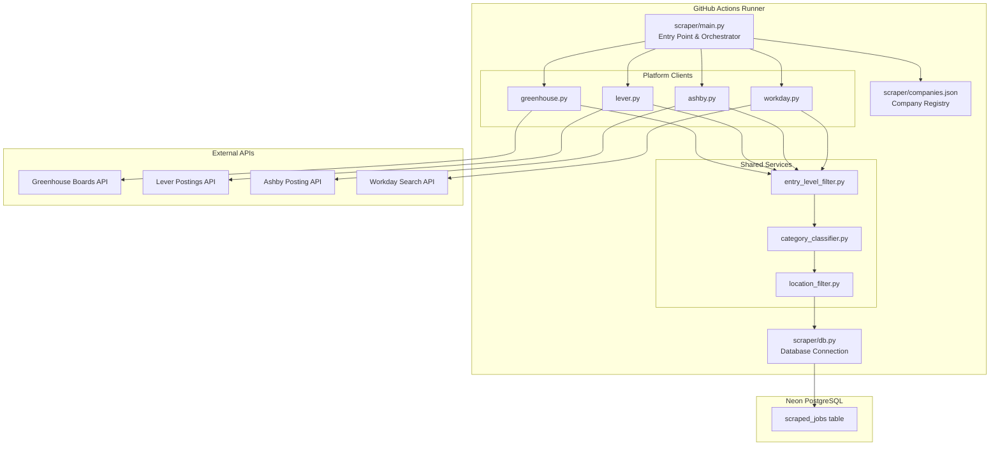
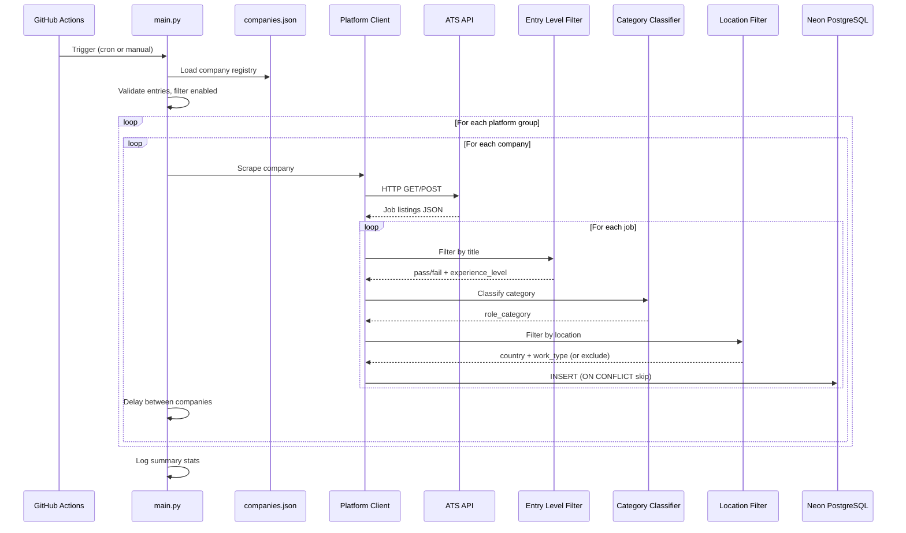

# Design Document: ATS Job Scraper

## Overview

The ATS Job Scraper is a standalone Python pipeline that directly scrapes job listings from four major Applicant Tracking System (ATS) platforms — Greenhouse, Lever, Ashby, and Workday — targeting 200+ top tech companies. It filters for entry-level positions (intern/new grad), classifies by role category, filters to US/Canada locations, deduplicates by URL, and stores results in the existing Neon PostgreSQL `scraped_jobs` table.

The scraper runs on GitHub Actions every 6 hours, independent of the Vercel-hosted FastAPI backend. It connects directly to the shared Neon database and writes `ScrapedJob` records that the frontend immediately displays alongside existing GitHub-sourced and LinkedIn-sourced jobs.

**Key Design Decisions:**
- Standalone `scraper/` directory at repo root (not part of the FastAPI backend)
- Direct database writes via SQLAlchemy + pg8000 (no API dependency)
- Sequential platform processing with per-request delays (rate limit friendly)
- JSON-based company registry for easy expansion without code changes
- Copies of shared logic (CountryFilter, WorkTypeClassifier) to avoid import coupling

## Architecture



### Data Flow



## Components and Interfaces

### Entry Point: `scraper/main.py`

```python
"""Main orchestrator for the ATS job scraper pipeline."""

import argparse
import asyncio
import json
import logging
from dataclasses import dataclass
from typing import Optional

@dataclass
class ScrapeStats:
    """Aggregate statistics for a scrape run."""
    total_companies: int = 0
    companies_succeeded: int = 0
    companies_failed: int = 0
    total_jobs_found: int = 0
    jobs_after_filter: int = 0
    new_jobs_stored: int = 0
    duplicates_skipped: int = 0

class ATSScraper:
    """Orchestrates scraping across all configured ATS platforms."""
    
    def __init__(self, db_url: str, companies_path: str = "scraper/companies.json"):
        ...
    
    def load_registry(self) -> list[dict]:
        """Load and validate company registry from JSON file."""
        ...
    
    async def run(
        self,
        platform_filter: Optional[str] = None,
        company_filter: Optional[str] = None,
    ) -> ScrapeStats:
        """Execute the full scrape pipeline. Returns aggregate stats."""
        ...
    
    async def _scrape_platform(
        self, platform: str, companies: list[dict]
    ) -> ScrapeStats:
        """Scrape all companies for a given platform."""
        ...

def main():
    """CLI entry point with argument parsing."""
    parser = argparse.ArgumentParser(description="ATS Job Scraper")
    parser.add_argument("--platform", choices=["greenhouse", "lever", "ashby", "workday"])
    parser.add_argument("--company", type=str, help="Scrape a single company by name")
    args = parser.parse_args()
    
    asyncio.run(ATSScraper(db_url=os.environ["DATABASE_URL"]).run(
        platform_filter=args.platform,
        company_filter=args.company,
    ))
```

### Platform Client Base: `scraper/clients/base.py`

```python
"""Base class for ATS platform clients."""

from dataclasses import dataclass
from datetime import datetime
from typing import Optional
import httpx

@dataclass
class RawJob:
    """Normalized job data extracted from any ATS platform."""
    title: str
    company: str
    location: str
    url: str
    posted_date: Optional[datetime]
    department: Optional[str] = None
    salary_range: str = ""
    company_logo: str = ""
    employment_type: Optional[str] = None  # Full-time, Part-time, Intern

class BaseClient:
    """Base class for all ATS platform clients."""
    
    PLATFORM: str = ""
    MAX_RETRIES: int = 3
    RATE_LIMIT_WAIT: int = 60  # seconds
    REQUEST_DELAY: float = 1.0  # seconds between requests
    
    def __init__(self, http_client: httpx.AsyncClient):
        self._client = http_client
    
    async def scrape_company(self, company: dict) -> list[RawJob]:
        """Scrape all jobs from a single company. Returns normalized jobs."""
        ...
    
    async def _request_with_retry(self, method: str, url: str, **kwargs) -> httpx.Response:
        """Make HTTP request with retry logic for rate limits."""
        ...
```

### Greenhouse Client: `scraper/clients/greenhouse.py`

```python
class GreenhouseClient(BaseClient):
    """Fetches jobs from Greenhouse public boards API."""
    
    PLATFORM = "greenhouse"
    BASE_URL = "https://boards-api.greenhouse.io/v1/boards/{slug}/jobs"
    
    async def scrape_company(self, company: dict) -> list[RawJob]:
        """Fetch all jobs from a Greenhouse company board."""
        ...
    
    def _parse_job(self, job_data: dict, company: dict) -> RawJob:
        """Parse a single Greenhouse job object into RawJob."""
        ...
    
    def _extract_salary(self, job_data: dict) -> str:
        """Extract salary range from Greenhouse job metadata or content."""
        ...
```

### Lever Client: `scraper/clients/lever.py`

```python
class LeverClient(BaseClient):
    """Fetches jobs from Lever public postings API."""
    
    PLATFORM = "lever"
    BASE_URL = "https://api.lever.co/v0/postings/{slug}"
    
    async def scrape_company(self, company: dict) -> list[RawJob]:
        """Fetch all postings from a Lever company."""
        ...
    
    def _parse_posting(self, posting: dict, company: dict) -> RawJob:
        """Parse a single Lever posting into RawJob."""
        ...
```

### Ashby Client: `scraper/clients/ashby.py`

```python
class AshbyClient(BaseClient):
    """Fetches jobs from Ashby posting API."""
    
    PLATFORM = "ashby"
    BASE_URL = "https://api.ashbyhq.com/posting-api/job-board/{slug}"
    
    async def scrape_company(self, company: dict) -> list[RawJob]:
        """Fetch all jobs from an Ashby company board."""
        ...
    
    def _parse_job(self, job_data: dict, company: dict) -> RawJob:
        """Parse a single Ashby job object into RawJob."""
        ...
```

### Workday Client: `scraper/clients/workday.py`

```python
class WorkdayClient(BaseClient):
    """Fetches jobs from Workday company career sites."""
    
    PLATFORM = "workday"
    MAX_RETRIES = 2
    RATE_LIMIT_WAIT = 120  # Workday is more aggressive with rate limits
    
    async def scrape_company(self, company: dict) -> list[RawJob]:
        """Fetch entry-level jobs from a Workday company site."""
        ...
    
    def _build_search_payload(self, company: dict) -> dict:
        """Build the POST payload for Workday search API with entry-level filters."""
        ...
    
    def _parse_job(self, job_data: dict, company: dict) -> RawJob:
        """Parse a single Workday job result into RawJob."""
        ...
```

### Entry Level Filter: `scraper/services/entry_level_filter.py`

```python
"""Filters jobs to entry-level positions only (intern, new grad, junior)."""

import re
from dataclasses import dataclass
from typing import Optional

@dataclass
class FilterResult:
    """Result of entry-level filtering."""
    is_entry_level: bool
    experience_level: Optional[str] = None  # "internship" or "new_grad"

class EntryLevelFilter:
    """Identifies entry-level positions by analyzing job titles."""
    
    INTERN_PATTERNS: list[str] = [
        r"\bintern\b", r"\binternship\b", r"\bco-?op\b",
    ]
    
    NEW_GRAD_PATTERNS: list[str] = [
        r"\bnew\s+grad(?:uate)?\b", r"\bentry[\s-]level\b",
        r"\bjunior\b", r"\bassociate\b", r"\b0-2\s+years?\b",
        r"\bearly\s+career\b", r"\buniversity\b",
        r"\s+I$",  # Roman numeral suffix (e.g., "Engineer I")
        r"\s+I\b(?![A-Za-z])",  # "I" as standalone suffix
    ]
    
    SENIOR_EXCLUSIONS: list[str] = [
        r"\bsenior\b", r"\bstaff\b", r"\bprincipal\b",
        r"\blead\b", r"\bmanager\b", r"\bdirector\b",
        r"\bvp\b", r"\bhead\s+of\b",
    ]
    
    def filter(self, title: str) -> FilterResult:
        """Evaluate a job title for entry-level indicators.
        
        Returns FilterResult with is_entry_level=True and the experience_level
        if the title matches entry-level patterns. Returns is_entry_level=False
        if no match or if senior-level indicators are present.
        """
        ...
```

### Category Classifier: `scraper/services/category_classifier.py`

```python
"""Classifies jobs into role categories based on title and department keywords."""

class CategoryClassifier:
    """Assigns role_category based on job title and department metadata."""
    
    CATEGORIES: dict[str, list[str]] = {
        "Software Engineering": [
            "software", "developer", "swe", "full stack", "fullstack",
            "backend", "frontend", "full-stack", "web developer",
            "mobile developer", "ios", "android", "engineer",
        ],
        "Data Analysis": [
            "data analyst", "business intelligence", "bi analyst",
            "analytics", "data science",
        ],
        "Machine Learning/AI": [
            "machine learning", "ml engineer", "ai ", "artificial intelligence",
            "deep learning", "nlp", "computer vision",
        ],
        "Product Management": [
            "product manager", "program manager", "technical program",
        ],
        "Marketing": ["marketing", "growth", "content", "seo", "sem"],
        "Design": ["designer", "ux", "ui", "graphic", "visual design"],
        "Business Analyst": ["business analyst"],
        "Accounting/Finance": ["accountant", "finance", "financial analyst"],
        "Sales": ["sales", "account executive", "bdr", "sdr"],
        "Human Resources": ["human resources", "hr ", "recruiter", "talent"],
        "Legal": ["legal", "counsel", "attorney", "compliance"],
        "Operations": ["operations", "supply chain", "logistics"],
        "Customer Support": ["customer support", "customer success", "support engineer"],
        "Hardware Engineering": ["hardware", "electrical engineer", "mechanical engineer"],
        "Cybersecurity": ["security", "cybersecurity", "infosec", "penetration"],
        "DevOps/Infrastructure": ["devops", "sre", "infrastructure", "platform engineer", "cloud"],
        "Other": [],
    }
    
    def classify(self, title: str, department: str = "") -> str:
        """Classify a job into a role category.
        
        Priority: title keywords > department keywords > "Other"
        """
        ...
```

### Location Filter: `scraper/services/location_filter.py`

```python
"""Filters jobs to US and Canada only, extracts work_type and country."""

from dataclasses import dataclass
from typing import Optional

@dataclass
class LocationResult:
    """Result of location filtering."""
    is_included: bool
    country: str = ""       # "US" or "CA"
    work_type: str = ""     # "remote", "hybrid", "onsite"

class LocationFilter:
    """Filters jobs to US/Canada and extracts work arrangement type.
    
    Replicates logic from backend/services/country_filter.py and
    backend/services/work_type_classifier.py as a standalone copy.
    """
    
    # US state abbreviations, full names, Canadian provinces (same as CountryFilter)
    ...
    
    def filter(self, location: str) -> LocationResult:
        """Evaluate location for country and work type.
        
        Returns LocationResult with is_included=True if US or Canada,
        along with the country code and work_type classification.
        """
        ...
    
    def _classify_country(self, location: str) -> Optional[str]:
        """Classify location into 'US', 'CA', or None."""
        ...
    
    def _classify_work_type(self, location: str) -> str:
        """Classify location into 'remote', 'hybrid', or 'onsite'."""
        ...
```

### Database Layer: `scraper/db.py`

```python
"""Database connection and job storage for the ATS scraper."""

from sqlalchemy import create_engine, Column, Integer, String, Text, DateTime, Enum
from sqlalchemy.orm import sessionmaker, DeclarativeBase
from datetime import datetime

class Base(DeclarativeBase):
    pass

class ScrapedJob(Base):
    """Mirror of the backend ScrapedJob model — only fields the scraper writes."""
    __tablename__ = "scraped_jobs"
    
    id = Column(Integer, primary_key=True)
    platform = Column(String, default="greenhouse")
    title = Column(String, nullable=False)
    company = Column(String, nullable=False)
    location = Column(String, default="")
    url = Column(String, nullable=False, unique=True)
    posted_date = Column(DateTime, nullable=True)
    salary_range = Column(String, default="")
    company_logo = Column(String, default="")
    ats_type = Column(String, default="")
    source_platform = Column(String, default="ats")
    work_type = Column(String, default="onsite")
    role_category = Column(String, default="")
    country = Column(String, default="")
    experience_level = Column(String, default="")
    scraped_at = Column(DateTime, default=datetime.utcnow)

def get_session(database_url: str):
    """Create a database session."""
    engine = create_engine(database_url)
    Session = sessionmaker(bind=engine)
    return Session()

def store_job(session, job_data: dict) -> bool:
    """Insert a job record. Returns True if inserted, False if duplicate.
    
    Uses INSERT ... ON CONFLICT (url) DO NOTHING for deduplication.
    """
    ...

def normalize_url(url: str) -> str:
    """Normalize URL for deduplication: strip trailing slashes, sort query params."""
    ...
```

## Data Models

### Company Registry Schema (`scraper/companies.json`)

```json
{
  "$schema": "Company Registry",
  "companies": [
    {
      "company_name": "Stripe",
      "ats_platform": "greenhouse",
      "board_slug": "stripe",
      "company_logo_url": "https://logo.clearbit.com/stripe.com",
      "enabled": true
    },
    {
      "company_name": "Netflix",
      "ats_platform": "lever",
      "board_slug": "netflix",
      "company_logo_url": "https://logo.clearbit.com/netflix.com",
      "enabled": true
    },
    {
      "company_name": "Ramp",
      "ats_platform": "ashby",
      "board_slug": "ramp",
      "company_logo_url": "https://logo.clearbit.com/ramp.com",
      "enabled": true
    },
    {
      "company_name": "Salesforce",
      "ats_platform": "workday",
      "board_slug": "salesforce",
      "workday_url_template": "https://salesforce.wd12.myworkdayjobs.com/en-US/External_Career_Site",
      "company_logo_url": "https://logo.clearbit.com/salesforce.com",
      "enabled": true
    }
  ]
}
```

**Required fields:**
| Field | Type | Description |
|-------|------|-------------|
| `company_name` | string | Display name of the company |
| `ats_platform` | enum | One of: `greenhouse`, `lever`, `ashby`, `workday` |
| `board_slug` | string | The company's identifier on the ATS platform |

**Optional fields:**
| Field | Type | Default | Description |
|-------|------|---------|-------------|
| `company_logo_url` | string | `""` | URL to company logo image |
| `enabled` | boolean | `true` | Whether to include in scrape runs |
| `workday_url_template` | string | — | Full Workday career site URL (required for Workday companies) |

### RawJob (Internal Data Transfer Object)

```python
@dataclass
class RawJob:
    title: str              # Job title as-is from ATS
    company: str            # Company name from registry
    location: str           # Location string from ATS
    url: str                # Direct apply URL
    posted_date: Optional[datetime]  # When job was posted
    department: Optional[str] = None  # Department/team from ATS
    salary_range: str = ""  # Formatted salary string
    company_logo: str = ""  # Logo URL from registry or API
    employment_type: Optional[str] = None  # Full-time, Part-time, Intern
```

### ScrapedJob Record (Database Output)

The scraper writes these fields to the existing `scraped_jobs` table:

| Field | Source | Example |
|-------|--------|---------|
| `title` | ATS API | "Software Engineer Intern" |
| `company` | Registry | "Stripe" |
| `location` | ATS API | "San Francisco, CA" |
| `url` | Constructed/API | "https://boards.greenhouse.io/stripe/jobs/12345" |
| `posted_date` | ATS API | `2025-01-15T00:00:00` |
| `salary_range` | ATS API (if available) | "$80,000 - $120,000" |
| `company_logo` | Registry or API | "https://logo.clearbit.com/stripe.com" |
| `ats_type` | Platform name | "greenhouse" |
| `source_platform` | Fixed | "ats" |
| `platform` | Platform name | "greenhouse" |
| `work_type` | LocationFilter | "remote" |
| `role_category` | CategoryClassifier | "Software Engineering" |
| `country` | LocationFilter | "US" |
| `experience_level` | EntryLevelFilter | "internship" |
| `scraped_at` | Current time | `2025-01-15T12:00:00` |

### GitHub Actions Workflow (`.github/workflows/scrape.yml`)

```yaml
name: Hourly Job Scraper

on:
  schedule:
    - cron: '0 * * * *'  # Every hour (unlimited on public repos)
  workflow_dispatch:  # Manual trigger

jobs:
  scrape:
    runs-on: ubuntu-latest
    timeout-minutes: 45

    steps:
      - name: Checkout repository
        uses: actions/checkout@v4

      - name: Set up Python
        uses: actions/setup-python@v5
        with:
          python-version: '3.11'
          cache: 'pip'

      - name: Install dependencies
        run: pip install -r requirements.txt

      - name: Run ATS Scraper
        env:
          DATABASE_URL: ${{ secrets.DATABASE_URL }}
        run: python -m scraper.main

      - name: Upload logs on failure
        if: failure()
        uses: actions/upload-artifact@v4
        with:
          name: scraper-logs
          path: scraper/logs/
          retention-days: 7
```


## Correctness Properties

*A property is a characteristic or behavior that should hold true across all valid executions of a system — essentially, a formal statement about what the system should do. Properties serve as the bridge between human-readable specifications and machine-verifiable correctness guarantees.*

### Property 1: Registry field extraction preserves all data

*For any* valid company registry JSON entry containing company_name, ats_platform, board_slug, company_logo_url, and enabled fields, parsing that entry and re-serializing it SHALL produce an equivalent object with all fields intact.

**Validates: Requirements 1.2**

### Property 2: Enabled flag filtering

*For any* list of company registry entries with varying enabled flags, the set of companies selected for scraping SHALL be exactly the subset where enabled is true (or enabled is absent, defaulting to true).

**Validates: Requirements 1.4**

### Property 3: Registry validation rejects entries missing required fields

*For any* company registry entry that is missing one or more of the required fields (company_name, ats_platform, board_slug), the registry loader SHALL mark it as invalid and exclude it from the scrape list without raising an exception.

**Validates: Requirements 1.5, 1.6**

### Property 4: Greenhouse job parsing extracts all required fields

*For any* valid Greenhouse API job response object containing title, location.name, absolute_url, updated_at, and departments, the parser SHALL produce a RawJob with all corresponding fields populated and non-empty.

**Validates: Requirements 2.2**

### Property 5: Greenhouse URL construction

*For any* board_slug string and job_id integer, the constructed Greenhouse apply URL SHALL match the format `https://boards.greenhouse.io/{board_slug}/jobs/{job_id}`.

**Validates: Requirements 2.4**

### Property 6: Lever job parsing extracts all required fields

*For any* valid Lever API posting object containing text, categories.location, hostedUrl, and createdAt, the parser SHALL produce a RawJob with all corresponding fields populated and the url field equal to hostedUrl.

**Validates: Requirements 3.2, 3.3**

### Property 7: Ashby job parsing extracts all required fields

*For any* valid Ashby API job object containing title, location, department, applyUrl, and publishedAt, the parser SHALL produce a RawJob with all corresponding fields populated and the url field equal to applyUrl.

**Validates: Requirements 4.2, 4.3**

### Property 8: Workday job parsing extracts all required fields

*For any* valid Workday search result object containing title, location, postedOn, and external URL path, the parser SHALL produce a RawJob with all corresponding fields populated.

**Validates: Requirements 5.2**

### Property 9: Workday URL construction from template

*For any* workday_url_template string and job posting path, the constructed Workday apply URL SHALL combine the template base with the job path to form a valid URL.

**Validates: Requirements 5.3, 5.4**

### Property 10: Entry-level filter assigns correct experience_level

*For any* job title containing an intern-specific pattern ("intern", "internship", "co-op", "coop"), the filter SHALL return experience_level="internship". *For any* job title containing a new-grad-specific pattern ("new grad", "entry level", "junior", "associate", "I" as suffix, "0-2 years", "early career"), the filter SHALL return experience_level="new_grad".

**Validates: Requirements 6.2, 6.3, 6.4**

### Property 11: Non-entry-level titles are excluded

*For any* job title that does not contain any entry-level indicator pattern and does not contain any senior-level exclusion pattern, the entry-level filter SHALL return is_entry_level=False.

**Validates: Requirements 6.5**

### Property 12: Roman numeral "I" only matches as standalone suffix

*For any* job title where "I" appears only as part of a longer word (e.g., "Senior", "Intelligence", "Integration"), the entry-level filter SHALL NOT match it as a Roman numeral indicator. *For any* job title ending with " I" (space followed by capital I) as a standalone token, the filter SHALL match it as entry-level.

**Validates: Requirements 6.6**

### Property 13: Category classifier keyword matching

*For any* job title containing a keyword from a specific category's keyword list, the classifier SHALL assign that category to the job.

**Validates: Requirements 7.3**

### Property 14: Category classifier title priority over department fallback

*For any* job where the title contains keywords matching category A and the department contains keywords matching category B (where A ≠ B), the classifier SHALL assign category A (title wins). *For any* job where the title matches no category keywords but the department does, the classifier SHALL use the department-based category.

**Validates: Requirements 7.4, 7.6**

### Property 15: Category classifier defaults to "Other"

*For any* job title and department string that contain no keywords matching any defined category, the classifier SHALL assign "Other" as the role_category.

**Validates: Requirements 7.5**

### Property 16: Location filter country classification

*For any* location string containing a US state abbreviation (in City, ST format), full US state name, "United States", or "USA", the filter SHALL classify it as country="US". *For any* location string containing a Canadian province abbreviation (in City, PR format), full province name, or "Canada", the filter SHALL classify it as country="CA". *For any* location string containing only "Remote" with no country indicator, the filter SHALL default to country="US". *For any* location that matches neither US nor Canada, the filter SHALL return is_included=False.

**Validates: Requirements 8.2, 8.3, 8.4, 8.5, 8.6**

### Property 17: Location filter work_type extraction

*For any* location string containing "remote" (case-insensitive), the filter SHALL assign work_type="remote". *For any* location containing "hybrid", the filter SHALL assign work_type="hybrid". *For any* location with no remote/hybrid indicator, the filter SHALL assign work_type="onsite".

**Validates: Requirements 8.7**

### Property 18: URL normalization is idempotent

*For any* URL string, applying the normalization function twice SHALL produce the same result as applying it once: `normalize(normalize(url)) == normalize(url)`.

**Validates: Requirements 9.3**

### Property 19: Stale job exclusion by posted date

*For any* job with a posted_date more than 30 days before the current scrape time, the pipeline SHALL exclude that job from storage. *For any* job with a posted_date within the last 30 days, the pipeline SHALL not exclude it based on date alone.

**Validates: Requirements 10.6**

## Error Handling

### Strategy: Fail-Forward with Isolation

The scraper uses a "fail-forward" strategy where individual failures are logged and skipped without halting the pipeline. Only fatal infrastructure failures (database connection loss) cause a hard exit.

### Error Categories

| Error Type | Handling | Retry | Impact |
|-----------|----------|-------|--------|
| Network timeout | Log warning, skip company | No | Single company missed |
| HTTP 404 | Log warning, skip company | No | Company board not found |
| HTTP 429 (rate limit) | Wait + retry | Yes (3x for GH/LV/AB, 2x for WD) | Delayed processing |
| HTTP 5xx | Log warning, skip company | No | Platform temporarily down |
| JSON parse error | Log error, skip company | No | Unexpected API response |
| Invalid registry entry | Log warning, skip entry | No | Company excluded from run |
| Database connection failure | **Fatal** — exit with code 1 | No | Entire run fails |
| Database write error | Log error, skip job | No | Single job not stored |
| URL construction error | Log error, skip job | No | Single job not stored |

### Rate Limiting Approach

```
Platform-specific delays:
├── Greenhouse: 1s between requests, 60s on 429, max 3 retries
├── Lever: 1s between requests, 60s on 429, max 3 retries
├── Ashby: 1s between requests, 60s on 429, max 3 retries
└── Workday: 2s between requests, 120s on 429, max 2 retries
```

**Implementation:**
- `asyncio.sleep(delay)` between each company request within a platform
- Exponential backoff not needed — fixed wait on 429 is sufficient for public APIs
- Total estimated runtime for 200 companies: ~5-10 minutes (well within 6-hour limit)

### Logging Strategy

```python
# Structured logging with levels:
# INFO: Pipeline start/end, platform start/end, summary stats
# WARNING: Skipped companies (404, invalid), skipped jobs (filter excluded)
# ERROR: Unexpected failures, parse errors, database write errors
# CRITICAL: Fatal errors (database connection failure)

logging.basicConfig(
    level=logging.INFO,
    format="%(asctime)s [%(levelname)s] %(name)s: %(message)s",
)
```

### Exit Codes

| Code | Meaning |
|------|---------|
| 0 | Success (even if some companies failed) |
| 1 | Fatal error (database unreachable, registry file missing) |

## Testing Strategy

### Property-Based Tests (Hypothesis)

The scraper's core logic — filtering, classification, URL construction, and parsing — is well-suited for property-based testing. These are pure functions with clear input/output behavior and large input spaces.

**Library:** [Hypothesis](https://hypothesis.readthedocs.io/) (Python PBT library)
**Configuration:** Minimum 100 examples per property test
**Tag format:** `# Feature: ats-job-scraper, Property {N}: {title}`

Property tests cover:
- `EntryLevelFilter.filter()` — Properties 10, 11, 12
- `CategoryClassifier.classify()` — Properties 13, 14, 15
- `LocationFilter.filter()` — Properties 16, 17
- `normalize_url()` — Property 18
- Platform parsers (`_parse_job`, `_parse_posting`) — Properties 4, 6, 7, 8
- URL construction functions — Properties 5, 9
- Registry loading/validation — Properties 1, 2, 3
- Date staleness filter — Property 19

### Unit Tests (pytest)

Example-based tests for:
- Specific known company board URLs
- CLI argument parsing
- Error handling paths (404, 429 responses)
- Logo extraction fallback logic
- Salary extraction from various formats
- Platform field mapping (source_platform="ats", ats_type, platform)

### Integration Tests

- Database write with ON CONFLICT deduplication
- Full pipeline with mocked HTTP responses
- Registry loading from actual `companies.json`

### Test File Structure

```
scraper/
├── tests/
│   ├── __init__.py
│   ├── test_entry_level_filter.py      # Properties 10, 11, 12 + examples
│   ├── test_category_classifier.py     # Properties 13, 14, 15 + examples
│   ├── test_location_filter.py         # Properties 16, 17 + examples
│   ├── test_url_normalization.py       # Property 18
│   ├── test_greenhouse_parser.py       # Properties 4, 5 + examples
│   ├── test_lever_parser.py            # Property 6 + examples
│   ├── test_ashby_parser.py            # Property 7 + examples
│   ├── test_workday_parser.py          # Properties 8, 9 + examples
│   ├── test_registry.py               # Properties 1, 2, 3 + examples
│   ├── test_staleness_filter.py        # Property 19
│   └── test_pipeline_integration.py    # Integration tests
```

### Dependencies (`scraper/requirements.txt`)

```
httpx>=0.27.0
sqlalchemy>=2.0.0
pg8000>=1.31.0
hypothesis>=6.100.0
pytest>=8.0.0
pytest-asyncio>=0.23.0
```
