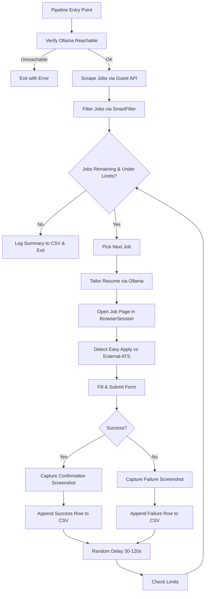
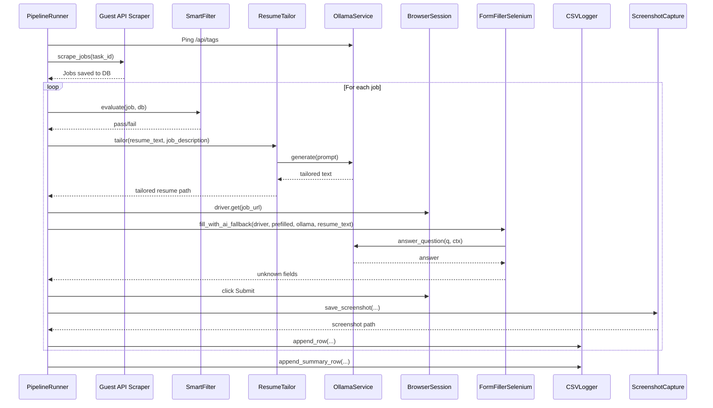

# Design Document: Auto-Apply Pipeline

## Overview

The Auto-Apply Pipeline orchestrates the existing subsystems — job scraping, resume tailoring, browser-based form filling, AI question answering, screenshot capture, and CSV logging — into a single end-to-end batch flow. A user starts the pipeline, and it autonomously fetches jobs, filters them, tailors the resume per job, applies via the existing Selenium + selenium_stealth browser session, answers open-ended questions via Ollama (Qwen2.5:14b), captures confirmation screenshots, and appends every outcome to a CSV log file.

The pipeline is implemented as a new Celery task (`run_pipeline`) that delegates to existing modules. No new browser automation strategy is introduced — the design reuses `BrowserSession`, `FormFillerSelenium`, `SmartFilter`, and `OllamaService` as-is.

### Key Design Decisions

1. **Sequential job processing** — Jobs are processed one at a time with randomized delays (30–120s) to mimic human behavior and avoid LinkedIn rate-limiting.
2. **Fail-forward** — A single job failure never stops the pipeline. Exceptions are caught, logged to CSV, and a failure screenshot is captured before moving to the next job.
3. **CSV as append-only log** — The CSV file is opened in append mode for each row write, ensuring previous run data is never lost and concurrent reads are safe.
4. **Resume tailoring is summary + skill reorder only** — The Ollama prompt explicitly instructs the model to rewrite only the professional summary and reorder skills. No fabrication.
5. **No paid APIs** — All AI inference runs locally via Ollama at `http://localhost:11434` using `qwen2.5:14b`.

## Architecture



### Component Interaction



## Components and Interfaces

### 1. PipelineRunner (NEW)

**Location:** `backend/bot/pipeline_runner.py`

The top-level orchestrator. Exposes a single `run_pipeline(task_id: str)` function that is called by a Celery task.

```python
def run_pipeline(task_id: str) -> None:
    """
    Main pipeline entry point.
    1. Verify Ollama is reachable
    2. Scrape jobs
    3. For each job: filter → tailor resume → apply → screenshot → CSV log
    4. Respect daily/weekly limits
    5. Log summary
    """
```

**Responsibilities:**
- Orchestrate the full pipeline sequence
- Enforce daily/weekly apply limits by querying `ApplicationRecord` counts
- Catch per-job exceptions and continue
- Call `BrowserSession.keep_alive()` every 5 minutes
- Insert randomized delays (30–120s) between applications

### 2. ResumeTailor (NEW)

**Location:** `backend/bot/resume_tailor.py`

Wraps the existing `OllamaService.tailor_resume()` method with file I/O and fallback logic.

```python
class ResumeTailor:
    def __init__(self, ollama: OllamaService):
        self.ollama = ollama

    def tailor(self, resume_text: str, job_description: str, job_id: int) -> tuple[str, str]:
        """
        Returns (tailored_file_path, resume_version).
        Falls back to ("", "original") on Ollama failure.
        """
```

**Responsibilities:**
- Call `OllamaService.tailor_resume()` with resume text and job description
- Save tailored output to `data/tailored_resumes/resume_{job_id}_{timestamp}.txt`
- Return the file path and version string ("tailored" or "original")
- On Ollama failure: log warning, return original resume path

### 3. CSVLogger (NEW)

**Location:** `backend/bot/csv_logger.py`

Handles all CSV file operations for the application log.

```python
class CSVLogger:
    CSV_PATH = "applications/applications_log.csv"
    COLUMNS = [
        "timestamp", "company", "job_title", "job_url", "status",
        "resume_version", "screenshot_path", "questions_answered",
        "failure_reason", "ats_type",
    ]

    def __init__(self):
        """Create directory and header row if CSV doesn't exist."""

    def log(self, row: dict) -> None:
        """Append a single row to the CSV file."""

    def log_summary(self, counts: dict) -> None:
        """Append a summary row with totals for each status category."""
```

**Responsibilities:**
- Create `applications/` directory and CSV header on first use
- Append rows in append mode (never overwrite)
- Sanitize values (escape commas, newlines)
- Thread-safe writes (single-threaded pipeline, but safe for concurrent reads)

### 4. ScreenshotCapture (NEW)

**Location:** `backend/bot/screenshot_capture.py`

Encapsulates screenshot naming conventions and directory management.

```python
class ScreenshotCapture:
    SCREENSHOT_DIR = "applications/screenshots"

    def __init__(self, driver):
        self.driver = driver

    def capture_success(self, company: str, job_title: str) -> str:
        """Save success screenshot, return file path."""

    def capture_failure(self, company: str, job_title: str) -> str:
        """Save failure screenshot, return file path."""

    @staticmethod
    def _safe_filename(text: str) -> str:
        """Convert text to filesystem-safe characters."""
```

**Responsibilities:**
- Create `applications/screenshots/` directory if missing
- Generate filenames: `{company}_{job_title}_{timestamp}.png` (success) or `failed_{company}_{job_title}_{timestamp}.png` (failure)
- Sanitize filenames (replace non-alphanumeric chars with underscores)

### 5. Existing Components (REUSED)

| Component | Location | Role in Pipeline |
|---|---|---|
| `scrape_jobs()` | `backend/bot/linkedin_bot.py` | Fetch job listings via LinkedIn guest API |
| `SmartFilter` | `backend/bot/smart_filter.py` | Evaluate jobs against user filter rules |
| `BrowserSession` | `backend/services/browser_pool.py` | Persistent Selenium + stealth Chrome session |
| `FormFillerSelenium` | `backend/bot/form_filler_selenium.py` | Fill form fields with profile/prefilled/AI |
| `OllamaService` | `backend/services/ollama_service.py` | Local AI inference (Qwen2.5:14b) |
| `apply_to_job()` | `backend/bot/linkedin_bot.py` | Core apply logic (Easy Apply + external ATS) |
| `AutopilotEngine` | `backend/bot/autopilot.py` | Reference for limit checking pattern |

### 6. Celery Task Registration

**Location:** `backend/worker.py` (existing, add new task)

```python
@celery_app.task(name="backend.worker.run_pipeline")
def run_pipeline_task():
    task_id = run_pipeline_task.request.id
    from backend.bot.pipeline_runner import run_pipeline
    run_pipeline(task_id)
```

### 7. API Endpoint

**Location:** `backend/routers/bot.py` (existing, add new endpoint)

```python
@router.post("/pipeline/start")
def start_pipeline():
    """Start the auto-apply pipeline as a background Celery task."""
```

## Data Models

### CSV Row Schema

| Column | Type | Description |
|---|---|---|
| `timestamp` | ISO 8601 string | When the application attempt occurred |
| `company` | string | Company name from ScrapedJob |
| `job_title` | string | Job title from ScrapedJob |
| `job_url` | string | LinkedIn job URL |
| `status` | enum string | One of: `success`, `failed`, `captcha`, `skipped`, `already_applied` |
| `resume_version` | string | `"original"` or `"tailored"` |
| `screenshot_path` | string | Relative path to screenshot file |
| `questions_answered` | int | Count of questions answered by AI during this application |
| `failure_reason` | string | Error message or skip reason (empty on success) |
| `ats_type` | string | `easy_apply`, `greenhouse`, `lever`, `workday`, `external`, etc. |

### Tailored Resume File

- **Path pattern:** `data/tailored_resumes/resume_{job_id}_{timestamp}.txt`
- **Content:** Full resume text with rewritten summary and reordered skills
- **Retention:** Files persist indefinitely; user can clean up manually

### Screenshot File

- **Success path:** `applications/screenshots/{company}_{job_title}_{timestamp}.png`
- **Failure path:** `applications/screenshots/failed_{company}_{job_title}_{timestamp}.png`
- **Naming:** Non-alphanumeric characters replaced with underscores, truncated to 200 chars

### Existing DB Models Used (no changes)

- `ScrapedJob` — Job listings with status tracking
- `ApplicationRecord` — Application outcomes (used for limit counting and duplicate detection)
- `UserSettings` — All pipeline configuration (limits, delays, credentials, prefilled answers)
- `PendingQuestion` — Questions the bot couldn't answer (AI fallback failed)
- `ResumeProfileDB` — Parsed resume text for AI context

### Pipeline Configuration (from UserSettings)

| Setting | Default | Description |
|---|---|---|
| `daily_apply_limit` | 50 | Max applications per calendar day |
| `weekly_apply_limit` | 200 | Max applications per calendar week |
| `apply_delay_min` | 30.0 | Minimum seconds between applications |
| `apply_delay_max` | 120.0 | Maximum seconds between applications |
| `resume_tailoring_enabled` | 0 | Whether to tailor resume per job |
| `max_applications_per_run` | 25 | Max jobs to process in a single pipeline run |


## Correctness Properties

*A property is a characteristic or behavior that should hold true across all valid executions of a system — essentially, a formal statement about what the system should do. Properties serve as the bridge between human-readable specifications and machine-verifiable correctness guarantees.*

### Property 1: SmartFilter gates all jobs

*For any* list of scraped jobs and any user filter configuration, every job that reaches the apply step must have passed `SmartFilter.evaluate()`, and every job that fails the filter must be skipped with the correct reason logged — including jobs already applied to (duplicate URL or job ID).

**Validates: Requirements 1.2, 7.2**

### Property 2: Inter-application delay is bounded

*For any* pipeline run processing multiple jobs, the delay between consecutive application attempts must be a value in the range `[apply_delay_min, apply_delay_max]` (default [30, 120] seconds).

**Validates: Requirements 1.4**

### Property 3: Daily and weekly limits are never exceeded

*For any* combination of `daily_apply_limit`, `weekly_apply_limit`, and existing `ApplicationRecord` counts, the pipeline must stop before the total applications for the day exceed the daily limit or the total for the week exceed the weekly limit. The number of new applications made in a pipeline run plus existing applications must be ≤ the configured limit.

**Validates: Requirements 1.5**

### Property 4: Fail-forward on per-job exceptions

*For any* ordered list of jobs where some jobs throw exceptions during application, the pipeline must process all non-failing jobs in the list. Each failing job must produce exactly one failure row in the CSV log and one failure screenshot. The pipeline must not terminate early due to a single job failure.

**Validates: Requirements 1.6, 7.5**

### Property 5: Resume tailoring preserves original content

*For any* original resume text and job description, the tailored resume output must not contain any skills, experience entries, certifications, or education items that are not present in the original resume text. The set of factual items in the tailored version must be a subset of the original.

**Validates: Requirements 2.2, 2.3**

### Property 6: Tailored resume file path follows naming convention

*For any* job ID (positive integer) and timestamp, the tailored resume file must be saved at `data/tailored_resumes/resume_{job_id}_{timestamp}.txt` and the file must exist on disk after the tailor operation completes successfully.

**Validates: Requirements 2.4**

### Property 7: ATS type detection is consistent with page signals

*For any* LinkedIn job page HTML containing Easy Apply indicators (`apply-link-onsite`, `easyApplyUrl`, `"isEasyApply":true`), the detection function must return `"easy_apply"`. For any HTML containing offsite indicators with a known ATS domain in the apply URL, the detection must return the correct ATS type string.

**Validates: Requirements 3.3**

### Property 8: Form fill priority order

*For any* form field label that matches both a profile data key and a prefilled answer, the form filler must use the profile data value (not the prefilled answer or AI). For any field that matches a prefilled answer but not profile data, the filler must use the prefilled answer (not AI). AI is only used when both profile and prefilled fail to match.

**Validates: Requirements 3.4**

### Property 9: Screenshot filenames are filesystem-safe

*For any* company name and job title string (including Unicode, special characters, spaces, slashes, and empty strings), the generated screenshot filename must contain only alphanumeric characters, underscores, hyphens, and dots, and must not exceed 200 characters. Success screenshots must match `{safe_company}_{safe_title}_{timestamp}.png` and failure screenshots must match `failed_{safe_company}_{safe_title}_{timestamp}.png`.

**Validates: Requirements 5.2, 5.3**

### Property 10: CSV append preserves existing data

*For any* sequence of N `log()` calls to the CSVLogger, the resulting CSV file must contain exactly N data rows (plus one header row). Each row written by a previous call must still be present and unmodified after subsequent calls.

**Validates: Requirements 6.1, 6.5**

### Property 11: CSV rows have valid schema and status

*For any* row written to the CSV, it must contain exactly the 10 required columns (`timestamp`, `company`, `job_title`, `job_url`, `status`, `resume_version`, `screenshot_path`, `questions_answered`, `failure_reason`, `ats_type`), and the `status` value must be one of: `success`, `failed`, `captcha`, `skipped`, `already_applied`.

**Validates: Requirements 6.2, 6.3**

### Property 12: Keep-alive is called within 5-minute intervals

*For any* pipeline run lasting longer than 5 minutes, `BrowserSession.keep_alive()` must be called at least once every 5 minutes (300 seconds). The maximum gap between consecutive keep-alive calls must be ≤ 300 seconds.

**Validates: Requirements 7.6**

### Property 13: Summary row matches actual run totals

*For any* pipeline run, the summary row logged at the end must contain counts that exactly match the number of rows logged with each status during that run. The sum of all status counts in the summary must equal the total number of jobs processed.

**Validates: Requirements 7.7**

## Error Handling

### Per-Job Error Recovery

The pipeline wraps each job's apply flow in a try/except block. On any unhandled exception:

1. Capture a failure screenshot via `ScreenshotCapture.capture_failure()`
2. Append a `failed` row to the CSV with the exception message as `failure_reason`
3. Update the `ScrapedJob.status` to `FAILED` in the database
4. Continue to the next job

### CAPTCHA Detection

Before attempting to fill a form, the pipeline checks the page for CAPTCHA indicators:
- URL contains `checkpoint` or `challenge`
- Page body contains "security verification" or CAPTCHA-related text

On detection: skip the job, log status as `captcha`, continue.

### Session Loss Recovery

After each job application, the pipeline calls `BrowserSession.is_session_valid()`. If the session is invalid:

1. Attempt `BrowserSession.ensure_logged_in(settings)` (tries saved cookies → li_at cookie → credentials)
2. If re-login succeeds: continue pipeline
3. If re-login fails: log the reason, write a summary row to CSV, and exit the pipeline

### Ollama Failures

- **Startup:** If Ollama is unreachable at pipeline start (`/api/tags` returns error), the pipeline exits immediately with a clear error message.
- **Resume tailoring:** If Ollama fails during tailoring, fall back to the original resume. Log a warning.
- **Question answering:** If Ollama times out (30s) or errors during form filling, skip the field and log it as unanswered. The field becomes a `PendingQuestion` for the user.

### File System Errors

- CSV write failure: log error, continue pipeline (don't stop for logging failures)
- Screenshot failure: log warning, set screenshot_path to empty string
- Resume save failure: fall back to original resume

## Testing Strategy

### Property-Based Testing

All correctness properties (1–13) will be implemented as property-based tests using **Hypothesis** (Python). The project already uses Hypothesis (`.hypothesis/` directory exists).

Each property test must:
- Run a minimum of 100 iterations
- Reference its design property in a comment tag
- Use Hypothesis strategies to generate random inputs

**Tag format:** `# Feature: auto-apply-pipeline, Property {N}: {title}`

### Property Test Breakdown

| Property | Test Approach | Key Generators |
|---|---|---|
| 1: SmartFilter gates | Generate random jobs + filter configs, verify pass/fail routing | `st.builds(ScrapedJob)`, `st.dictionaries()` for settings |
| 2: Delay bounds | Generate random delay_min/max pairs, verify output in range | `st.floats(min_value=1, max_value=300)` |
| 3: Limit enforcement | Generate random limits + existing counts, verify stop condition | `st.integers(min_value=0, max_value=500)` |
| 4: Fail-forward | Generate job lists with random failure positions, verify all processed | `st.lists(st.booleans())` for success/fail pattern |
| 5: Content preservation | Generate random resume texts + job descriptions, verify subset | `st.text()`, `st.lists(st.text())` for skills |
| 6: File path format | Generate random job IDs, verify path pattern | `st.integers(min_value=1)` |
| 7: ATS detection | Generate HTML snippets with various ATS signals | `st.sampled_from(["easy_apply", "greenhouse", ...])` |
| 8: Fill priority | Generate field labels + profile/prefilled/AI data, verify priority | `st.text()`, `st.dictionaries()` |
| 9: Filename safety | Generate Unicode strings with special chars, verify safe output | `st.text(alphabet=st.characters())` |
| 10: CSV append | Generate sequences of row dicts, verify row count and preservation | `st.lists(st.fixed_dictionaries(...))` |
| 11: CSV schema | Generate row dicts with random values, verify columns and status | `st.fixed_dictionaries(...)` |
| 12: Keep-alive timing | Generate pipeline durations, verify call intervals | `st.floats(min_value=0, max_value=3600)` |
| 13: Summary accuracy | Generate lists of status outcomes, verify summary totals | `st.lists(st.sampled_from(["success", "failed", ...]))` |

### Unit Tests

Unit tests complement property tests for specific examples and edge cases:

- **CSVLogger:** Empty file creation with headers, append to existing file, handle missing directory
- **ScreenshotCapture:** Empty string inputs, very long filenames, path traversal characters
- **ResumeTailor:** Ollama timeout fallback, empty resume text, empty job description
- **PipelineRunner:** Ollama unreachable at startup exits cleanly, zero jobs after scrape, all jobs filtered out
- **CAPTCHA detection:** Known CAPTCHA URL patterns, checkpoint page detection
- **Session recovery:** Login state check after apply, re-auth flow

### Integration Tests

- Full pipeline run with mocked Selenium driver and mocked Ollama responses
- Verify CSV file contains correct rows after a multi-job run
- Verify screenshot files are created in the correct directory
- Verify tailored resume files are saved with correct naming

### Test Configuration

```python
from hypothesis import settings as hypothesis_settings

# All property tests use this profile
hypothesis_settings.register_profile(
    "pipeline",
    max_examples=100,
    deadline=None,  # Ollama calls can be slow in integration tests
)
```
