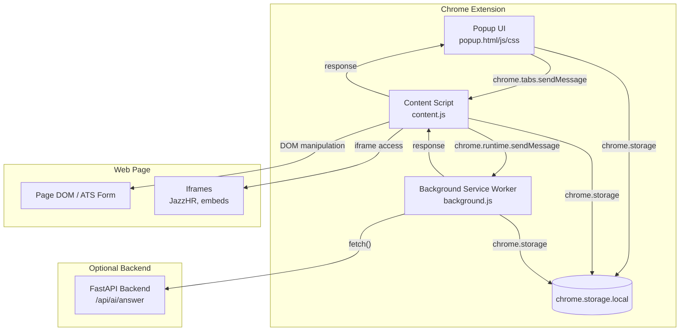

# Design: Chrome Extension Bot

## Overview

This Chrome extension (Manifest V3) autofills job application forms across major ATS platforms. It ports the form-filling logic from the existing `smart_form_filler.py` and `FormFillerSelenium` into a browser extension that runs natively in the user's Chrome — no Selenium required.

The extension consists of four components:
1. **Content Script** — injected into ATS pages; detects forms, extracts fields, fills values, handles iframes and React inputs
2. **Popup UI** — four-tab interface (Dashboard, Personal Info, Settings, Applied Jobs) for managing the extension
3. **Background Service Worker** — handles API calls to the optional FastAPI backend for AI-powered answers
4. **Storage Layer** — chrome.storage.local for profile, settings, prefilled answers, and applied jobs history

The architecture mirrors the existing backend bot's separation: field detection → label matching → profile mapping → AI fallback → fill execution. The key difference is that the content script runs in the page's DOM directly, eliminating the Selenium abstraction layer.

## Architecture



### Message Flow

1. User clicks "Autofill" in popup
2. Popup reads profile + settings from `chrome.storage.local`
3. Popup sends `{action: "autofill", profile, settings}` to content script via `chrome.tabs.sendMessage`
4. Content script detects ATS type from URL
5. Content script extracts form fields (scoped to modal/iframe as needed)
6. For each empty field:
   - Try profile mapping (exact match → substring match)
   - Try prefilled answers (fuzzy match)
   - If AI enabled: send to background worker → backend API → return answer
7. Content script fills fields using appropriate method (sendKeys simulation, React native setter, typeahead handling)
8. Content script sends result back to popup: `{filled: N, skipped: N, failed: N, unfilled: [...]}`
9. Popup updates dashboard stats and optionally logs to applied jobs

## Components and Interfaces

### 1. manifest.json

```json
{
  "manifest_version": 3,
  "name": "Auto Apply Bot",
  "version": "1.0.0",
  "description": "Autofill job application forms from your profile",
  "permissions": ["storage", "activeTab", "scripting", "tabs"],
  "host_permissions": ["http://localhost:8000/*"],
  "action": {
    "default_popup": "popup/popup.html",
    "default_icon": { "16": "icons/icon16.png", "48": "icons/icon48.png", "128": "icons/icon128.png" }
  },
  "background": {
    "service_worker": "background.js"
  },
  "content_scripts": [
    {
      "matches": [
        "*://*.linkedin.com/*",
        "*://boards.greenhouse.io/*",
        "*://jobs.lever.co/*",
        "*://*.myworkdayjobs.com/*",
        "*://*.applytojob.com/*"
      ],
      "js": ["content.js"],
      "run_at": "document_idle"
    }
  ],
  "icons": { "16": "icons/icon16.png", "48": "icons/icon48.png", "128": "icons/icon128.png" }
}
```

### 2. Content Script (`content.js`)

**Responsibilities:**
- Detect ATS type from `window.location.href`
- Extract form fields from the page DOM (and iframes)
- Fill fields using profile data, prefilled answers, or AI responses
- Handle React-controlled inputs, typeahead dropdowns, and multi-step forms

**Key Interfaces:**

```typescript
// Message types received from popup
interface AutofillMessage {
  action: "autofill" | "detect" | "getStatus";
  profile: ProfileData;
  settings: ExtensionSettings;
  prefilledAnswers: Record<string, string>;
}

// Field extraction result
interface FormField {
  type: "input" | "textarea" | "select" | "radio" | "checkbox" | "file";
  inputType?: string;
  label: string;
  value: string;
  id: string;
  name: string;
  required: boolean;
  options?: string[];
  element?: HTMLElement; // live reference, not serialized
}

// Fill result sent back to popup
interface FillResult {
  atsType: string;
  totalFields: number;
  filled: number;
  skipped: number;
  failed: number;
  unfilled: Array<{ label: string; type: string }>;
}

// ATS detection
type ATSType = "linkedin" | "greenhouse" | "lever" | "workday" | "jazzhr" | "generic";
```

**Core Functions:**

| Function | Description |
|---|---|
| `detectATS(url: string): ATSType` | Match URL against known ATS patterns |
| `extractFields(root: Element): FormField[]` | Extract all visible form fields from a DOM subtree |
| `extractFieldsFromIframes(): FormField[]` | Enumerate iframes and extract fields from each |
| `getLabel(el: HTMLElement): string` | Multi-strategy label detection (label[for], aria-label, placeholder, parent, nearby text) |
| `getProfileValue(label: string, profile: ProfileData): string \| null` | Map field label to profile value using exact then substring matching |
| `matchPrefilled(label: string, prefilled: Record<string, string>): string \| null` | Fuzzy match against prefilled Q&A |
| `fillField(field: FormField, value: string): boolean` | Fill a single field using appropriate strategy |
| `setReactValue(el: HTMLElement, value: string): void` | Use native setter + event dispatch for React inputs |
| `handleTypeahead(el: HTMLElement, value: string): Promise<void>` | Type value, wait for dropdown, select first match |
| `autofill(profile, settings, prefilled): Promise<FillResult>` | Orchestrate full form detection and filling |

### 3. Popup UI (`popup/`)

**File Structure:**
- `popup.html` — shell with tab navigation
- `popup.css` — styling
- `popup.js` — tab switching, storage read/write, message sending

**Tabs:**

| Tab | Content |
|---|---|
| Dashboard | ATS type badge, field stats (filled/skipped/failed), Autofill button, Autoapply button (multi-step), Stop button |
| Personal Info | Editable form: first name, last name, email, phone, address, city, state, postal, country, LinkedIn URL, website. Save button. |
| Settings | Backend API URL, AI toggle, prefilled Q&A editor (add/remove pairs), ATS-specific toggles |
| Applied Jobs | Scrollable list of applied jobs: company, role, URL (link), timestamp, status, field counts |

### 4. Background Service Worker (`background.js`)

**Responsibilities:**
- Relay AI answer requests from content script to backend API
- Handle extension install/update events
- Manage content script injection for dynamically loaded pages

**Key Interfaces:**

```typescript
// Message from content script requesting AI answer
interface AIRequest {
  action: "askAI";
  question: string;
  options?: string[];
  resumeText?: string;
  jobDescription?: string;
}

// Response back to content script
interface AIResponse {
  answer: string | null;
  error?: string;
}
```

### 5. Storage Schema

All data stored in `chrome.storage.local`:

```typescript
interface StorageSchema {
  profile: {
    firstName: string;
    lastName: string;
    email: string;
    phone: string;
    phoneCountryCode: string;
    address: string;
    city: string;
    state: string;
    postal: string;
    country: string;
    linkedinUrl: string;
    website: string;
  };
  settings: {
    backendUrl: string;       // default: "http://localhost:8000"
    aiEnabled: boolean;       // default: false
    prefilledAnswers: Record<string, string>;
    autoDetectATS: boolean;   // default: true
  };
  appliedJobs: Array<{
    company: string;
    role: string;
    url: string;
    timestamp: string;        // ISO 8601
    status: "filled" | "partial" | "failed";
    atsType: string;
    fieldsFilled: number;
    fieldsSkipped: number;
    fieldsFailed: number;
  }>;
}
```

## Data Models

### Profile Data

Ported from `smart_form_filler.py`'s `DEFAULT_PROFILE`. The `FIELD_MAP` from the Python code is replicated as a JavaScript object in the content script:

```javascript
const FIELD_MAP = {
  "first name": "firstName",
  "last name": "lastName",
  "full name": (p) => `${p.firstName} ${p.lastName}`,
  "name": (p) => `${p.firstName} ${p.lastName}`,
  "email address": "email",
  "e-mail address": "email",
  "email": "email",
  "e-mail": "email",
  "phone": "phone",
  "mobile phone": "phone",
  "mobile phone number": "phone",
  "phone number": "phone",
  "phone country code": "phoneCountryCode",
  "street address": "address",
  "address": "address",
  "city": "city",
  "state": "state",
  "province": "state",
  "state/province": "state",
  "postal": "postal",
  "postal code": "postal",
  "zip": "postal",
  "zip code": "postal",
  "country": "country",
  "linkedin": "linkedinUrl",
  "linkedin url": "linkedinUrl",
  "linkedin profile": "linkedinUrl",
  "website": "website",
  "portfolio": "website",
};
```

### ATS Detection Patterns

Ported from `linkedin_bot.py`'s `_classify_url_as_ats`:

```javascript
const ATS_PATTERNS = {
  linkedin:  /linkedin\.com/i,
  greenhouse: /boards\.greenhouse\.io|greenhouse\.io\/embed/i,
  lever:     /jobs\.lever\.co/i,
  workday:   /myworkdayjobs\.com|workday\.com\/.*\/job/i,
  jazzhr:    /applytojob\.com|app\.jazz\.co/i,
};
```

### Message Protocol

All messages between popup, content script, and background use a consistent shape:

```typescript
interface ExtensionMessage {
  action: string;
  payload?: any;
}

interface ExtensionResponse {
  success: boolean;
  data?: any;
  error?: string;
}
```

