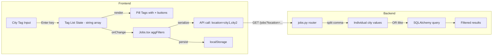

# Design Document: City Multi-Tag Filter

## Overview

This feature transforms the existing single-text city filter in the `JobFilterBar` component into a multi-tag input. Users type a city name, press Enter, and it appears as a removable pill tag. Multiple cities can be active simultaneously, and the backend applies OR logic to return jobs matching ANY selected city.

The change touches three layers:
1. **Frontend component** (`JobFilterBar.tsx`) — new multi-tag input UI replacing the single text input
2. **Frontend page** (`Jobs.tsx`) — data model change from `string` to `string[]`, localStorage migration, API serialization
3. **Backend router** (`jobs.py`) — split comma-separated location param and apply OR-based `ilike` filtering

This is a focused, low-risk change with no new dependencies. The existing inline-style approach and filter pill pattern are preserved.

## Architecture



The data flows as:
1. User types city → presses Enter → tag added to `string[]` state
2. On confirm, `JobFilterBar` calls `onChange` with updated `JobFilters` (location is now `string[]`)
3. `Jobs.tsx` serializes the array as comma-separated string for the API request
4. Backend splits on comma, trims each value, builds OR condition with `ilike` per city
5. State persisted to localStorage as JSON array; legacy single-string values migrated on load

## Components and Interfaces

### JobFilterBar.tsx Changes

**Interface change:**
```typescript
export interface JobFilters {
  country: string;
  location: string[];  // Changed from string to string[]
  work_type: string[];
  role_category: string[];
  experience_level: string[];
  date_posted: string;
}
```

**New internal state:**
```typescript
const [tempLocationTags, setTempLocationTags] = useState<string[]>(filters.location);
const [locationInput, setLocationInput] = useState("");
```

**Tag management functions:**
- `addCityTag(city: string)` — trims, validates non-empty, checks no duplicate, appends to array
- `removeCityTag(city: string)` — filters out the specified city from the array
- `handleKeyDown(e: KeyboardEvent)` — Enter adds tag, Backspace on empty input removes last tag

**New sub-component: CityTagInput**
- Renders existing tags as pill elements with × buttons
- Renders a text input for typing new cities
- Handles keyboard events (Enter, Backspace)

### Jobs.tsx Changes

**State initialization with migration:**
```typescript
location: Array.isArray(parsed.location)
  ? parsed.location
  : typeof parsed.location === "string" && parsed.location
    ? [parsed.location]
    : []
```

**API serialization:**
```typescript
if (aggFilters.location.length > 0) {
  const locationParam = aggFilters.location
    .map(c => c.trim())
    .filter(c => c.length > 0)
    .join(",");
  if (locationParam) params.set("location", locationParam);
}
```

### Backend jobs.py Changes

**Updated location filter logic:**
```python
if location:
    city_values = [c.strip() for c in location.split(",") if c.strip()]
    if city_values:
        from sqlalchemy import or_
        location_conditions = [
            ScrapedJob.location.ilike(f"%{city}%") for city in city_values
        ]
        q = q.filter(or_(*location_conditions))
```

## Data Models

### Filter State (Frontend)

| Field | Old Type | New Type | Notes |
|-------|----------|----------|-------|
| `location` | `string` | `string[]` | Array of city names |

### API Parameter (HTTP)

| Parameter | Format | Example |
|-----------|--------|---------|
| `location` | Comma-separated string | `Ottawa,Toronto,Vancouver` |

### localStorage Schema

```json
{
  "country": "CA",
  "location": ["Ottawa", "Toronto"],
  "work_type": ["remote"],
  "role_category": [],
  "experience_level": ["entry"],
  "date_posted": ""
}
```

**Migration rule:** If `location` is a string (legacy), wrap in single-element array. If invalid/missing, default to `[]`.


## Correctness Properties

*A property is a characteristic or behavior that should hold true across all valid executions of a system — essentially, a formal statement about what the system should do. Properties serve as the bridge between human-readable specifications and machine-verifiable correctness guarantees.*

### Property 1: Adding a city tag grows the list with trimmed value

*For any* non-empty, non-whitespace-only city string and any existing tag list that does not already contain the trimmed version of that string, adding the city shall result in the tag list growing by exactly one element, and the new element shall be the trimmed version of the input string.

**Validates: Requirements 1.1, 1.6**

### Property 2: Invalid inputs are rejected without modifying the tag list

*For any* input that is empty, composed entirely of whitespace, or already exists (case-sensitive) in the current tag list, attempting to add it shall leave the tag list unchanged.

**Validates: Requirements 1.4, 1.5**

### Property 3: Removing a city tag preserves all other tags

*For any* tag list containing at least one element and any city chosen from that list, removing that city shall result in a list that contains all original elements except the removed one, in the same relative order.

**Validates: Requirements 1.2**

### Property 4: Backspace on empty input removes only the last tag

*For any* non-empty tag list, pressing Backspace when the input field is empty shall result in a list equal to the original list with the last element removed.

**Validates: Requirements 7.2**

### Property 5: Serialization produces valid comma-separated string excluding invalid values

*For any* array of strings (including empty strings and whitespace-only strings), serializing for the API shall produce a comma-separated string containing only the non-empty trimmed values, or no parameter at all if no valid values remain.

**Validates: Requirements 3.1, 3.2, 3.3**

### Property 6: Backend OR-logic filter returns exactly matching jobs

*For any* set of jobs with various location strings and any non-empty list of city filter values, the filtered result shall contain exactly those jobs whose location field contains at least one of the filter values as a case-insensitive substring (after trimming each filter value).

**Validates: Requirements 4.1, 4.2, 4.3, 4.4, 4.5**

### Property 7: Location array round-trips through localStorage with migration

*For any* valid location array, saving to localStorage and loading back shall produce the same array. Additionally, *for any* non-empty legacy string value stored in the old format, loading shall produce a single-element array containing that string. *For any* invalid or corrupted location value, loading shall produce an empty array.

**Validates: Requirements 5.1, 5.2, 5.3, 5.4**

## Error Handling

| Scenario | Handling |
|----------|----------|
| Empty/whitespace city input on Enter | Silently reject, do not add tag |
| Duplicate city input | Silently reject, do not add tag |
| localStorage corrupted or missing | Default to empty location array |
| Legacy string in localStorage | Migrate to single-element array |
| Backend receives empty location param | Skip location filter entirely |
| Backend receives whitespace-padded cities | Trim before matching |
| Backend receives single comma (e.g., ",") | Filter out empty values, skip filter if none remain |

No error toasts or user-facing error messages are needed — all invalid inputs are silently handled with sensible defaults.

## Testing Strategy

### Property-Based Tests (Hypothesis + fast-check)

**Backend (Pytest + Hypothesis):**
- Property 6: OR-logic filter correctness — generate random jobs and city filter lists, verify filter results match expected OR semantics
- Minimum 100 iterations per property
- Tag format: `Feature: city-multi-tag-filter, Property 6: Backend OR-logic filter returns exactly matching jobs`

**Frontend (Vitest + fast-check):**
- Property 1: Add city tag — generate random valid city strings and tag lists
- Property 2: Invalid input rejection — generate empty/whitespace/duplicate inputs
- Property 3: Remove city tag — generate random tag lists, pick random element to remove
- Property 4: Backspace removes last — generate random non-empty tag lists
- Property 5: Serialization — generate arrays with mixed valid/invalid strings
- Property 7: localStorage round-trip — generate random arrays, test save/load cycle + migration
- Minimum 100 iterations per property
- Tag format: `Feature: city-multi-tag-filter, Property N: {property_text}`

### Unit Tests (Example-Based)

- Visual styling: verify inline styles match brand colors (#F0EEFF, #D3D3FF, #374151, border-radius 999px)
- Keyboard accessibility: verify × button is focusable and responds to Enter/Space
- Default initialization: verify empty array when no localStorage exists
- Data model type: verify `location` field is `string[]` in the interface

### Integration Tests

- End-to-end filter flow: add multiple cities → verify API call contains correct comma-separated param → verify response contains matching jobs
- localStorage migration: set legacy string value → reload → verify array format
