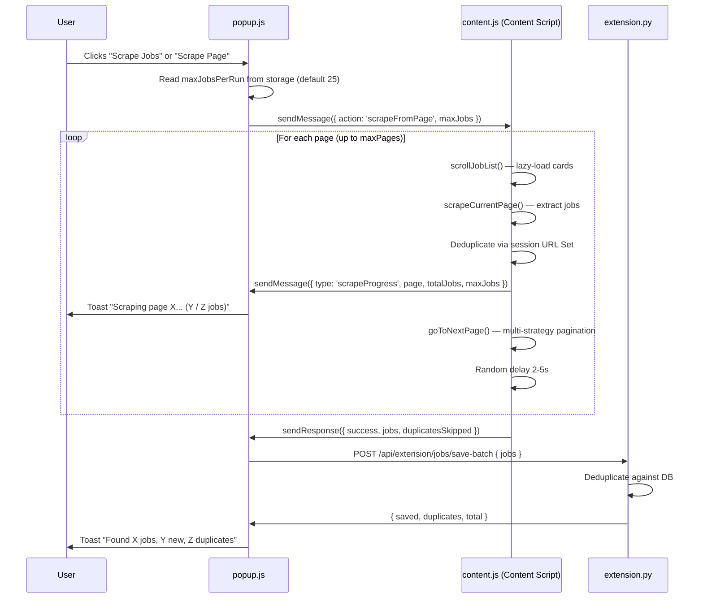

# Design Document: Deep Scrape Pagination

## Overview

This feature overhauls the job scraping pipeline so the authenticated "Scrape Page" approach becomes the primary (and only) scraping method, replacing the guest API path. The system will respect the user's `maxJobsPerRun` setting (up to 500), handle LinkedIn's multiple page layouts (numbered pagination, Next button, URL `start=` param, infinite scroll), provide real-time toast feedback, deduplicate on both client and server, and apply randomized rate limiting between pages.

### Key Changes

1. **Popup (`popup.js`)**: `scrapeJobsFromBackend()` is rewired to use the same authenticated page-scraping flow as `scrapeFromPage()`. Both buttons now trigger `scrapeFromPage()` logic. The popup reads `maxJobsPerRun` from settings and passes it as `maxJobs` to the content script.
2. **Content Script (`content.js`)**: The pagination loop replaces the hardcoded `maxPages: 10` with a dynamic `maxPages = Math.ceil(maxJobs / 25)`. A URL `Set` deduplicates within the session. Rate limiting adds 2–5s random delays between pages. Progress messages are sent per page.
3. **Backend (`extension.py`)**: `save_job_batch` returns `{ saved, duplicates, total }` instead of just `{ saved, total }`.

## Architecture



## Components and Interfaces

### 1. Popup → Content Script Message

```typescript
// Message sent from popup to content script
interface ScrapeRequest {
  action: 'scrapeFromPage';
  maxJobs: number;        // from maxJobsPerRun setting, default 25, max 500
}

// Response from content script
interface ScrapeResponse {
  success: boolean;
  jobs?: ScrapedJob[];
  error?: string;
  duplicatesSkipped?: number;  // in-session duplicates
}
```

### 2. Content Script → Popup Progress Message

```typescript
interface ScrapeProgressMessage {
  type: 'scrapeProgress';
  page: number;
  totalJobs: number;
  maxJobs: number;
}
```

### 3. Backend Save Batch Endpoint

```typescript
// POST /api/extension/jobs/save-batch
// Request body
interface SaveBatchRequest {
  jobs: ScrapedJob[];
}

// Response (updated)
interface SaveBatchResponse {
  saved: number;       // newly saved
  duplicates: number;  // skipped (already in DB)
  total: number;       // total in request
}
```

### 4. Content Script Internal Components

| Component | Responsibility |
|---|---|
| `scrapeCurrentPage()` | Extract job cards from current DOM (link-based + SDUI) |
| `scrollJobList()` | Scroll containers to trigger lazy loading |
| `goToNextPage()` | Multi-strategy pagination: numbered → Next → URL param |
| `loadMoreCollections()` | Infinite scroll for `/jobs/collections/` pages |
| `sessionUrlSet` (Set) | Client-side dedup within scrape session |
| `randomDelay(min, max)` | Rate limiting helper (2000–5000ms) |

### 5. Popup Functions

| Function | Change |
|---|---|
| `scrapeFromPage()` | Read `maxJobsPerRun`, pass as `maxJobs`, show progress toasts, display final saved/duplicates counts |
| `scrapeJobsFromBackend()` | Rewired: constructs LinkedIn search URL from settings, navigates tab, then calls `scrapeFromPage()` logic |

## Data Models

### ScrapedJob (client-side, unchanged)

```javascript
{
  title: string,      // max 100 chars
  company: string,    // max 100 chars
  url: string,        // canonical: https://www.linkedin.com/jobs/view/{id}
  location: string,
  atsType: 'easy_apply' | 'external',
  easyApply: 0 | 1
}
```

### SaveBatchResponse (backend, updated)

```python
# Current: {"saved": int, "total": int}
# New:     {"saved": int, "duplicates": int, "total": int}
```

### Settings Storage (Chrome extension)

```javascript
// Relevant fields in chrome.storage.local → settings
{
  maxJobsPerRun: number,    // 1–500, default 25
  jobTitle: string,
  searchLocation: string,
  backendUrl: string
}
```


## Correctness Properties

*A property is a characteristic or behavior that should hold true across all valid executions of a system — essentially, a formal statement about what the system should do. Properties serve as the bridge between human-readable specifications and machine-verifiable correctness guarantees.*

### Property 1: maxPages calculation

*For any* valid `maxJobs` value (1–500), `Math.ceil(maxJobs / 25)` should produce a `maxPages` value such that `maxPages * 25 >= maxJobs` and `(maxPages - 1) * 25 < maxJobs`.

**Validates: Requirements 1.2**

### Property 2: Pagination stops at job limit

*For any* `maxJobs` value and any sequence of page scrape results (each returning 0–25 jobs), the pagination loop should stop as soon as the cumulative job count equals or exceeds `maxJobs`, and the total returned jobs should not exceed `maxJobs + 24` (at most one extra page worth).

**Validates: Requirements 1.4**

### Property 3: maxJobsPerRun input validation

*For any* integer value provided as `maxJobsPerRun`, the system should accept values in [1, 500] and clamp or reject values outside that range. Invalid inputs (undefined, null, NaN, 0, negative) should resolve to the default of 25.

**Validates: Requirements 1.3, 1.5**

### Property 4: LinkedIn search URL construction

*For any* non-empty `jobTitle` and `searchLocation` strings, the constructed LinkedIn search URL should contain the URL-encoded `jobTitle` as the `keywords` parameter, the URL-encoded `searchLocation` as the `location` parameter, and include the `f_AL=true` Easy Apply filter.

**Validates: Requirements 2.2**

### Property 5: Empty page stops pagination

*For any* pagination sequence where a page returns 0 new jobs (after deduplication) and at least one page has already been scraped, the pagination loop should terminate and return all previously collected jobs.

**Validates: Requirements 3.3**

### Property 6: Progress message formatting

*For any* page number (≥1), totalJobs count (≥0), and maxJobs target (≥1), the formatted progress toast string should match the pattern `"Scraping page {page}... ({totalJobs} / {maxJobs} jobs)"` and contain all three numeric values.

**Validates: Requirements 4.1, 4.2**

### Property 7: Server-side deduplication accounting

*For any* batch of jobs submitted to `save_job_batch` where some URLs already exist in the database, the response should satisfy `saved + duplicates == total` where `total` is the count of jobs with non-empty URLs, `saved` is the count of newly inserted jobs, and `duplicates` is the count of jobs whose URLs were already present.

**Validates: Requirements 5.1, 5.2, 5.3**

### Property 8: Rate limiting delay bounds

*For any* invocation of the random delay function, the returned delay value should be in the range [2000, 5000] milliseconds (inclusive).

**Validates: Requirements 6.1**

### Property 9: Client-side session deduplication

*For any* array of scraped job objects (potentially containing duplicate URLs), after client-side deduplication: (a) all URLs in the output array should be unique, and (b) `duplicatesSkipped` should equal `totalScraped - uniqueCount`.

**Validates: Requirements 7.2, 7.3**

## Error Handling

| Scenario | Behavior |
|---|---|
| `maxJobsPerRun` missing/invalid | Default to 25 |
| Content script not on LinkedIn | Show error toast, abort |
| No Easy Apply jobs found | Show info toast, return empty |
| Pagination loads 0 new jobs | Stop loop, return collected jobs |
| HTTP error / "too many requests" on page | Stop loop, return collected jobs, include reason in response |
| Backend `save-batch` fails | Show error toast, do not offer to apply |
| URL parameter navigation timeout (10s) | Stop pagination, return collected jobs |
| Chrome messaging failure (popup closed) | Silently catch, continue scraping |

## Testing Strategy

### Property-Based Tests

Use **fast-check** (JavaScript) for content script and popup logic, and **Hypothesis** (Python) for backend endpoint logic. Each property test runs a minimum of 100 iterations.

| Property | Library | Target |
|---|---|---|
| P1: maxPages calculation | fast-check | `calculateMaxPages(maxJobs)` helper |
| P2: Pagination stops at job limit | fast-check | Pagination loop simulation |
| P3: maxJobsPerRun validation | fast-check | `resolveMaxJobs(setting)` helper |
| P4: URL construction | fast-check | `buildLinkedInSearchUrl(title, location)` helper |
| P5: Empty page stops pagination | fast-check | Pagination loop simulation |
| P6: Progress message formatting | fast-check | `formatProgressToast(page, total, max)` helper |
| P7: Server dedup accounting | Hypothesis | `save_job_batch` endpoint |
| P8: Delay bounds | fast-check | `randomDelay(min, max)` helper |
| P9: Client dedup | fast-check | `deduplicateJobs(jobs)` helper |

Each test must be tagged with: `Feature: deep-scrape-pagination, Property {N}: {title}`

### Unit Tests

Unit tests cover specific examples, edge cases, and integration points:

- Default maxJobs when setting is undefined, null, 0, negative, NaN, "abc"
- maxPages for boundary values: 1, 25, 26, 500
- URL construction with special characters in job title
- `save_job_batch` with empty batch, all-duplicate batch, mixed batch
- Progress toast with page=1, totalJobs=0, maxJobs=25
- Rate limit detection (page contains "too many requests" text)
- Collections page detection from URL
- Scroll interval constants are in [250, 400]

### Test Organization

- `extension/tests/test_deep_scrape_property.js` — fast-check property tests (P1–P6, P8–P9)
- `backend/tests/test_save_batch_dedup_property.py` — Hypothesis property test (P7)
- `extension/tests/test_deep_scrape.js` — unit tests for edge cases and examples
- `backend/tests/test_save_batch_dedup.py` — unit tests for backend endpoint
