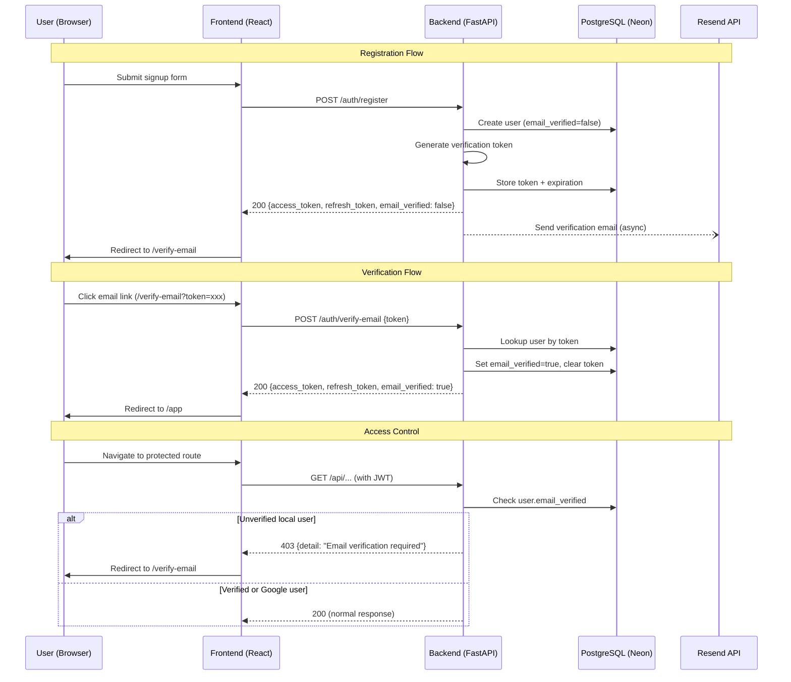
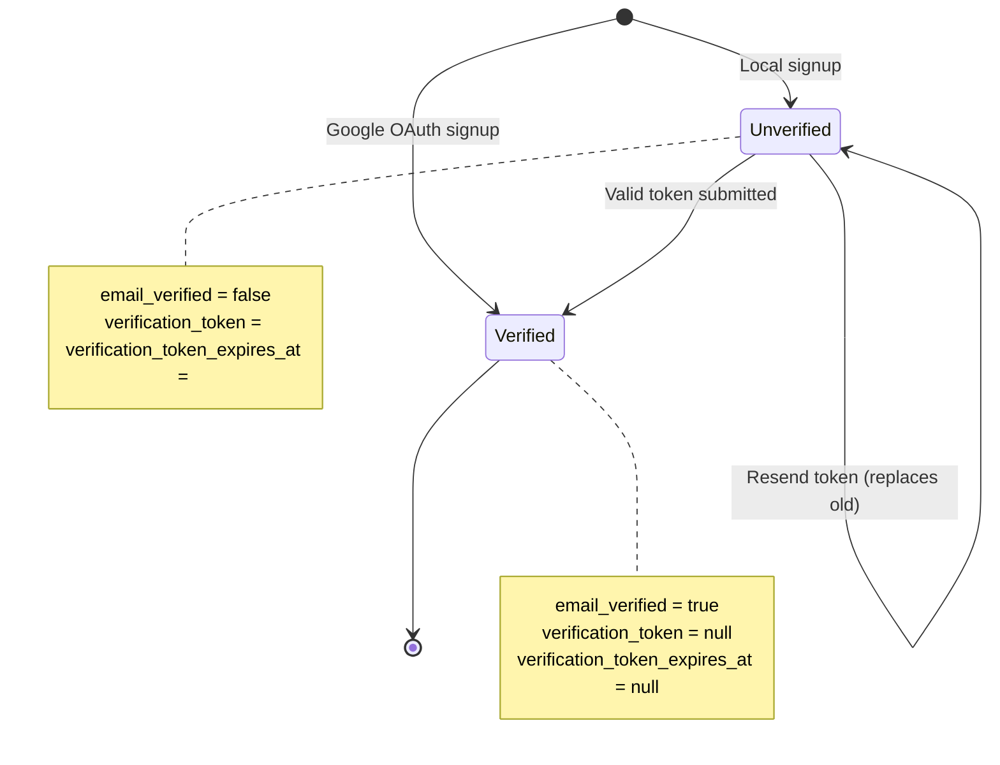

# Design Document: Email Verification

## Overview

This design adds email verification for local (email+password) signups to the Tailrd platform. After registration, local users must verify their email before accessing protected features. Google OAuth users bypass verification since Google already validates their email.

The system uses the Resend transactional email service to deliver verification emails containing a time-limited token link. The architecture introduces a verification service layer, extends the User model, adds middleware-level access control, and provides a frontend verification flow.

### Key Design Decisions

1. **Token storage in User model** (not a separate table): Since each user has at most one pending token, storing it directly on the User row avoids joins and simplifies cleanup.
2. **Resend as email provider**: Lightweight API, good deliverability, simple integration — no SMTP configuration needed.
3. **Middleware-based access control**: A FastAPI dependency checks verification status before reaching route handlers, keeping route logic clean.
4. **Tokens returned on verification success**: The verify endpoint returns fresh JWT tokens so the frontend can immediately transition to authenticated+verified state without re-login.
5. **Rate limiting via token timestamp**: Instead of a separate rate-limit store, we use `verification_token_expires_at` minus 23h59m to determine when the last token was generated, avoiding additional infrastructure.

## Architecture



## Components and Interfaces

### Backend Components

#### 1. `backend/services/email_service.py` — Email Gateway

Handles all communication with the Resend API.

```python
"""Email delivery service using Resend API."""

import logging
import os
from typing import Optional

logger = logging.getLogger(__name__)


class EmailService:
    """Sends transactional emails via Resend."""

    def __init__(self):
        self.api_key: Optional[str] = os.getenv("RESEND_API_KEY")
        self.from_email: Optional[str] = os.getenv("RESEND_FROM_EMAIL")
        self.frontend_url: Optional[str] = os.getenv("FRONTEND_URL")

        if not self.api_key or not self.from_email:
            logger.warning(
                "RESEND_API_KEY or RESEND_FROM_EMAIL not set. "
                "Email sending will be skipped."
            )

    @property
    def is_configured(self) -> bool:
        """Check if email service has required configuration."""
        return bool(self.api_key and self.from_email)

    def send_verification_email(self, to_email: str, token: str) -> bool:
        """
        Send a verification email with the token link.

        Args:
            to_email: Recipient email address.
            token: The verification token to embed in the link.

        Returns:
            True if email was sent successfully, False otherwise.
        """
        ...

    def _build_verification_link(self, token: str) -> str:
        """Construct the verification URL: {FRONTEND_URL}/verify-email?token={token}"""
        ...


# Module-level singleton, initialized once at import time
email_service = EmailService()
```

#### 2. `backend/services/verification_service.py` — Verification Service

Handles token generation, validation, and rate limiting logic.

```python
"""Verification token generation and validation."""

import secrets
import datetime
from typing import Optional, Tuple

from sqlalchemy.orm import Session

from backend.db.models import User


TOKEN_LENGTH = 32
TOKEN_EXPIRY_HOURS = 24
RESEND_COOLDOWN_SECONDS = 60


def generate_token() -> str:
    """Generate a cryptographically random URL-safe token of exactly 32 characters."""
    return secrets.token_urlsafe(TOKEN_LENGTH)[:TOKEN_LENGTH]


def create_verification_token(user: User, db: Session) -> str:
    """
    Generate a new verification token for the user.
    Replaces any existing token.

    Args:
        user: The user to generate a token for.
        db: Database session.

    Returns:
        The generated token string.
    """
    ...


def verify_token(token: str, db: Session) -> Tuple[Optional[User], Optional[str]]:
    """
    Validate a verification token.

    Args:
        token: The token string to validate.
        db: Database session.

    Returns:
        Tuple of (user, error_message).
        On success: (user, None)
        On failure: (None, error_description)
    """
    ...


def can_resend(user: User) -> Tuple[bool, int]:
    """
    Check if the user can request a new verification email.

    Args:
        user: The user requesting resend.

    Returns:
        Tuple of (can_resend, remaining_seconds).
        If can_resend is False, remaining_seconds indicates wait time.
    """
    ...


def mark_verified(user: User, db: Session) -> None:
    """
    Mark a user as email-verified and clear token fields.

    Args:
        user: The user to mark as verified.
        db: Database session.
    """
    ...
```

#### 3. `backend/auth/dependencies.py` — Extended Auth Middleware

New dependency that enforces email verification on protected routes.

```python
from fastapi import Request

# Endpoints accessible to unverified users
VERIFICATION_EXEMPT_PATHS = {
    "/auth/verify-email",
    "/auth/resend-verification",
    "/auth/me",
    "/auth/refresh",
    "/auth/logout",
}


async def get_verified_user(
    request: Request,
    user: User = Depends(get_current_user),
) -> User:
    """
    Requires the user to be email-verified (or Google OAuth).
    Raises HTTP 403 if a local user is unverified and the endpoint
    is not in the exempt list.
    """
    ...
```

#### 4. `backend/routers/auth.py` — New/Modified Endpoints

New endpoints:
- `POST /auth/verify-email` — Verify token, return tokens
- `POST /auth/resend-verification` — Resend verification email

Modified endpoints (response schema change):
- `POST /auth/register` — Now includes `email_verified: false` + triggers verification email
- `POST /auth/login` — Now includes `email_verified` field
- `POST /auth/google` — Now includes `email_verified: true`
- `POST /auth/refresh` — Now includes `email_verified` field
- `GET /auth/me` — Now includes `email_verified` field

```python
# New schemas

class TokenResponseWithVerification(BaseModel):
    access_token: str
    refresh_token: str
    token_type: str = "bearer"
    email_verified: bool


class VerifyEmailRequest(BaseModel):
    token: str


class ResendVerificationResponse(BaseModel):
    message: str


# New endpoints

@router.post("/verify-email", response_model=TokenResponseWithVerification)
def verify_email(body: VerifyEmailRequest, db: Session = Depends(get_db)):
    """Verify a user's email with the provided token."""
    ...


@router.post("/resend-verification", response_model=ResendVerificationResponse)
def resend_verification(
    user: User = Depends(get_current_user),
    db: Session = Depends(get_db),
):
    """Resend verification email to the authenticated user."""
    ...
```

#### 5. `backend/migrations/add_email_verification.py` — Migration Script

```python
"""
Migration: Add email verification fields to users table.

Adds:
  - email_verified (Boolean, NOT NULL, default false)
  - verification_token (String(255), nullable)
  - verification_token_expires_at (DateTime, nullable)

Sets email_verified=true for all existing rows (grandfather clause).
Idempotent: skips columns that already exist.
"""

from sqlalchemy import text, inspect
from backend.db.database import engine


def run_migration():
    """Execute the email verification migration."""
    ...
```

### Frontend Components

#### 6. `frontend/src/pages/VerifyEmail.tsx` — Verification Page

Handles two modes:
1. **Pending mode** (no token in URL): Shows "check your inbox" message with resend button
2. **Verifying mode** (token in URL): Calls verify endpoint, shows result

```typescript
interface VerifyEmailPageProps {}

// States: "pending" | "verifying" | "success" | "expired" | "error"
export default function VerifyEmailPage(): JSX.Element { ... }
```

#### 7. `frontend/src/auth/AuthContext.tsx` — Updated Types

```typescript
export interface UserProfile {
  id: number;
  email: string;
  first_name: string;
  last_name: string;
  profile_image_url?: string;
  created_at?: string;
  email_verified: boolean;  // NEW
}

export interface AuthContextValue extends AuthState {
  // ... existing methods ...
  resendVerification: () => Promise<void>;  // NEW
  isEmailVerified: boolean;                 // NEW computed property
}
```

#### 8. `frontend/src/auth/AuthProvider.tsx` — Updated Provider

- `register()` now checks `email_verified` in response and sets user state accordingly
- New `resendVerification()` method calls `POST /auth/resend-verification`
- `isEmailVerified` computed from `user?.email_verified ?? false`

#### 9. `frontend/src/auth/ProtectedRoute.tsx` — Updated Route Guard

```typescript
export function ProtectedRoute({ children }: ProtectedRouteProps) {
  const { isAuthenticated, isLoading, isEmailVerified } = useAuth();

  if (isLoading) return <Spinner />;
  if (!isAuthenticated) return <Navigate to="/sign-in" replace />;
  if (!isEmailVerified) return <Navigate to="/verify-email" replace />;

  return <>{children}</>;
}
```

## Data Models

### User Model Extension

```python
class User(Base):
    __tablename__ = "users"

    # ... existing fields ...

    # Email verification fields
    email_verified = Column(Boolean, default=False, nullable=False)
    verification_token = Column(String(255), nullable=True, default=None)
    verification_token_expires_at = Column(DateTime, nullable=True, default=None)
```

### Token Response Schema (Updated)

```python
class TokenResponseWithVerification(BaseModel):
    access_token: str
    refresh_token: str
    token_type: str = "bearer"
    email_verified: bool
```

### Verify Email Request Schema

```python
class VerifyEmailRequest(BaseModel):
    token: str  # Required, non-empty (Pydantic enforces via str type)
```

### State Transitions




## Correctness Properties

*A property is a characteristic or behavior that should hold true across all valid executions of a system — essentially, a formal statement about what the system should do. Properties serve as the bridge between human-readable specifications and machine-verifiable correctness guarantees.*

### Property 1: User creation defaults by auth provider

*For any* valid registration, if the auth_provider is "local" then `email_verified` SHALL be `false`, and if the auth_provider is "google" then `email_verified` SHALL be `true` and both `verification_token` and `verification_token_expires_at` SHALL be `null`.

**Validates: Requirements 1.1, 1.2, 8.1, 8.2**

### Property 2: Token format invariant

*For any* invocation of `generate_token()`, the result SHALL be exactly 32 characters long and consist only of URL-safe alphanumeric characters (a-z, A-Z, 0-9, hyphen, underscore).

**Validates: Requirements 2.1, 3.1**

### Property 3: Token expiration is 24 hours from creation

*For any* call to `create_verification_token()`, the stored `verification_token_expires_at` SHALL be within 1 second of exactly 24 hours after the current time.

**Validates: Requirements 1.4, 2.2, 3.1**

### Property 4: Token replacement (idempotence)

*For any* user, calling `create_verification_token()` N times (N ≥ 1) SHALL result in exactly one token stored on the user record, and that token SHALL be the one from the most recent call.

**Validates: Requirements 2.3, 5.1**

### Property 5: Token validation correctness

*For any* token string T and database state:
- If T matches a stored token AND the current time is before `verification_token_expires_at`, then `verify_token(T)` SHALL return the associated user with no error.
- If T matches a stored token AND the current time is at or after `verification_token_expires_at`, then `verify_token(T)` SHALL return an expiration error.
- If T does not match any stored token, then `verify_token(T)` SHALL return an invalid token error.

**Validates: Requirements 2.4, 2.5, 3.7, 4.1, 4.3, 4.4**

### Property 6: Verification state transition

*For any* user with `email_verified=false` and a valid non-expired token, after calling `mark_verified()`, the user SHALL have `email_verified=true`, `verification_token=null`, and `verification_token_expires_at=null`.

**Validates: Requirements 1.5, 4.1, 4.2**

### Property 7: Verification email link format

*For any* valid token string and configured `FRONTEND_URL`, the verification link embedded in the email SHALL equal `{FRONTEND_URL}/verify-email?token={token}`.

**Validates: Requirements 3.3**

### Property 8: Registration fault tolerance

*For any* registration where the email service fails (raises exception or returns error), the registration endpoint SHALL still return a successful response containing valid `access_token`, `refresh_token`, and `email_verified=false`.

**Validates: Requirements 3.5**

### Property 9: Access control for unverified local users

*For any* authenticated local user with `email_verified=false` and *for any* request path:
- If the path is NOT in the exempt set (`/auth/verify-email`, `/auth/resend-verification`, `/auth/me`, `/auth/refresh`, `/auth/logout`), the middleware SHALL return HTTP 403.
- If the path IS in the exempt set, the middleware SHALL permit the request.

**Validates: Requirements 3.6, 6.1, 6.2**

### Property 10: Google OAuth verification bypass

*For any* authenticated user with `auth_provider="google"` and *for any* request path, the verification middleware SHALL permit the request regardless of the `email_verified` field value.

**Validates: Requirements 6.3**

### Property 11: Rate limiting on resend

*For any* user, if `create_verification_token()` was called at time T, then calling `can_resend()` at any time before T + 60 seconds SHALL return `(False, remaining_seconds)` where `remaining_seconds > 0`, and calling it at or after T + 60 seconds SHALL return `(True, 0)`.

**Validates: Requirements 5.2, 5.3**

### Property 12: All token responses include email_verified

*For any* successful call to `/auth/register`, `/auth/login`, `/auth/google`, `/auth/refresh`, or `/auth/verify-email`, the JSON response SHALL contain an `email_verified` field that is a boolean value matching the user's current `email_verified` database state.

**Validates: Requirements 8.1, 8.2, 8.3, 8.4, 8.5**

### Property 13: Session preservation on 403

*For any* unverified local user who receives a 403 response from the verification middleware, subsequent requests to exempt endpoints with the same JWT SHALL succeed (the session is not invalidated).

**Validates: Requirements 6.5, 6.6**

## Error Handling

### Backend Error Responses

| Scenario | Status Code | Response Body |
|----------|-------------|---------------|
| Token missing/empty in verify request | 422 | `{"detail": "field required"}` (Pydantic) |
| Token invalid/not found | 400 | `{"detail": "Invalid verification token"}` |
| Token expired | 410 | `{"detail": "Verification token has expired. Please request a new one."}` |
| Already verified (verify endpoint) | 400 | `{"detail": "Email is already verified"}` |
| Already verified (resend endpoint) | 400 | `{"detail": "Email is already verified"}` |
| Rate limited (resend) | 429 | `{"detail": "Please wait before requesting another email", "retry_after": <seconds>}` |
| Email send failure (resend) | 500 | `{"detail": "Failed to send verification email. Please try again later."}` |
| Unverified user on protected route | 403 | `{"detail": "Email verification required"}` |
| FRONTEND_URL not configured | 500 | `{"detail": "Server configuration error"}` (logged internally) |

### Backend Error Handling Strategy

1. **Email delivery failures during registration**: Caught silently, logged as warning. Registration succeeds regardless.
2. **Email delivery failures during resend**: Returned as 500 to the user since they explicitly requested the action.
3. **Database errors**: Standard SQLAlchemy exception handling with transaction rollback.
4. **Missing environment variables**: Logged at startup. Email operations gracefully degrade (skip sending).

### Frontend Error Handling

1. **Network errors**: Display generic "Something went wrong" with retry option.
2. **410 (expired token)**: Show "Link expired" message with prominent "Resend Email" button.
3. **400 (invalid token)**: Show "Invalid link" message with "Resend Email" button.
4. **429 (rate limited)**: Disable resend button, show countdown timer.
5. **403 on API calls**: Redirect to `/verify-email` page (handled by axios interceptor).

## Testing Strategy

### Property-Based Tests (Backend — Hypothesis)

The following properties will be tested using Hypothesis with a minimum of 100 iterations each:

| Property | Test Target | Generator Strategy |
|----------|-------------|-------------------|
| P1: User creation defaults | `User` model creation | Random emails + passwords + auth_providers |
| P2: Token format | `generate_token()` | No input (stateless function) |
| P3: Token expiration | `create_verification_token()` | Random users |
| P4: Token replacement | `create_verification_token()` | Random users, called N times |
| P5: Token validation | `verify_token()` | Random tokens × random DB states (valid/expired/missing) |
| P6: Verification transition | `mark_verified()` | Random unverified users with tokens |
| P7: Email link format | `_build_verification_link()` | Random tokens × random FRONTEND_URLs |
| P8: Fault tolerance | Register endpoint | Random registrations × mocked email failures |
| P9: Access control | Verification middleware | Random unverified users × random paths |
| P10: Google bypass | Verification middleware | Random Google users × random paths |
| P11: Rate limiting | `can_resend()` | Random users × random time offsets |
| P12: Response format | All token endpoints | Random valid requests |
| P13: Session preservation | Middleware + subsequent requests | Random unverified users |

**Library**: `hypothesis` (already in requirements.txt)
**Configuration**: `@settings(max_examples=100)`
**Tag format**: `# Feature: email-verification, Property {N}: {title}`

### Unit Tests (Backend — Pytest)

Example-based tests for specific scenarios:
- Registration with duplicate email returns 409
- Verify with empty token returns 422
- Verify already-verified user returns 400
- Resend for verified user returns 400
- Rate limit returns 429 with correct `retry_after` value
- Migration is idempotent (running twice doesn't error)
- `/auth/me` response includes `email_verified` field

### Frontend Tests (Vitest + fast-check)

**Property tests** (fast-check, 100+ iterations):
- P7 (link format): For any token, the constructed URL matches the expected pattern
- Frontend route guard: For any unverified user state, protected routes redirect to `/verify-email`

**Example-based tests** (Vitest):
- VerifyEmail page renders email and instructions
- Resend button triggers API call
- 429 response disables button and shows countdown
- Successful verification stores tokens and redirects
- Expired token shows error with resend option
- Invalid token shows error with resend option

### Integration Tests

- Full registration → email sent → verify flow (mocked Resend)
- Resend flow with rate limiting
- Access control: unverified user blocked, then verified, then unblocked
- Migration on existing database with users
