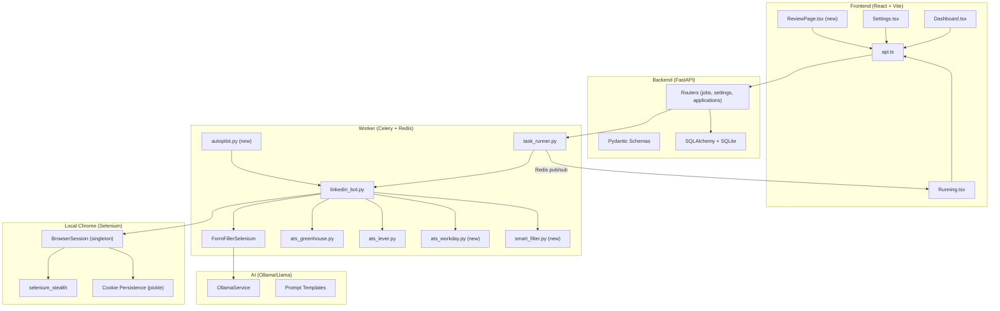
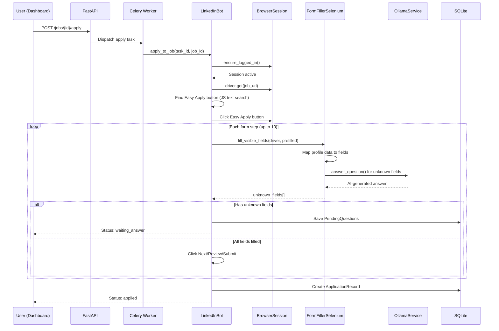
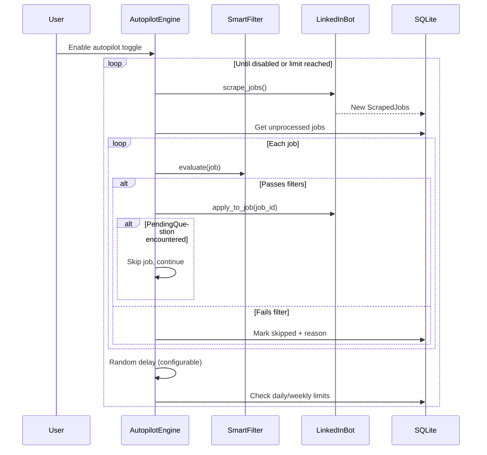

# Design Document: End-to-End Easy Apply

## Overview

This design covers the full automation pipeline for the Auto Apply Bot: LinkedIn authentication, Easy Apply form completion, external ATS support (Greenhouse, Lever, Workday), application tracking, autopilot mode, smart filtering, AI-powered assistance, HR outreach, browser UX, and desktop packaging.

The system follows a layered architecture where a React+Vite dashboard communicates with a FastAPI backend, which dispatches Celery tasks to a worker process. The worker drives a local Chrome browser via Selenium+selenium_stealth. An Ollama/Llama AI service provides intelligent form filling, resume matching, and cover letter generation.

Key design constraints:
- Browser automation MUST use local Chrome + Selenium + selenium_stealth (not Docker, not Playwright, not headless)
- LinkedIn uses obfuscated CSS classes — buttons must be found by JavaScript `span.textContent`
- Easy Apply forms live inside iframes — must `driver.switch_to.frame()`
- Anti-detection: `excludeSwitches["enable-automation"]`, `useAutomationExtension=False`
- ATS modules (Greenhouse, Lever) currently use Playwright and must be migrated to Selenium
- Cookie persistence via pickle files for session reuse

## Architecture



### Data Flow for Easy Apply



### Autopilot Flow



## Components and Interfaces

### 1. BrowserSession (existing, enhanced)

File: `backend/services/browser_pool.py`

Singleton managing a persistent Chrome instance with anti-detection stealth.

```python
class BrowserSession:
    def get() -> BrowserSession          # Singleton accessor
    def driver -> WebDriver              # Lazy-launch Chrome
    def ensure_logged_in(settings) -> None
    def close() -> None
    
    # Enhanced:
    def keep_alive() -> None             # Mouse move / scroll every 5 min
    def take_screenshot(name: str) -> str  # Returns saved file path
    def is_session_valid() -> bool       # Check /feed URL without full nav
```

Login order: saved cookies → li_at cookie injection → credential login → 2FA prompt via Dashboard.

### 2. FormFillerSelenium (existing, enhanced)

File: `backend/bot/form_filler_selenium.py`

Fills form fields using profile data, prefilled answers, and AI fallback.

```python
class FormFillerSelenium:
    def fill_visible_fields(driver, prefilled) -> list[dict]
    
    # Enhanced:
    def fill_with_ai_fallback(driver, prefilled, ollama: OllamaService, resume_text: str) -> list[dict]
    def fill_in_iframe(driver, prefilled) -> list[dict]  # Handles iframe switching
    def _set_react_value(driver, element, value) -> None  # Native setter + events
```

Field fill priority: profile mapping → prefilled answers → AI (OllamaService) → PendingQuestion.

Iframe handling: switch to each iframe, fill fields, switch back to default content.

React value persistence: `send_keys()` primary, JS native setter fallback with `input`/`change`/`blur` events.

### 3. LinkedInBot (existing, enhanced)

File: `backend/bot/linkedin_bot.py`

Core bot logic for scraping and applying.

```python
# Existing functions (enhanced):
def scrape_jobs(task_id: str) -> None
def apply_to_job(task_id: str, job_id: int) -> str
def _do_easy_apply(task_id, driver, job, settings, db) -> str

# New functions:
def _detect_already_applied(driver) -> bool
def _discard_modal(driver) -> None          # ESC key + dismiss dialog
def _take_pre_submit_screenshot(driver, job_id) -> str
def _follow_company(driver) -> None
```

Easy Apply button detection: aria-label selectors first, then JavaScript `span.textContent` fallback walking up to parent `<button>`.

### 4. ATS Handlers (migrated to Selenium)

Files: `backend/bot/ats_greenhouse.py`, `backend/bot/ats_lever.py`, `backend/bot/ats_workday.py` (new)

All ATS handlers share the same interface:

```python
def is_<ats>(url: str) -> bool
def apply_<ats>(driver: WebDriver, settings: dict, prefilled: dict, 
                task_id: str, log_fn, ollama: OllamaService) -> tuple[str, list[dict]]
```

Migration: Replace all `page.query_selector()` → `driver.find_element()`, `page.fill()` → `element.send_keys()`, `page.query_selector_all()` → `driver.find_elements()`, `page.set_input_files()` → `element.send_keys(file_path)`.

### 5. SmartFilter (new)

File: `backend/bot/smart_filter.py`

Evaluates jobs against user-defined filter rules before applying.

```python
class SmartFilter:
    def __init__(self, settings: dict)
    def evaluate(self, job: ScrapedJob) -> tuple[bool, str]
    # Returns (passes, skip_reason)
    
    def _check_company_blacklist(self, job) -> str | None
    def _check_keyword_blacklist(self, job) -> str | None
    def _check_salary_range(self, job) -> str | None
    def _check_experience_range(self, job) -> str | None
    def _check_already_applied(self, job, db) -> str | None
```

### 6. AutopilotEngine (new)

File: `backend/bot/autopilot.py`

Continuous auto-apply loop with configurable limits and delays.

```python
class AutopilotEngine:
    def __init__(self, settings: dict, smart_filter: SmartFilter)
    def run(self, task_id: str) -> None    # Main loop
    def _check_limits(self, db) -> bool    # Daily/weekly limit check
    def _random_delay(self) -> None        # Human-like delay between apps
```

### 7. OllamaService (existing, enhanced)

File: `backend/services/ollama_service.py`

```python
class OllamaService:
    # Existing:
    async def analyze_resume(raw_text) -> ResumeProfile
    async def generate_cover_letter(profile, job) -> str
    async def answer_question(question, context) -> str
    async def match_job(resume_text, title, company, desc) -> dict
    
    # Enhanced:
    async def answer_form_question(question, options, resume_text) -> str  # For select/radio
    async def extract_experience_years(description) -> int | None
    async def generate_connection_message(profile, job_title, company) -> str
    async def tailor_resume(resume_text, job_description) -> str
```

### 8. TaskRunner (existing, enhanced)

File: `backend/services/task_runner.py`

```python
# Existing:
def start_scrape_task() -> str
def start_apply_task(job_id) -> str
def publish_log(task_id, message) -> None
async def stream_logs(task_id) -> AsyncGenerator

# New:
def start_autopilot_task() -> str
def stop_autopilot_task(task_id) -> bool
def start_connect_task(job_id) -> str
```

### 9. Frontend Components (enhanced + new)

New pages/components:
- `ReviewPage.tsx` — Application review with screenshots, filters, CSV export
- `AutopilotPanel` — Toggle, stats, recently-applied carousel
- Enhanced `Settings.tsx` — Blacklists, salary range, experience range, autopilot config, pause-before-submit toggle, follow companies toggle, HR outreach toggle

New API endpoints:
- `GET /applications/review` — Paginated applications with screenshot paths
- `GET /applications/export` — CSV download
- `POST /autopilot/start` / `POST /autopilot/stop`
- `GET /autopilot/status` — Current stats
- `POST /jobs/{id}/connect` — Send HR connection request

## Data Models

### Enhanced ScrapedJob

```python
class ScrapedJob(Base):
    # Existing fields preserved...
    
    # New fields:
    experience_years_required = Column(Integer, nullable=True)  # AI-extracted
    skip_reason = Column(String, default="")  # Why it was filtered out
```

### Enhanced ApplicationRecord

```python
class ApplicationRecord(Base):
    # Existing fields preserved...
    
    # New fields:
    screenshot_path = Column(String, default="")        # Pre-submit screenshot
    failure_screenshot_path = Column(String, default="") # Failure debug screenshot
    cover_letter_text = Column(Text, default="")         # Generated cover letter
    questions_answered = Column(JSON, default=list)       # [{question, answer, source}]
    ats_type = Column(String, default="")                # easy_apply, greenhouse, etc.
    resume_version = Column(String, default="original")  # original or tailored
```

### Enhanced UserSettings

```python
class UserSettings(Base):
    # Existing fields preserved...
    
    # New fields:
    company_blacklist = Column(JSON, default=list)       # ["Company A", "Company B"]
    keyword_blacklist = Column(JSON, default=list)       # ["unpaid", "intern only"]
    min_salary = Column(Integer, nullable=True)          # Minimum salary filter
    max_salary = Column(Integer, nullable=True)          # Maximum salary filter
    min_experience_years = Column(Integer, nullable=True)
    max_experience_years = Column(Integer, nullable=True)
    autopilot_enabled = Column(Integer, default=0)
    daily_apply_limit = Column(Integer, default=50)
    weekly_apply_limit = Column(Integer, default=200)
    apply_delay_min = Column(Float, default=30.0)        # Seconds between apps
    apply_delay_max = Column(Float, default=120.0)
    pause_before_submit = Column(Integer, default=0)
    follow_companies = Column(Integer, default=0)
    hr_outreach_enabled = Column(Integer, default=0)
    hr_daily_connect_limit = Column(Integer, default=10)
    smooth_scrolling = Column(Integer, default=0)
    resume_tailoring_enabled = Column(Integer, default=0)
```

### New: ConnectionRequest

```python
class ConnectionRequest(Base):
    __tablename__ = "connection_requests"
    
    id = Column(Integer, primary_key=True, index=True)
    job_id = Column(Integer, nullable=True)
    contact_name = Column(String, nullable=False)
    contact_title = Column(String, default="")
    company = Column(String, nullable=False)
    role_applied = Column(String, default="")
    message_sent = Column(Text, default="")
    status = Column(String, default="sent")  # sent, accepted, pending
    sent_at = Column(DateTime, default=datetime.datetime.utcnow)
```

### New: AutopilotRun

```python
class AutopilotRun(Base):
    __tablename__ = "autopilot_runs"
    
    id = Column(Integer, primary_key=True, index=True)
    task_id = Column(String, unique=True, index=True)
    started_at = Column(DateTime, default=datetime.datetime.utcnow)
    stopped_at = Column(DateTime, nullable=True)
    total_applied = Column(Integer, default=0)
    total_skipped = Column(Integer, default=0)
    total_failed = Column(Integer, default=0)
    total_waiting = Column(Integer, default=0)
    status = Column(String, default="running")  # running, stopped, limit_reached
```

