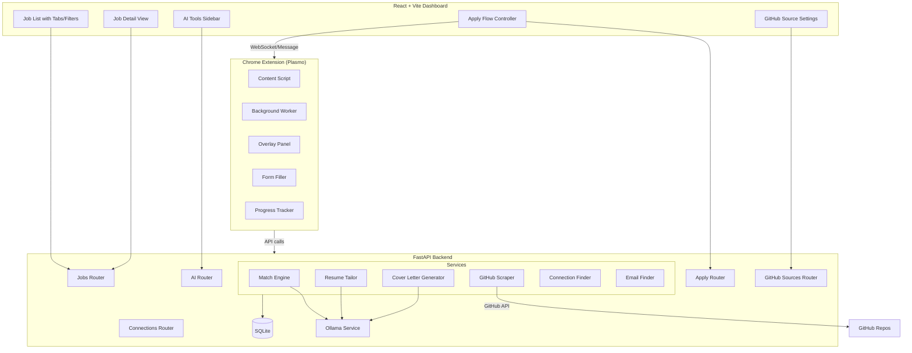
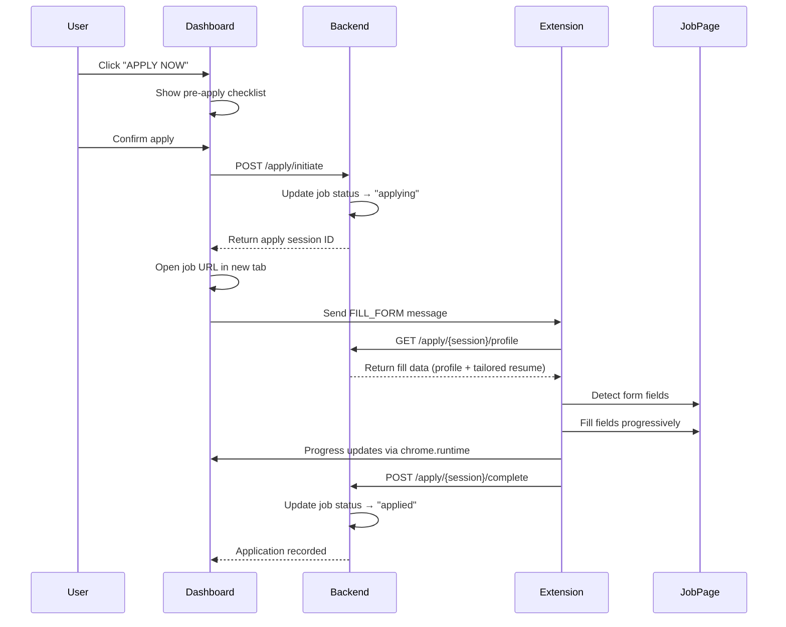

# Design Document: Job Dashboard & Apply Flow

## Overview

This design extends the ApplyPilot platform to deliver a Jobright.ai-style experience across three layers: a multi-source job fetching backend, a rich dashboard frontend with AI tools, and a Chrome extension with form autofill capabilities.

The system adds:
- **GitHub repository scraping** alongside existing LinkedIn scraping
- **Match score breakdown** (experience, skills, industry) computed via Ollama
- **AI tools sidebar** (resume tailoring, cover letter generation, fit analysis)
- **Insider connections** and **email finder** features
- **Apply flow** coordinating dashboard → extension → form autofill
- **Enhanced job list** with tabs, filters, source indicators, and saved jobs
- **Form autofill with progress tracking** in the Chrome extension

All AI operations use the existing Ollama/Llama integration. Browser automation runs on the user's local machine via Selenium + selenium_stealth (not Docker). The Chrome extension uses Plasmo framework with Manifest V3.

## Architecture

### High-Level System Diagram



### Communication Patterns

1. **Dashboard ↔ Backend**: REST API over HTTP (existing pattern)
2. **Dashboard → Extension**: `chrome.runtime.sendMessage` via a shared message protocol
3. **Extension → Backend**: HTTP REST calls from background service worker
4. **Extension → Page**: Content script DOM manipulation for form filling
5. **Backend → Ollama**: HTTP calls to local Ollama instance

### Apply Flow Sequence



## Components and Interfaces

### Backend Services

#### GitHubScraper

Fetches and parses job listings from configured GitHub repositories.

```python
class GitHubScraper:
    """Scrapes job listings from GitHub repository markdown files."""

    async def fetch_jobs(self, source: GitHubSource) -> list[ParsedJob]:
        """Fetch new jobs from a GitHub repo since last poll."""
        ...

    def parse_markdown_table(self, content: str) -> list[ParsedJob]:
        """Parse pipe-delimited markdown table into structured records.
        
        Handles formats like:
        | Company | Role | Location | Application/Link | Date Posted |
        |---------|------|----------|-----------------|-------------|
        | Google  | SWE  | Remote   | [Apply](url)    | 2024-01-15  |
        """
        ...

    def extract_link_from_cell(self, cell: str) -> str | None:
        """Extract URL from markdown link syntax [text](url)."""
        ...

    async def poll_all_sources(self) -> int:
        """Poll all configured GitHub sources. Returns count of new jobs."""
        ...
```

#### MatchEngine (extended)

Extends existing `OllamaService.match_job` to return breakdown scores.

```python
class MatchEngine:
    """Computes detailed match score breakdowns via Ollama."""

    async def compute_breakdown(
        self, resume_text: str, job_description: str
    ) -> MatchBreakdown:
        """Compute match breakdown with individual category scores.
        
        Returns:
            MatchBreakdown with overall_score, experience_score,
            skill_score, industry_score, strengths, weaknesses
        """
        ...

    async def analyze_fit(
        self, resume_text: str, job_description: str
    ) -> FitAnalysis:
        """Detailed fit analysis with strengths/weaknesses narrative."""
        ...

    async def queue_analysis(self, job_id: int) -> None:
        """Queue a job for background match analysis."""
        ...
```

#### ConnectionFinder

```python
class ConnectionFinder:
    """Identifies insider connections at target companies."""

    async def find_connections(
        self, company: str, user_connections: list[Connection]
    ) -> list[InsiderConnection]:
        """Find connections at a company, categorized by relationship type."""
        ...
```

#### EmailFinder

```python
class EmailFinder:
    """Resolves work email addresses from LinkedIn profile URLs."""

    def validate_linkedin_url(self, url: str) -> bool:
        """Validate that input is a valid LinkedIn profile URL."""
        ...

    async def resolve_email(self, linkedin_url: str) -> str | None:
        """Attempt to resolve work email from LinkedIn profile.
        
        Uses pattern matching (first.last@company.com) and
        verification via SMTP check or Hunter.io API.
        """
        ...
```

### Backend API Endpoints (New)

#### AI Router (`/ai`)

```
POST /ai/match-breakdown/{job_id}    → MatchBreakdown
POST /ai/tailor-resume/{job_id}      → TailoredResumeOut
POST /ai/cover-letter/{job_id}       → CoverLetterOut
POST /ai/analyze-fit/{job_id}        → FitAnalysis
```

#### Apply Router (`/apply`)

```
POST /apply/initiate                 → ApplySession
GET  /apply/{session_id}/profile     → FillProfile (for extension)
POST /apply/{session_id}/progress    → ProgressUpdate
POST /apply/{session_id}/complete    → ApplicationRecordOut
POST /apply/{session_id}/question    → PendingQuestionOut
```

#### Connections Router (`/connections`)

```
GET  /connections/{company}          → list[InsiderConnection]
POST /connections/email-find         → EmailResult
```

#### GitHub Sources Router (`/github-sources`)

```
GET    /github-sources               → list[GitHubSourceOut]
POST   /github-sources               → GitHubSourceOut
PUT    /github-sources/{id}          → GitHubSourceOut
DELETE /github-sources/{id}          → None
POST   /github-sources/{id}/poll     → PollResult
```

#### Jobs Router (Extended)

```
GET  /jobs                           → (add: source filter, saved filter)
GET  /jobs/stats                     → (add: avg_match_score, saved count)
POST /jobs/{id}/save                 → ScrapedJobOut
POST /jobs/{id}/unsave               → ScrapedJobOut
```

### Chrome Extension Components

#### Content Script (`content.ts`)

```typescript
interface FormField {
  element: HTMLElement;
  type: "text" | "select" | "radio" | "checkbox" | "textarea";
  label: string;
  name: string;
  required: boolean;
  inIframe: boolean;
  iframeIndex?: number;
}

class FormDetector {
  /** Detect all fillable fields on the page, including inside iframes. */
  detectFields(): FormField[];
  
  /** Switch to iframe context and detect fields within. */
  detectFieldsInIframe(iframe: HTMLIFrameElement): FormField[];
}

class FormFiller {
  /** Fill a single field with the appropriate value. */
  fillField(field: FormField, value: string): boolean;
  
  /** Handle React-controlled inputs with native value setter. */
  fillReactInput(element: HTMLInputElement, value: string): void;
  
  /** Dispatch input, change, and blur events. */
  dispatchEvents(element: HTMLElement): void;
}
```

#### Progress Tracker

```typescript
interface ProgressState {
  totalFields: number;
  filledFields: number;
  percentage: number;
  currentField: string;
  status: "filling" | "waiting_user" | "complete" | "error";
}

class ProgressTracker {
  /** Update progress as fields are filled. */
  update(filled: number, total: number, currentLabel: string): void;
  
  /** Render progress bar overlay on the page. */
  render(): void;
  
  /** Report progress back to dashboard. */
  reportToDashboard(state: ProgressState): void;
}
```

#### Task Queue

```typescript
interface FillTask {
  field: FormField;
  value: string;
  priority: number;
  status: "pending" | "filling" | "done" | "failed";
}

class TaskQueue {
  /** Add a fill task to the queue. */
  enqueue(task: FillTask): void;
  
  /** Process next task in queue with delay between fills. */
  async processNext(): Promise<boolean>;
  
  /** Get tasks that failed and need user intervention. */
  getFailedTasks(): FillTask[];
}
```

### Frontend Components (New/Modified)

#### JobDetailView

```typescript
interface JobDetailViewProps {
  job: Job;
  matchBreakdown?: MatchBreakdown;
  connections?: InsiderConnection[];
}
```

#### AIToolsSidebar

```typescript
interface AIToolsSidebarProps {
  jobId: number;
  onResumeGenerated: (resume: TailoredResume) => void;
  onCoverLetterGenerated: (letter: string) => void;
}
```

#### ApplyFlowModal

```typescript
interface ApplyFlowModalProps {
  job: Job;
  tailoredResume?: TailoredResume;
  coverLetter?: string;
  onConfirm: () => void;
  onCancel: () => void;
}
```

## Data Models

### New Database Tables

#### GitHubSource

```python
class GitHubSource(Base):
    """A configured GitHub repository job source."""
    __tablename__ = "github_sources"

    id = Column(Integer, primary_key=True, index=True)
    repo_url = Column(String, nullable=False, unique=True)
    repo_owner = Column(String, nullable=False)
    repo_name = Column(String, nullable=False)
    file_path = Column(String, default="README.md")  # path to markdown file
    poll_interval_minutes = Column(Integer, default=60)
    last_polled_at = Column(DateTime, nullable=True)
    last_commit_sha = Column(String, nullable=True)  # track changes
    status = Column(String, default="active")  # active, error, disabled
    error_message = Column(String, default="")
    created_at = Column(DateTime, default=datetime.datetime.utcnow)
```

#### TailoredResume

```python
class TailoredResume(Base):
    """A resume version tailored for a specific job."""
    __tablename__ = "tailored_resumes"

    id = Column(Integer, primary_key=True, index=True)
    job_id = Column(Integer, nullable=False)  # FK to scraped_jobs
    original_text = Column(Text, nullable=False)
    tailored_text = Column(Text, nullable=False)
    diff_summary = Column(Text, default="")  # human-readable diff
    status = Column(String, default="draft")  # draft, accepted, rejected
    created_at = Column(DateTime, default=datetime.datetime.utcnow)
```

#### InsiderConnection

```python
class InsiderConnection(Base):
    """A connection at a target company."""
    __tablename__ = "insider_connections"

    id = Column(Integer, primary_key=True, index=True)
    company = Column(String, nullable=False, index=True)
    name = Column(String, nullable=False)
    title = Column(String, default="")
    linkedin_url = Column(String, default="")
    relationship_type = Column(String, default="beyond_network")
        # beyond_network, previous_company, school
    source = Column(String, default="linkedin")
    discovered_at = Column(DateTime, default=datetime.datetime.utcnow)
```

### Extended ScrapedJob Fields

```python
# Additional columns on ScrapedJob:
source_platform = Column(String, default="linkedin")  # linkedin, github, other
saved = Column(Integer, default=0)  # 1 = user saved this job
experience_score = Column(Integer, default=0)  # 0-100 breakdown
skill_score = Column(Integer, default=0)       # 0-100 breakdown
industry_score = Column(Integer, default=0)    # 0-100 breakdown
match_label = Column(String, default="")       # STRONG/GOOD/FAIR MATCH
applicant_count = Column(Integer, nullable=True)
github_source_id = Column(Integer, nullable=True)  # FK to github_sources
last_viewed_at = Column(DateTime, nullable=True)
```

### Pydantic Schemas (New)

```python
class MatchBreakdown(BaseModel):
    overall_score: int  # 0-100
    experience_score: int  # 0-100
    skill_score: int  # 0-100
    industry_score: int  # 0-100
    match_label: str  # "STRONG MATCH", "GOOD MATCH", "FAIR MATCH"
    strengths: list[str]
    weaknesses: list[str]

class FitAnalysis(BaseModel):
    overall_score: int
    breakdown: MatchBreakdown
    narrative: str  # detailed analysis text
    recommendations: list[str]

class TailoredResumeOut(BaseModel):
    id: int
    job_id: int
    tailored_text: str
    diff_summary: str
    status: str
    created_at: datetime.datetime

class CoverLetterOut(BaseModel):
    text: str
    job_id: int
    generated_at: datetime.datetime

class GitHubSourceOut(BaseModel):
    id: int
    repo_url: str
    repo_owner: str
    repo_name: str
    file_path: str
    poll_interval_minutes: int
    last_polled_at: datetime.datetime | None
    status: str
    error_message: str

class GitHubSourceCreate(BaseModel):
    repo_url: str  # validated as GitHub URL
    file_path: str = "README.md"
    poll_interval_minutes: int = 60

class InsiderConnectionOut(BaseModel):
    id: int
    company: str
    name: str
    title: str
    relationship_type: str
    linkedin_url: str

class EmailResult(BaseModel):
    linkedin_url: str
    email: str | None
    found: bool
    message: str

class ApplySession(BaseModel):
    session_id: str
    job_id: int
    resume_version: str  # "original" or "tailored"
    cover_letter_ready: bool
    match_score: int

class FillProfile(BaseModel):
    """Profile data sent to extension for form filling."""
    first_name: str
    last_name: str
    email: str
    phone: str
    location: str
    linkedin_url: str
    website: str
    skills: list[str]
    experience: list[dict]
    education: list[dict]
    resume_text: str  # tailored or original
    cover_letter: str
    prefilled_answers: dict[str, str]

class ProgressUpdate(BaseModel):
    total_fields: int
    filled_fields: int
    percentage: int
    current_field: str
    status: str  # filling, waiting_user, complete, error
```

### GitHub Markdown Table Parsing Algorithm

The GitHub scraper handles repositories like `jobright-ai/2026-Software-Engineer-New-Grad` that use pipe-delimited markdown tables:

```python
def parse_markdown_table(content: str) -> list[ParsedJob]:
    """
    Parse markdown table into job records.
    
    Algorithm:
    1. Split content by lines
    2. Find header row (contains | delimiters)
    3. Map column positions to field names using fuzzy matching
    4. Skip separator row (contains ---)
    5. Parse each data row, extracting cell values
    6. Extract URLs from markdown link syntax [text](url)
    7. Return list of ParsedJob with mapped fields
    
    Handles variations:
    - Column order varies between repos
    - Some repos use [Company](url) format
    - Date formats vary (2024-01-15, Jan 15, etc.)
    - Location may be empty or "Remote"
    """
    lines = content.strip().split("\n")
    jobs = []
    
    # Find header row
    header_idx = None
    for i, line in enumerate(lines):
        if "|" in line and "---" not in line:
            header_idx = i
            break
    
    if header_idx is None:
        return []
    
    # Parse header columns
    headers = [h.strip() for h in lines[header_idx].split("|")[1:-1]]
    column_map = map_columns_to_fields(headers)
    
    # Parse data rows (skip header + separator)
    for line in lines[header_idx + 2:]:
        if "|" not in line or line.strip().startswith("<!--"):
            continue
        cells = [c.strip() for c in line.split("|")[1:-1]]
        if len(cells) < len(headers):
            continue
        
        job = extract_job_from_cells(cells, column_map)
        if job and job.url:
            jobs.append(job)
    
    return jobs
```

### Match Score Computation

The Match Engine uses a structured prompt to get Ollama to return breakdown scores:

```python
MATCH_BREAKDOWN_PROMPT = """
Analyze how well this resume matches the job posting.
Return a JSON object with these exact fields:

{
  "overall_score": <0-100>,
  "experience_score": <0-100 based on years and relevance of experience>,
  "skill_score": <0-100 based on technical skill overlap>,
  "industry_score": <0-100 based on industry/domain experience>,
  "strengths": ["strength 1", "strength 2", ...],
  "weaknesses": ["weakness 1", "weakness 2", ...]
}

Resume:
{{RESUME_TEXT}}

Job Posting:
Title: {{JOB_TITLE}}
Company: {{JOB_COMPANY}}
Description: {{JOB_DESCRIPTION}}
"""
```

### Extension ↔ Dashboard Communication Protocol

```typescript
// Message types for chrome.runtime messaging
type MessageType =
  | { type: "FILL_FORM"; payload: { sessionId: string; jobUrl: string } }
  | { type: "FILL_PROGRESS"; payload: ProgressState }
  | { type: "FILL_COMPLETE"; payload: { sessionId: string; fieldsCompleted: number } }
  | { type: "FILL_ERROR"; payload: { sessionId: string; error: string; field?: string } }
  | { type: "NEED_ANSWER"; payload: { sessionId: string; question: string; options?: string[] } }
  | { type: "GET_MATCH_SCORE"; payload: { jobUrl: string } }
  | { type: "MATCH_SCORE_RESULT"; payload: MatchBreakdown }
```


## Correctness Properties

*A property is a characteristic or behavior that should hold true across all valid executions of a system — essentially, a formal statement about what the system should do. Properties serve as the bridge between human-readable specifications and machine-verifiable correctness guarantees.*

### Property 1: Job Deduplication Preserves URL Uniqueness

*For any* list of scraped jobs (possibly containing duplicate URLs), after deduplication, no two jobs in the output shall share the same URL, and every unique URL from the input shall appear exactly once in the output.

**Validates: Requirements 1.3**

### Property 2: Job Storage Round-Trip Preserves All Fields

*For any* valid job record with title, company, location, URL, description, posted date, salary range, and source platform, storing it in the database and retrieving it shall produce a record with all fields equal to the original values.

**Validates: Requirements 1.4**

### Property 3: Markdown Table Parsing Round-Trip

*For any* list of valid job records (title, company, location, URL, posted date), formatting them as a pipe-delimited markdown table and then parsing that table shall produce job records with fields equal to the originals.

**Validates: Requirements 1.7, 11.3, 11.6**

### Property 4: Match Score Label Mapping

*For any* integer score in [0, 100], the label mapping shall produce "STRONG MATCH" if score >= 80, "GOOD MATCH" if 60 <= score < 80, and "FAIR MATCH" if score < 60. The mapping shall be total (every valid score gets exactly one label).

**Validates: Requirements 2.2**

### Property 5: LinkedIn URL Validation

*For any* string, the LinkedIn URL validator shall return true if and only if the string matches the pattern `https://www.linkedin.com/in/{slug}` (with optional trailing slash and query params), and shall return false for all other strings including other LinkedIn paths, other domains, and malformed URLs.

**Validates: Requirements 5.5**

### Property 6: GitHub Repository URL Validation

*For any* string, the GitHub URL validator shall return true if and only if the string matches the pattern `https://github.com/{owner}/{repo}` (with optional trailing slash), and shall return false for all other strings including gist URLs, raw content URLs, and non-GitHub domains.

**Validates: Requirements 11.2**

### Property 7: Apply Flow Resume Version Selection

*For any* apply session, if a tailored resume exists for the target job (status = "accepted"), the fill profile shall contain the tailored resume text; otherwise it shall contain the original resume text. The selected version shall never be empty.

**Validates: Requirements 6.7**

### Property 8: Form Field Detection Completeness

*For any* HTML document containing form elements (input[type=text], input[type=email], select, textarea, input[type=radio], input[type=checkbox]), the form detector shall identify every visible, enabled form field and classify its type correctly.

**Validates: Requirements 8.1**

### Property 9: Field-to-Profile Mapping Correctness

*For any* detected form field with a label containing a recognized keyword (e.g., "name", "email", "phone", "linkedin"), the field mapper shall map it to the corresponding profile field. Fields with unrecognized labels shall be mapped to "unknown".

**Validates: Requirements 8.2**

### Property 10: Progress Percentage Computation

*For any* pair (filledFields, totalFields) where 0 <= filledFields <= totalFields and totalFields > 0, the progress percentage shall equal floor(filledFields / totalFields * 100), and shall be 100 if and only if filledFields == totalFields.

**Validates: Requirements 8.3**

### Property 11: React Input Value Persistence

*For any* React-controlled input element and any string value, after filling using the native value setter and dispatching input, change, and blur events, reading the element's value property shall return the set value.

**Validates: Requirements 8.6**

### Property 12: Tab Filter Correctness and Sort Order

*For any* list of jobs with various statuses (new, applied, saved) and match scores, the "Applied" tab shall contain exactly the jobs with status "applied", the "New" tab shall contain exactly jobs with status "new", the "Saved" tab shall contain exactly jobs with saved=true, and the "Recommended" tab shall contain all jobs sorted by match_score descending.

**Validates: Requirements 9.2**

### Property 13: Aggregate Stats Computation

*For any* list of jobs, the aggregate stats shall satisfy: total == len(jobs), applied == count(status=="applied"), new == count(status=="new"), and average_match_score == mean(match_score) for all jobs (rounded to nearest integer).

**Validates: Requirements 9.4**

### Property 14: Multi-Filter Intersection

*For any* list of jobs and any combination of active filters (source platform, minimum match score, location, experience level), the filtered result shall contain exactly those jobs that satisfy ALL active filter conditions simultaneously.

**Validates: Requirements 9.5**

### Property 15: Pagination Correctness

*For any* total job count N and page size P (P > 0), requesting page K shall return at most P items, the total number of pages shall equal ceil(N/P), and the union of all pages shall equal the full sorted list with no duplicates or omissions.

**Validates: Requirements 9.7**

### Property 16: Incremental Poll Processing

*For any* set of job entries with posted dates and a last_polled_at timestamp, the incremental processor shall return exactly those entries whose posted date is strictly after last_polled_at, and shall return an empty list if no entries are newer.

**Validates: Requirements 11.4**

### Property 17: Diff Computation Correctness

*For any* pair of strings (original, tailored), computing the diff and then applying it to the original shall produce the tailored string exactly.

**Validates: Requirements 10.3**

## Error Handling

### Backend Error Handling

| Error Scenario | Response | Recovery |
|---|---|---|
| Ollama unreachable | 503 with message "Ollama service unavailable. Please start Ollama." | Frontend shows error banner with instructions |
| GitHub API rate limit | 429, source marked as "rate_limited" | Exponential backoff, retry next cycle |
| GitHub repo not found | 404, source marked as "error" | Log error, notify user in settings |
| LinkedIn scrape failure | Log error, retry after backoff | Configurable retry count (default 3) |
| Invalid LinkedIn URL (email finder) | 422 with validation error | Frontend shows inline validation message |
| Form field unfillable | Extension highlights field, creates PendingQuestion | User fills manually or provides answer |
| Database write failure | 500 with generic error | Transaction rollback, log full traceback |
| Extension disconnected during apply | Apply session marked "interrupted" | User can resume from dashboard |

### Frontend Error States

- **Loading states**: Skeleton loaders for job list, spinner for AI tools
- **Empty states**: Contextual messages ("No jobs found", "No connections identified")
- **Network errors**: Toast notification with retry button
- **AI timeout**: "Taking longer than expected..." with cancel option (timeout: 120s)

### Extension Error Handling

- **Content script injection failure**: Log and skip page (non-matching URL)
- **Iframe access denied (cross-origin)**: Skip iframe, mark fields as unfillable
- **Form field value not persisting**: Retry with alternative fill strategy (sendKeys fallback)
- **Backend unreachable**: Queue actions locally, sync when connection restored

## Testing Strategy

### Property-Based Tests (Hypothesis - Python Backend)

The backend uses **Hypothesis** (already present in the project) for property-based testing. Each property test runs a minimum of 100 iterations.

**Configuration:**
```python
from hypothesis import given, settings, strategies as st

@settings(max_examples=100)
```

**Properties to implement:**
- Property 1: Deduplication (generate lists of jobs with overlapping URLs)
- Property 2: Job storage round-trip (generate random job dicts, store/retrieve)
- Property 3: Markdown parsing round-trip (generate job lists, format/parse)
- Property 4: Score-to-label mapping (generate integers 0-100)
- Property 5: LinkedIn URL validation (generate valid/invalid URL strings)
- Property 6: GitHub URL validation (generate valid/invalid URL strings)
- Property 7: Resume version selection (generate sessions with/without tailored resumes)
- Property 13: Aggregate stats (generate job lists, verify computed stats)
- Property 14: Multi-filter intersection (generate jobs + filter combos)
- Property 15: Pagination (generate counts + page sizes)
- Property 16: Incremental processing (generate entries + timestamps)
- Property 17: Diff computation (generate string pairs)

### Property-Based Tests (fast-check - Frontend/Extension)

The frontend and extension use **fast-check** for TypeScript property-based testing.

**Properties to implement:**
- Property 4: Score-to-label mapping (frontend utility)
- Property 8: Form field detection (generate HTML form strings)
- Property 9: Field-to-profile mapping (generate field labels)
- Property 10: Progress percentage (generate filled/total pairs)
- Property 11: React input persistence (generate input elements + values)
- Property 12: Tab filter correctness (generate job arrays with statuses)

### Unit Tests (Example-Based)

- API endpoint tests (FastAPI TestClient): CRUD for GitHub sources, apply flow initiation
- UI component tests (React Testing Library): Job detail view, AI tools sidebar, apply modal
- Extension popup and overlay rendering
- Error state rendering for all components

### Integration Tests

- Ollama service integration (mocked): match breakdown, resume tailoring, cover letter
- GitHub API polling (mocked): fetch new commits, parse content
- Extension ↔ Backend communication (mocked chrome.runtime)
- Apply flow end-to-end (mocked extension + backend)

### Test Tag Format

Each property-based test includes a comment referencing its design property:

```python
# Feature: job-dashboard-apply, Property 1: Job deduplication preserves URL uniqueness
```

```typescript
// Feature: job-dashboard-apply, Property 10: Progress percentage computation
```
