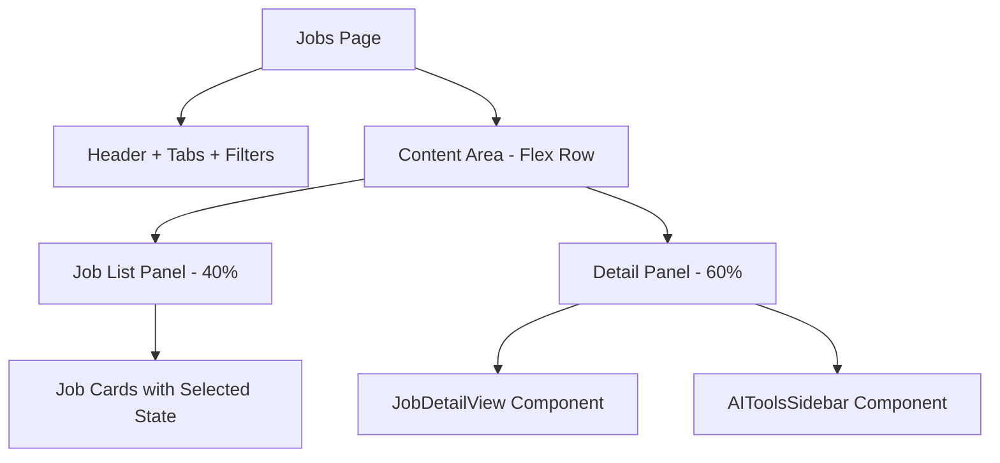
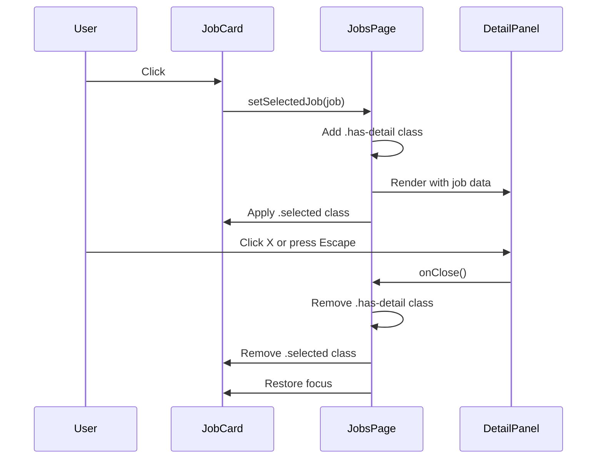

# Design Document: Job Detail Inline Panel

## Overview

This feature transforms the job detail view from a fixed-position modal overlay (`job-detail-overlay`) into an inline split-panel layout within the Jobs page. Currently, clicking a job card opens a centered modal with a backdrop that blocks interaction with the job list. The new design renders the detail panel as a sibling element beside the job list, creating a master-detail pattern where users can browse jobs on the left (~40% width) and read full details on the right (~60% width) without losing scroll position or context.

### Key Changes

1. **Remove overlay/modal pattern** — Eliminate the `job-detail-overlay` fixed-position container and backdrop
2. **Introduce flex split-layout** — Wrap the job feed and detail panel in a horizontal flex container
3. **Independent scrolling** — Both panels get their own `overflow-y: auto` with constrained heights
4. **Selected state** — Highlight the active job card in the list
5. **Keyboard support** — Escape key closes the panel, focus management for accessibility

### Design Rationale

The master-detail (split-panel) pattern is standard in email clients, job boards (LinkedIn, Indeed), and file managers. It reduces context-switching cost because the user never loses their place in the list. The 40/60 split gives enough room for job cards to remain scannable while providing ample space for the full job description and match breakdown.

## Architecture



### Layout Structure

The `Jobs` component currently renders:
```
jobs-page (flex column)
├── jobs-header
├── filter-bar
├── filters-expanded (conditional)
├── JobFilterBar
├── jobs-feed (scrollable list)
└── job-detail-overlay (fixed modal - REMOVE)
```

The new structure will be:
```
jobs-page (flex column)
├── jobs-header
├── filter-bar
├── filters-expanded (conditional)
├── JobFilterBar
└── jobs-content-area (flex row, flex: 1, overflow: hidden)
    ├── jobs-feed (scrollable, width: 100% or 40% when detail open)
    └── job-detail-inline (scrollable, width: 60%, conditional)
```

### State Management

No new state management libraries are needed. The existing `selectedJob` state in `Jobs.tsx` already controls which job is displayed. The only additions are:
- A CSS class toggle on the content area when `selectedJob` is non-null
- A `selectedJob.id` comparison for highlighting the active card
- A `keydown` event listener for Escape key handling

## Components and Interfaces

### Modified Components

#### 1. `Jobs.tsx` (Page Component)

**Changes:**
- Remove the `job-detail-overlay` wrapper and its click-to-dismiss backdrop
- Wrap `jobs-feed` and the detail panel in a new `jobs-content-area` flex container
- Add `job-selected` class to content area when a job is selected (triggers 40/60 split)
- Pass `selectedJob.id` to job cards for highlight styling
- Add `useEffect` for Escape key listener
- Add `ref` to the selected job card for focus restoration on close

```typescript
interface JobCardProps {
  job: Job;
  isSelected: boolean;
  onClick: () => void;
  onToggleSave: (e: React.MouseEvent) => void;
}
```

#### 2. `JobDetailView.tsx` (Detail Component)

**Changes:**
- Remove any overlay-specific assumptions (the component is already overlay-agnostic)
- Ensure the component works at any width (it already uses relative sizing)
- Include `AIToolsSidebar` within the detail view's content area
- No structural changes needed — the component already accepts `job` and `onClose` props

#### 3. `AIToolsSidebar.tsx` (AI Tools Component)

**Changes:**
- No code changes needed — already renders as a self-contained block
- Will be positioned within the detail panel's sidebar grid column (existing `job-detail-sidebar` area)

### New CSS Classes

| Class | Purpose |
|-------|---------|
| `.jobs-content-area` | Flex row container for list + detail |
| `.jobs-content-area.has-detail` | Activates the 40/60 split |
| `.job-detail-inline` | The inline detail panel wrapper (replaces overlay) |
| `.job-card.selected` | Visual highlight for the active job card |

### Component Interaction Flow



## Data Models

No new data models are required. The existing `Job` interface and component props remain unchanged. The feature is purely a layout/presentation change.

### Existing Interfaces (Unchanged)

```typescript
// Already defined in Jobs.tsx
interface Job {
  id: number;
  title: string;
  company: string;
  location: string;
  url: string;
  description: string;
  match_score: number;
  // ... all existing fields
}

// Already defined in JobDetailView.tsx
interface Props {
  job: Job;
  onClose?: () => void;
}

// Already defined in AIToolsSidebar.tsx
interface Props {
  jobId: number;
}
```

### State Shape

```typescript
// In Jobs.tsx - no new state variables needed
const [selectedJob, setSelectedJob] = useState<Job | null>(null);
// selectedJob already exists and drives the detail panel visibility
```


## Correctness Properties

*A property is a characteristic or behavior that should hold true across all valid executions of a system — essentially, a formal statement about what the system should do. Properties serve as the bridge between human-readable specifications and machine-verifiable correctness guarantees.*

### Property 1: Inline rendering without overlay

*For any* valid job object, when it is set as the selected job, the Jobs page SHALL render the detail panel as an inline sibling of the job list (both present in a flex container) and SHALL NOT render any element with the overlay class, fixed-position backdrop, or click-to-dismiss behavior.

**Validates: Requirements 1.1, 1.3, 2.1, 2.2**

### Property 2: Detail panel content completeness

*For any* job with populated fields (title, company, location, work_type, description, match_score > 0, applicant_count > 0), the rendered detail panel SHALL contain: the job title, company name, location tag, work type badge, job description text under an "Overview" heading, the match score circle with breakdown bars, and the applicant count.

**Validates: Requirements 3.1, 3.3, 3.4, 3.5**

### Property 3: Close button removes detail panel

*For any* selected job, when the close action is triggered (onClose callback), the detail panel SHALL be removed from the DOM and the content area SHALL revert to full-width single-column layout (no `has-detail` class).

**Validates: Requirements 4.1**

### Property 4: Job switching updates detail content

*For any* two distinct jobs A and B in the list, when job B is selected while job A's detail is displayed, the detail panel SHALL update to show job B's title and company (not job A's).

**Validates: Requirements 4.2**

### Property 5: Selection highlight exclusivity

*For any* list of jobs and any selected job, exactly one job card in the list SHALL have the `selected` CSS class applied, and it SHALL correspond to the currently selected job's ID. All other cards SHALL NOT have the `selected` class.

**Validates: Requirements 6.1, 6.2**

### Property 6: Escape key closes panel and restores focus

*For any* selected job, when a `keydown` event with key "Escape" is dispatched, the detail panel SHALL be removed from the DOM and keyboard focus SHALL be returned to the job list area.

**Validates: Requirements 7.1**

## Error Handling

### Edge Cases

| Scenario | Behavior |
|----------|----------|
| Selected job is removed from list (e.g., filter change) | Close the detail panel automatically (`useEffect` checks if `selectedJob` is still in `filteredJobs`) |
| Job has no description | Detail panel shows the existing "No description available" empty state |
| Job has no match score | Detail panel shows "Analyze" button (existing behavior preserved) |
| Rapid job switching | Each selection cancels the previous `fetchJobDetails` call or ignores stale responses (existing `useEffect` with `job.id` dependency handles this) |
| Very long job list | Independent scrolling ensures the detail panel remains stable |

### Focus Management

- When the detail panel opens, focus remains on the job list (no focus trap — this is not a modal)
- When the panel closes via Escape, focus returns to the previously selected job card
- The close button is a native `<button>` element, inherently keyboard-accessible

## Testing Strategy

### Property-Based Tests (Vitest + fast-check)

The feature is suitable for property-based testing because:
- The rendering logic varies meaningfully with input (different job objects produce different detail content)
- Universal properties hold across all valid job inputs (no overlay, content completeness, selection exclusivity)
- The tests exercise pure rendering logic that is cost-effective to run 100+ iterations

**Configuration:**
- Library: `fast-check` (already installed)
- Runner: `vitest` (already configured)
- Minimum iterations: 100 per property
- Tag format: `Feature: job-detail-inline-panel, Property {N}: {title}`

Each correctness property above maps to a single property-based test that generates random job objects and verifies the property holds.

### Unit Tests (Example-Based)

| Test | Validates |
|------|-----------|
| Default state renders full-width list without detail panel | Req 1.4 |
| Detail panel renders "Apply with Autofill" and "View Original Post" buttons | Req 3.2 |
| AI Tools Sidebar renders all three tool buttons | Req 3.6 |
| Split layout applies ~40%/60% width classes | Req 5.1 |
| Both panels have independent scroll (overflow-y: auto) | Req 5.2, 5.3 |
| Close button is a focusable `<button>` with aria-label | Req 7.2 |
| No `job-detail-overlay` element exists in component output | Req 2.2 |

### Integration Tests

| Test | Validates |
|------|-----------|
| Click job card → detail panel appears with correct job data | End-to-end flow |
| Click different job → detail updates | Switching behavior |
| Click X → panel closes, list returns to full width | Close flow |
| Press Escape → panel closes | Keyboard accessibility |

### Test File Location

- Property tests: `frontend/src/__tests__/job-detail-inline-panel.property.test.tsx`
- Unit/integration tests: `frontend/src/__tests__/job-detail-inline-panel.test.tsx`
