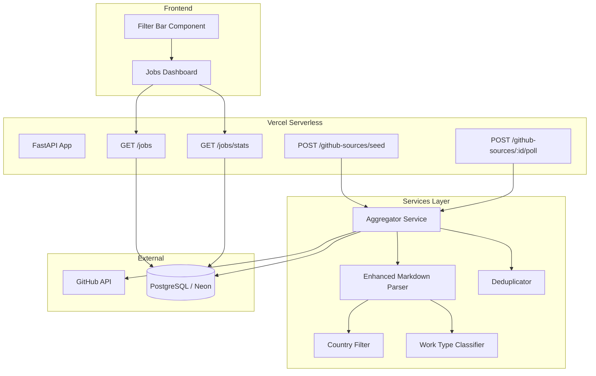

# Design Document: Job Scraper Aggregator

## Overview

This feature extends the existing FastAPI + React application to aggregate job listings from 9 jobright-ai GitHub repositories (8 New Grad + 1 Internship mega-repo). The system enhances the existing `GitHubScraper` service with section-header-aware parsing for the Internship mega-repo, adds classification pipelines for country, work type, and role category, implements commit-SHA-based change detection for efficient polling, and provides rich API filtering with a corresponding frontend filter UI.

The design builds on the existing `GitHubSource` and `ScrapedJob` models, adding new metadata fields and classification services while preserving backward compatibility with existing LinkedIn-sourced jobs.

## Architecture



### Data Flow

1. **Seed**: `POST /github-sources/seed` creates 9 `GitHubSource` records with role_category mappings
2. **Poll**: `POST /github-sources/{id}/poll` fetches commit SHA → compares → fetches README if changed → parses → classifies → deduplicates → stores
3. **Query**: `GET /jobs` applies filters (country, work_type, role_category, experience_level) with AND logic
4. **Display**: Frontend filter bar sends query params, renders filtered results

### Key Design Decisions

- **No separate scheduler process**: Vercel serverless doesn't support long-running processes. Polling is triggered via API calls (manual or external cron like Vercel Cron Jobs / GitHub Actions).
- **Commit SHA change detection**: Avoids re-parsing unchanged READMEs, saving GitHub API quota.
- **Classification at ingest time**: Country, work type, and role category are computed once during parsing and stored on the job record for fast query-time filtering.
- **Additive schema changes**: New fields added to existing `ScrapedJob` model with defaults, preserving existing LinkedIn jobs.

## Components and Interfaces

### 1. Aggregator Service (`backend/services/aggregator.py`)

Orchestrates the full scrape-classify-store pipeline.

```python
class AggregatorService:
    """Orchestrates scraping, classification, and storage of jobs from GitHub sources."""

    REPO_CATEGORY_MAP: dict[str, str]  # repo_name → role_category
    REPOS: list[dict]  # seed configuration for all 9 repos

    def __init__(self, db: Session): ...

    async def seed_sources(self) -> dict[str, int]:
        """Create GitHubSource records for all 9 repos. Idempotent."""
        ...

    async def poll_source(self, source: GitHubSource) -> int:
        """Poll a single source: check SHA → fetch → parse → classify → store.
        Returns count of new jobs added."""
        ...

    async def poll_all_sources(self) -> dict[str, int]:
        """Poll all active sources. Returns summary of results."""
        ...

    def _check_commit_sha(self, source: GitHubSource) -> tuple[bool, str]:
        """Check if commit SHA has changed. Returns (changed, new_sha)."""
        ...

    def _get_experience_level(self, source: GitHubSource) -> str:
        """Returns 'internship' or 'new_grad' based on source repo name."""
        ...
```

### 2. Enhanced Markdown Parser (`backend/services/markdown_parser.py`)

Extends the existing `parse_markdown_table()` with section-header awareness and richer extraction.

```python
@dataclass
class ParsedJob:
    """A job record parsed from a GitHub markdown table."""
    title: str
    company: str
    location: str
    url: str
    posted_date: Optional[datetime.datetime] = None
    company_logo: Optional[str] = None
    section_category: Optional[str] = None  # from section headers (mega-repo)

class MarkdownParser:
    """Parses jobright-ai GitHub README markdown into structured job records."""

    def parse(self, content: str, is_mega_repo: bool = False) -> list[ParsedJob]:
        """Parse full README content. If is_mega_repo, tracks section headers."""
        ...

    def parse_markdown_table(self, content: str, section_category: Optional[str] = None) -> list[ParsedJob]:
        """Parse a single pipe-delimited markdown table."""
        ...

    def _detect_section_headers(self, lines: list[str]) -> list[tuple[int, str]]:
        """Find ## headers and map them to role categories."""
        ...

    def _handle_continuation_row(self, cells: list[str], prev_company: str) -> str:
        """Handle ↳ continuation rows by inheriting company from previous row."""
        ...

    def _extract_markdown_link(self, cell: str) -> tuple[Optional[str], Optional[str]]:
        """Extract (text, url) from markdown link syntax."""
        ...

    def _extract_image_url(self, cell: str) -> Optional[str]:
        """Extract image URL from markdown image syntax ."""
        ...

    def format_job_to_row(self, job: ParsedJob) -> str:
        """Format a ParsedJob back to a markdown table row (for round-trip testing)."""
        ...
```

### 3. Country Filter (`backend/services/country_filter.py`)

```python
class CountryFilter:
    """Classifies job locations into country codes (US, CA) or excludes them."""

    US_STATE_ABBREVS: set[str]  # {"CA", "NY", "TX", ...}
    US_STATE_NAMES: set[str]    # {"California", "New York", ...}
    CA_PROVINCE_ABBREVS: set[str]  # {"ON", "BC", "AB", ...}
    CA_PROVINCE_NAMES: set[str]    # {"Ontario", "British Columbia", ...}

    def classify(self, location: str) -> Optional[str]:
        """Classify location text into 'US', 'CA', or None (excluded).
        Returns None for non-US/CA locations."""
        ...

    def _is_usa(self, location: str) -> bool: ...
    def _is_canada(self, location: str) -> bool: ...
```

### 4. Work Type Classifier (`backend/services/work_type_classifier.py`)

```python
class WorkTypeClassifier:
    """Extracts work arrangement type from job location text."""

    REMOTE_INDICATORS: list[str] = ["remote", "remote in", "work from home", "wfh"]
    HYBRID_INDICATORS: list[str] = ["hybrid"]
    ONSITE_INDICATORS: list[str] = ["on site", "on-site", "onsite", "in-person", "in office"]

    def classify(self, location: str) -> str:
        """Classify location text into 'remote', 'hybrid', or 'onsite'.
        Defaults to 'onsite' if no indicator found."""
        ...
```

### 5. Enhanced API Router (`backend/routers/jobs.py` — updated)

```python
@router.get("", response_model=list[ScrapedJobOut])
def list_jobs(
    status: Optional[JobStatus] = None,
    min_score: int = Query(0, ge=0),
    source: Optional[str] = None,
    saved: Optional[int] = None,
    location: Optional[str] = None,
    country: Optional[str] = None,          # NEW: "US", "CA", or "US,CA"
    work_type: Optional[str] = None,        # NEW: "remote", "hybrid", "onsite"
    role_category: Optional[str] = None,    # NEW: comma-separated categories
    experience_level: Optional[str] = None, # NEW: "new_grad", "internship"
    page: int = Query(1, ge=1),
    page_size: int = Query(50, ge=1, le=200),
    db: Session = Depends(get_db),
): ...

@router.get("/stats")
def job_stats(db: Session = Depends(get_db)):
    """Return aggregate stats with breakdowns by country, work_type, role_category, experience_level."""
    ...
```

### 6. Seed Endpoint (`backend/routers/github_sources.py` — updated)

```python
@router.post("/seed")
async def seed_sources(db: Session = Depends(get_db)):
    """Seed all 9 jobright-ai repositories. Idempotent."""
    ...
```

### 7. Frontend Filter Bar (`frontend/src/components/JobFilterBar.tsx`)

```typescript
interface JobFilters {
  country: string;           // "US" | "CA" | ""
  work_type: string[];       // ["remote", "hybrid", "onsite"]
  role_category: string[];   // selected categories
  experience_level: string;  // "new_grad" | "internship" | ""
}

function JobFilterBar({ filters, onChange }: {
  filters: JobFilters;
  onChange: (filters: JobFilters) => void;
}): JSX.Element;
```

## Data Models

### ScrapedJob (Updated — new fields)

| Field | Type | Default | Description |
|-------|------|---------|-------------|
| work_type | String | "onsite" | "remote", "hybrid", "onsite" |
| role_category | String | "" | One of 17 role categories |
| country | String | "" | "US" or "CA" |
| experience_level | String | "" | "new_grad" or "internship" |

These fields are added to the existing `ScrapedJob` model. Existing records (LinkedIn jobs) retain empty defaults.

### GitHubSource (Updated — new fields)

| Field | Type | Default | Description |
|-------|------|---------|-------------|
| role_category | String | "" | Default category for jobs from this source |
| experience_level | String | "" | "new_grad" or "internship" |

### Repository → Category Mapping

| Repository Name | Role Category | Experience Level |
|----------------|---------------|-----------------|
| 2026-Software-Engineer-New-Grad | Software Engineering | new_grad |
| 2026-Data-Analysis-New-Grad | Data Analysis | new_grad |
| 2026-Engineering-New-Grad | Engineering and Development | new_grad |
| 2026-Account-New-Grad | Accounting and Finance | new_grad |
| 2026-Consultant-New-Grad | Consultant | new_grad |
| 2026-Design-New-Grad | Creatives and Design | new_grad |
| 2026-Product-Management-New-Grad | Product Management | new_grad |
| 2026-Management-New-Grad | Management and Executive | new_grad |
| 2026-Internship | (per section header) | internship |

### Section Header → Category Mapping (Internship Mega-Repo)

The parser maps `## <Header Text>` to one of the 17 categories using keyword matching:

| Section Header Pattern | Role Category |
|----------------------|---------------|
| Software Engineering | Software Engineering |
| Data Analysis | Data Analysis |
| Business Analyst | Business Analyst |
| Management and Executive | Management and Executive |
| Engineering and Development | Engineering and Development |
| Creatives and Design | Creatives and Design |
| Product Management | Product Management |
| Sales | Sales |
| Accounting and Finance | Accounting and Finance |
| Arts and Entertainment | Arts and Entertainment |
| Legal and Compliance | Legal and Compliance |
| Human Resources | Human Resources |
| Public Sector and Government | Public Sector and Government |
| Education and Training | Education and Training |
| Customer Service and Support | Customer Service and Support |
| Marketing | Marketing |
| Consultant | Consultant |

### API Response: Enhanced Stats

```json
{
  "total": 1250,
  "applied": 15,
  "new": 1200,
  "saved_count": 30,
  "avg_match_score": 45,
  "by_country": { "US": 1100, "CA": 150 },
  "by_work_type": { "remote": 400, "hybrid": 300, "onsite": 550 },
  "by_role_category": { "Software Engineering": 300, "Data Analysis": 150, ... },
  "by_experience_level": { "new_grad": 800, "internship": 450 }
}
```

## Correctness Properties

*A property is a characteristic or behavior that should hold true across all valid executions of a system — essentially, a formal statement about what the system should do. Properties serve as the bridge between human-readable specifications and machine-verifiable correctness guarantees.*

### Property 1: Markdown Table Parsing Round-Trip

*For any* valid `ParsedJob` record, formatting it to a markdown table row and then parsing that row back SHALL produce an equivalent `ParsedJob` with the same title, company, location, URL, and posted_date.

**Validates: Requirements 2.9**

### Property 2: Continuation Row Company Inheritance

*For any* markdown table containing rows with the "↳" symbol, parsing SHALL assign the company name from the most recent non-continuation row to all subsequent continuation rows until a new company row appears.

**Validates: Requirements 2.2**

### Property 3: Column Order Independence

*For any* valid markdown table with recognized column headers (Company, Role, Location, Link, Date), parsing SHALL produce the same structured job records regardless of the order in which columns appear.

**Validates: Requirements 2.7**

### Property 4: Section Header Category Assignment

*For any* markdown content with `##` section headers followed by job tables, all jobs parsed from a table SHALL be assigned the role_category corresponding to the most recent preceding section header.

**Validates: Requirements 1.5, 2.8**

### Property 5: Country Classification Correctness

*For any* location string containing a recognized US indicator (state abbreviation, full state name, city-state pattern, "United States") the classifier SHALL return "US"; for any location string containing a recognized Canadian indicator (province abbreviation, full province name, city-province pattern, "Canada") the classifier SHALL return "CA"; for any location string with neither indicator, the classifier SHALL return None (excluded).

**Validates: Requirements 3.1, 3.2, 3.3, 3.5**

### Property 6: Work Type Classification Correctness

*For any* location string containing a recognized work type indicator ("Remote", "Hybrid", "On Site", "On-Site", "Onsite", "In-Person", "In Office"), the classifier SHALL return the corresponding work type; for any location string with no recognized indicator, the classifier SHALL return "onsite".

**Validates: Requirements 4.1, 4.2, 4.4**

### Property 7: URL Uniqueness Invariant (Deduplication)

*For any* sequence of parsed jobs submitted to the storage layer, the resulting database SHALL contain at most one `ScrapedJob` record per unique URL, and the stored record SHALL match the first occurrence.

**Validates: Requirements 6.1, 6.2, 6.4**

### Property 8: API Filter AND Composition

*For any* combination of filter parameters (country, work_type, role_category, experience_level) applied to the jobs API, every returned job SHALL satisfy ALL specified filter conditions simultaneously.

**Validates: Requirements 9.5**

### Property 9: API Sort Order Invariant

*For any* set of jobs returned by the jobs API with default sorting, the posted_date of each job SHALL be greater than or equal to the posted_date of the next job in the list (descending order).

**Validates: Requirements 9.7**

### Property 10: Seed Idempotence

*For any* number of invocations of the seed endpoint, the GitHubSource table SHALL contain exactly 9 records (one per repository) with no duplicates, regardless of how many times seed is called.

**Validates: Requirements 11.2**

### Property 11: Filter Persistence Round-Trip

*For any* valid filter state saved to browser localStorage, loading the filters back SHALL produce an equivalent filter state with the same country, work_type, role_category, and experience_level selections.

**Validates: Requirements 10.7**

## Error Handling

### GitHub API Errors

| Error | Handling |
|-------|----------|
| 404 Not Found | Mark source as "error", store message, skip to next source |
| 403 Rate Limited | Mark source as "error", store "rate limited" message, retry next cycle |
| Network timeout | Mark source as "error", store timeout message, retry next cycle |
| Invalid markdown (no table found) | Log warning, return 0 new jobs, don't mark as error |

### Parsing Errors

| Error | Handling |
|-------|----------|
| Row missing title or URL | Skip row, log warning, continue parsing remaining rows |
| Unparseable date format | Set posted_date to None, continue with other fields |
| Unrecognized section header | Use empty string for role_category, log warning |
| Malformed markdown link | Use raw cell text as fallback |

### Classification Errors

| Error | Handling |
|-------|----------|
| Unrecognized location (no country match) | Exclude job from storage (by design) |
| Ambiguous work type (multiple indicators) | Use first match in priority order: Remote > Hybrid > On Site |

### API Errors

| Error | Handling |
|-------|----------|
| Invalid filter value | Ignore invalid value, apply remaining valid filters |
| Database connection failure | Return 503 with retry-after header |

## Testing Strategy

### Property-Based Tests (Hypothesis — Python)

The project already uses Hypothesis (`.hypothesis/` directory exists). Each correctness property maps to a property-based test with minimum 100 iterations.

| Property | Test File | Library |
|----------|-----------|---------|
| 1: Round-trip parsing | `backend/tests/test_markdown_parser_properties.py` | hypothesis |
| 2: Continuation rows | `backend/tests/test_markdown_parser_properties.py` | hypothesis |
| 3: Column order independence | `backend/tests/test_markdown_parser_properties.py` | hypothesis |
| 4: Section header categories | `backend/tests/test_markdown_parser_properties.py` | hypothesis |
| 5: Country classification | `backend/tests/test_country_filter_properties.py` | hypothesis |
| 6: Work type classification | `backend/tests/test_work_type_properties.py` | hypothesis |
| 7: URL deduplication | `backend/tests/test_deduplication_properties.py` | hypothesis |
| 8: API filter AND composition | `backend/tests/test_api_filter_properties.py` | hypothesis |
| 9: API sort order | `backend/tests/test_api_filter_properties.py` | hypothesis |
| 10: Seed idempotence | `backend/tests/test_aggregator_properties.py` | hypothesis |
| 11: Filter persistence | `frontend/src/__tests__/jobFilters.property.test.tsx` | fast-check |

**Configuration**: Each test tagged with `# Feature: job-scraper-aggregator, Property N: <title>` and configured for `@settings(max_examples=100)`.

### Unit Tests (Example-Based)

| Area | Test File | Coverage |
|------|-----------|----------|
| Seed endpoint | `backend/tests/test_aggregator.py` | Req 1.2, 1.3, 1.6, 11.3, 11.4 |
| Commit SHA detection | `backend/tests/test_aggregator.py` | Req 6.3, 7.2, 7.3, 7.4, 7.5 |
| API filter params | `backend/tests/test_jobs_api.py` | Req 9.1–9.4, 9.6 |
| Frontend filter UI | `frontend/src/__tests__/jobFilters.test.tsx` | Req 10.1–10.6, 10.8 |

### Integration Tests

| Area | Test File | Coverage |
|------|-----------|----------|
| Full poll pipeline (mocked GitHub) | `backend/tests/test_poll_integration.py` | Req 7.1–7.7 |
| End-to-end filter flow | `backend/tests/test_filter_integration.py` | Req 9.5 |

### Test Commands

```bash
# Backend property tests
pytest backend/tests/ -k "property" --tb=short

# Backend unit tests
pytest backend/tests/ -k "not property" --tb=short

# Frontend tests
cd frontend && npx vitest --run
```
