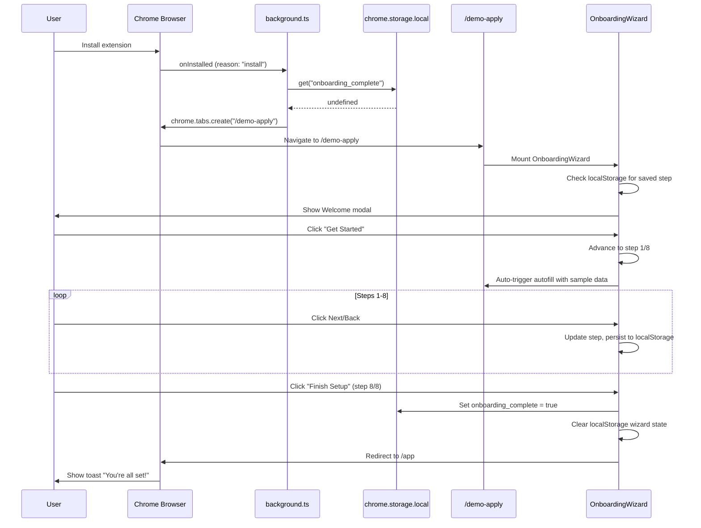

# Design Document: Onboarding Wizard

## Overview

The Onboarding Wizard is a multi-component feature spanning the Chrome extension and the Tailrd frontend. When a user installs the extension for the first time, the background script detects the `chrome.runtime.onInstalled` event, checks for an `onboarding_complete` flag in `chrome.storage.local`, and opens a demo Greenhouse-style job application page at `/demo-apply`. The page renders a tooltip-based wizard that walks the user through 8 steps demonstrating autofill, custom question saving, AI resume tailoring, supported platforms, and profile copy-to-clipboard.

The wizard is entirely frontend-driven (no backend API calls) and works independently of whether the extension is installed — making it usable as a marketing demo. State persistence uses `localStorage` so users can resume mid-wizard if they close the tab.

### Key Design Decisions

1. **Wizard lives in the frontend, not the extension** — The tooltip overlay renders as a React component on the `/demo-apply` page. This avoids content script injection complexity and allows the page to work as a standalone demo.
2. **Extension only handles the trigger** — The background script's sole responsibility is detecting first install and opening the tab. All wizard logic is in the frontend.
3. **localStorage for wizard state, chrome.storage.local for completion flag** — The wizard step persistence uses browser `localStorage` (accessible without extension APIs). The `onboarding_complete` flag uses `chrome.storage.local` (extension-only) to prevent re-triggering on future installs. The frontend communicates completion to the extension via `window.postMessage` or a direct `chrome.storage.local` call if the extension context is available.
4. **No authentication required** — The `/demo-apply` route is public, matching the existing pattern for `/`, `/sign-in`, `/sign-up`, and `/list`.

## Architecture

```mermaid
graph TD
    subgraph "Chrome Extension"
        A[background.ts] -->|onInstalled| B[onboarding.ts]
        B -->|check flag| C[chrome.storage.local]
        B -->|open tab| D[https://www.tailrd.ca/demo-apply]
    end

    subgraph "Frontend - /demo-apply"
        E[DemoApply.tsx] --> F[Greenhouse-style Form]
        E --> G[OnboardingWizard.tsx]
        G --> H[WizardOverlay - gray backdrop + cutout]
        G --> I[WizardTooltip - white card with arrow]
        G --> J[Step State Machine]
        J -->|persist| K[localStorage: wizard_step]
        G -->|on complete| L[Set onboarding_complete flag]
        G -->|on complete| M[Redirect to /app]
    end

    subgraph "Frontend Router (main.tsx)"
        N[BrowserRouter] --> O[/demo-apply → DemoApply]
    end
```

### Sequence Diagram: First Install Flow



## Components and Interfaces

### File Structure

```
extension/
├── background.ts          (modified — import onboarding handler)
├── onboarding.ts          (new — onInstalled listener + flag check)

frontend/src/
├── main.tsx               (modified — add /demo-apply route)
├── pages/
│   └── DemoApply.tsx      (new — Greenhouse-style demo form)
├── components/
│   └── OnboardingWizard.tsx  (new — wizard overlay + tooltip + state)
```

### Extension: `onboarding.ts`

```typescript
/**
 * Handles first-install detection and opens the onboarding demo page.
 * Imported and called from background.ts.
 */
export function registerOnboardingListener(): void

// Internal logic:
// 1. Listen to chrome.runtime.onInstalled
// 2. If reason !== "install", return early
// 3. Check chrome.storage.local for "onboarding_complete"
// 4. If not set, chrome.tabs.create({ url: "https://www.tailrd.ca/demo-apply" })
```

### Extension: `background.ts` (modified)

```typescript
import { registerMessageHandlers } from "./lib/messaging"
import { registerOnboardingListener } from "./onboarding"

registerMessageHandlers()
registerOnboardingListener()

console.log("[Tailrd] Background service worker initialized")
```

### Frontend: `DemoApply.tsx`

```typescript
interface DemoApplyProps {}

/**
 * Greenhouse-style demo job application page.
 * Renders a realistic form + the OnboardingWizard overlay.
 */
export default function DemoApply(): JSX.Element

// Renders:
// - Company header (Tailrd logo + "Software Engineer — Full Stack")
// - Form fields: First Name, Last Name, Email, Phone, LinkedIn, 
//   "Why are you a good fit?" textarea, Resume upload
// - Disabled Submit button
// - <OnboardingWizard /> component
```

### Frontend: `OnboardingWizard.tsx`

```typescript
// ─── Types ───────────────────────────────────────────────────────────────────

interface WizardStep {
  id: number
  type: "modal" | "tooltip"
  target?: string           // CSS selector for tooltip target element
  position?: "top" | "bottom" | "left" | "right" | "center"
  heading: string
  description: string       // Supports inline markup for purple highlights
  buttonLabel: string       // "Get Started", "Next", "Finish Setup"
  showBack: boolean
  action?: () => void       // Side effect on step enter (e.g., trigger autofill)
}

interface WizardState {
  currentStep: number       // -1 = welcome, 0-7 = steps 1/8 through 8/8
  isComplete: boolean
}

// ─── Constants ───────────────────────────────────────────────────────────────

const WIZARD_STEPS: WizardStep[]  // 9 entries: welcome + 8 numbered steps
const STORAGE_KEY = "tailrd_wizard_step"
const COMPLETION_FLAG = "onboarding_complete"

// ─── Component ───────────────────────────────────────────────────────────────

export default function OnboardingWizard(): JSX.Element | null

// ─── Key Functions ───────────────────────────────────────────────────────────

/** Advance to next step, persist to localStorage */
function goNext(): void

/** Return to previous step, persist to localStorage */
function goBack(): void

/** Skip tutorial: set flag, redirect to /app */
function skipTutorial(): void

/** Complete wizard: set flag, clear state, redirect, show toast */
function finishSetup(): void

/** Fill demo form with sample profile data */
function triggerDemoAutofill(): void

/** Calculate tooltip position relative to target element */
function calculateTooltipPosition(
  targetSelector: string,
  preferredPosition: string
): { top: number; left: number; arrowDirection: string }

/** Render the overlay with cutout around target element */
function renderOverlayWithCutout(targetSelector: string): JSX.Element

/** Set the onboarding_complete flag (tries chrome.storage.local, falls back to localStorage) */
function setCompletionFlag(): Promise<void>
```

### Sub-Components (inline in OnboardingWizard.tsx)

```typescript
/** Gray overlay with optional cutout hole */
function WizardOverlay({ targetSelector }: { targetSelector?: string }): JSX.Element

/** White tooltip card with arrow, step counter, content, and navigation */
function WizardTooltip({
  step,
  totalSteps,
  heading,
  description,
  buttonLabel,
  showBack,
  onNext,
  onBack,
  position,
  arrowDirection
}: WizardTooltipProps): JSX.Element

/** Toast notification shown after wizard completion */
function WizardToast({ message, onDismiss }: { message: string; onDismiss: () => void }): JSX.Element
```

### Route Registration (`main.tsx` modification)

```typescript
// Add import
import DemoApply from "./pages/DemoApply";

// Add route (outside ProtectedRoute, no auth required)
<Route path="/demo-apply" element={<DemoApply />} />
```

## Data Models

### Wizard Step Configuration

```typescript
const WIZARD_STEPS: WizardStep[] = [
  {
    id: -1,
    type: "modal",
    position: "center",
    heading: "Welcome to Tailrd",
    description: "Let us show you how to autofill job applications in seconds.",
    buttonLabel: "Get Started",
    showBack: false
  },
  {
    id: 0,
    type: "tooltip",
    target: "#autofill-btn",
    position: "bottom",
    heading: "Click Autofill",
    description: "Click <purple>Autofill</purple> to see the extension in action.",
    buttonLabel: "Next",
    showBack: false,
    action: triggerDemoAutofill  // auto-triggers fill on step enter
  },
  {
    id: 1,
    type: "tooltip",
    target: "#demo-form-fields",
    position: "right",
    heading: "Application Filled",
    description: "Just like that, your application has been automatically filled with information from your <purple>Tailrd profile</purple>.",
    buttonLabel: "Next",
    showBack: true
  },
  {
    id: 2,
    type: "tooltip",
    target: "#custom-question-textarea",
    position: "top",
    heading: "Custom Questions",
    description: "Fill in any custom application questions and Tailrd will <purple>save</purple> your answers. Your saved answers will then be used to autofill any future job applications with the exact same question.",
    buttonLabel: "Next",
    showBack: true
  },
  {
    id: 3,
    type: "tooltip",
    target: "#generate-resume-btn",
    position: "bottom",
    heading: "Tailor Your Resume",
    description: "<purple>Tailor</purple> your resume for every job, directly in Tailrd. Our AI analyzes the job description and optimizes your resume to match the keywords and requirements.",
    buttonLabel: "Next",
    showBack: true
  },
  {
    id: 4,
    type: "tooltip",
    target: "#extension-popup-area",
    position: "left",
    heading: "AI Generation",
    description: "Use <purple>AI</purple> to auto-generate tailored resumes and cover letters. Our AI will analyze the job description you are applying to and generate a tailored resume and cover letter in 1-click.",
    buttonLabel: "Next",
    showBack: true
  },
  {
    id: 5,
    type: "modal",
    position: "center",
    heading: "Supported Platforms",
    description: "Tailrd works with most job boards and ATS systems such as <purple>Workday, Lever, Greenhouse</purple>, and more. For unsupported platforms, you can still click on the extension to access your profile information for reference.",
    buttonLabel: "Next",
    showBack: true
  },
  {
    id: 6,
    type: "tooltip",
    target: "#autofill-info-section",
    position: "bottom",
    heading: "Copy to Clipboard",
    description: "From your profile, click on any text to <purple>copy it directly</purple> to your clipboard. We make it easy to copy and paste information directly into job applications.",
    buttonLabel: "Next",
    showBack: true
  },
  {
    id: 7,
    type: "tooltip",
    target: "#demo-submit-btn",
    position: "top",
    heading: "You're Ready!",
    description: "Click <purple>Submit</purple> to finish this job application. See how Tailrd helps you organize submitted applications.",
    buttonLabel: "Finish Setup",
    showBack: true
  }
]
```

### Demo Form Sample Data

```typescript
const DEMO_PROFILE = {
  first_name: "Fahad",
  last_name: "Aba-Alkhail",
  email: "fahadabraar@gmail.com",
  phone: "6133168025",
  location: "Ottawa, Ontario, Canada",
  linkedin_url: "https://linkedin.com/in/fahadabraar",
  why_good_fit: "I'm a great fit for Tailrd because of my extensive background in full-stack development and AI integration. At the University of Ottawa, I built multiple production applications using React, Python, and cloud services. My experience with job platforms and resume parsing directly aligns with Tailrd's mission to simplify the job application process."
} as const
```

### localStorage Schema

| Key | Type | Description |
|-----|------|-------------|
| `tailrd_wizard_step` | `number` | Current step index (-1 to 7). Cleared on completion. |

### chrome.storage.local Schema

| Key | Type | Description |
|-----|------|-------------|
| `onboarding_complete` | `boolean` | Set to `true` when wizard finishes or is skipped. Prevents re-triggering. |

### CSS Custom Properties (Wizard Styling)

```css
--wizard-accent: #7c3aed;          /* Purple accent */
--wizard-overlay-bg: rgba(0, 0, 0, 0.5);  /* 50% opacity overlay */
--wizard-tooltip-bg: #ffffff;
--wizard-tooltip-radius: 12px;
--wizard-tooltip-shadow: 0 4px 24px rgba(0, 0, 0, 0.15);
--wizard-arrow-size: 8px;
```

## Correctness Properties

*A property is a characteristic or behavior that should hold true across all valid executions of a system — essentially, a formal statement about what the system should do. Properties serve as the bridge between human-readable specifications and machine-verifiable correctness guarantees.*

### Property 1: Navigation button visibility

*For any* wizard step index, the "Next" button SHALL be displayed if and only if the step is not the final step (8/8), and the "Back" button SHALL be displayed if and only if the step is not the welcome step and not step 1/8.

**Validates: Requirements 10.1, 10.2**

### Property 2: Navigation step correctness

*For any* wizard step where the "Next" button is available, clicking Next SHALL result in the step index incrementing by exactly 1. *For any* wizard step where the "Back" button is available, clicking Back SHALL result in the step index decrementing by exactly 1.

**Validates: Requirements 10.3, 10.4**

### Property 3: Step counter accuracy

*For any* wizard step index in the range [0, 7] (excluding the welcome step), the step counter SHALL display the text "{index + 1}/8" matching the current position in the sequence.

**Validates: Requirements 10.5**

### Property 4: Wizard state persistence round-trip

*For any* valid wizard step number, persisting it to localStorage and then mounting the wizard SHALL result in the wizard resuming at that exact step. Conversely, advancing to any step SHALL update localStorage to contain that step number.

**Validates: Requirements 12.1, 12.2**

### Property 5: Skip Tutorial availability

*For any* active wizard step (including the welcome step and all 8 numbered steps), the "Skip Tutorial" link SHALL be displayed and visible.

**Validates: Requirements 13.1**

## Error Handling

| Scenario | Behavior |
|---|---|
| Target element not found in DOM | Tooltip falls back to centered modal position (no arrow, no cutout) |
| chrome.storage.local unavailable (no extension) | Fall back to localStorage for the completion flag; wizard still functions |
| localStorage unavailable (private browsing) | Wizard starts from welcome step each time; graceful degradation |
| Window resize during active tooltip | Recalculate tooltip position on resize event (debounced 100ms) |
| User navigates away mid-wizard | State persisted in localStorage; resumes on return |
| Demo form autofill fails (fields not rendered yet) | Retry autofill after 500ms delay; max 3 retries |
| Redirect to /app fails (not authenticated) | User lands on sign-in page naturally; onboarding_complete flag is still set |

### Graceful Degradation Strategy

The wizard is designed to work in three contexts:
1. **With extension installed** — Full flow: background script triggers, chrome.storage.local used for flag
2. **Without extension (marketing demo)** — Page accessible directly, localStorage used for flag, wizard still runs
3. **Private browsing** — No persistence, wizard restarts from welcome each visit

## Testing Strategy

### Property-Based Tests (fast-check)

The project already uses Vitest + fast-check for frontend property-based testing.

**Configuration:**
- Library: `fast-check` (JavaScript PBT library)
- Runner: Vitest
- Minimum iterations: 100 per property
- Each test tagged with: `Feature: onboarding-wizard, Property {N}: {title}`

**Properties to implement:**

1. **Navigation button visibility** — Generate random step indices (-1 to 7), verify correct button visibility rules
2. **Navigation step correctness** — Generate random step indices, simulate Next/Back clicks, verify step changes by ±1
3. **Step counter accuracy** — Generate random step indices (0-7), verify counter text matches "{n+1}/8"
4. **Wizard state persistence round-trip** — Generate random step numbers, persist to mock localStorage, mount wizard, verify resume behavior
5. **Skip Tutorial availability** — Generate random step indices, verify "Skip Tutorial" link is always present

### Unit Tests (example-based)

**Extension (`onboarding.ts`):**
- onInstalled with reason "install" and no flag → opens demo page
- onInstalled with reason "install" and flag set → does not open demo page
- onInstalled with reason "update" → does not open demo page

**DemoApply page:**
- Renders company name "Tailrd" and job title
- Renders all required form fields (First Name, Last Name, Email, Phone, LinkedIn, textarea, Resume)
- Submit button is present and disabled
- OnboardingWizard component is mounted
- Page renders without errors when chrome APIs are unavailable

**OnboardingWizard:**
- Welcome modal shows on initial load with "Get Started" button
- Clicking "Get Started" advances to step 1/8
- Step 1/8 triggers autofill with correct sample data
- Each step displays correct heading and description content
- "Finish Setup" sets completion flag and redirects to /app
- "Skip Tutorial" sets completion flag and redirects to /app
- Toast appears after completion with correct message
- Completion clears localStorage wizard state

### Integration Tests

- Full wizard flow: welcome → step 1 → ... → step 8 → finish → redirect
- Skip tutorial from various steps → verify flag set and redirect
- Resume mid-wizard: set localStorage step, reload, verify correct step shown
- Demo form autofill: verify all fields populated with DEMO_PROFILE values

### Manual/Visual Testing

- Tooltip positioning relative to target elements (various viewport sizes)
- Overlay opacity and cutout rendering
- Arrow direction correctness (top/bottom/left/right)
- Purple accent color consistency
- Responsive behavior on mobile viewports
- Smooth transitions between steps
- Toast notification appearance and auto-dismiss

