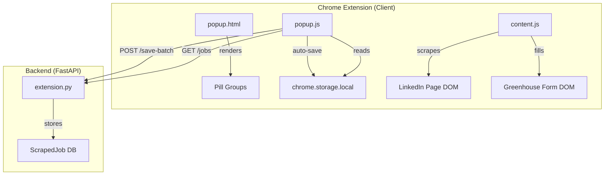

# Design Document: Popup Pills & Greenhouse Form Filling

## Overview

This design covers three related improvements to the Auto Apply Bot Chrome extension:

1. **Multi-select pill UI** — Replace the single-select `<select>` dropdowns for Experience Level, Work Type, and Posted Within filters with multi-select pill/chip button groups. This lets users select multiple values simultaneously (e.g., both "Entry Level" and "Mid-Senior").

2. **Easy Apply badge detection fix** — The scraper (`scrapeCurrentPage()` in `content.js`) currently hardcodes `atsType: 'easy_apply'` for every scraped job. It needs to actually check each job card for the Easy Apply badge and classify accordingly. The backend (`save_job_batch` in `extension.py`) also hardcodes `easy_apply=1` and `ats_type="easy_apply"` — it needs to respect the client-provided values.

3. **Greenhouse form filling in content script** — Add client-side Greenhouse form detection and filling to `content.js`, mirroring the logic in the existing Selenium-based `ats_greenhouse.py` but running in the browser context. This covers standard field filling, resume upload, custom question handling, and form submission.

## Architecture

The changes span three layers:



### Feature 1: Pill UI
- **popup.html**: Replace `<select>` elements with `<div class="pill-group">` containers holding `<button class="pill-btn">` elements.
- **popup.css**: Add `.pill-group` and `.pill-btn` styles matching the dark theme (Coronation Blue + Matte Bronze).
- **popup.js**: Update `saveConfig()` to collect pill selections as arrays. Update `populateSettingsFields()` to restore pill state from arrays (with legacy single-string fallback). Wire click handlers for toggle behavior.

### Feature 2: Easy Apply Badge Detection
- **content.js** (`scrapeCurrentPage`): For each job card, check for Easy Apply badge text/SVG. Set `atsType` and `easyApply` per-card instead of hardcoding.
- **backend/routers/extension.py** (`save_job_batch`): Read `atsType` and `easyApply` from the client payload, defaulting to `"easy_apply"` / `1` when absent.

### Feature 3: Greenhouse Form Filling
- **content.js**: Add a `fillGreenhouseForm(profile, settings, prefilledAnswers)` function that:
  1. Detects Greenhouse domain via `detectATS()` (already returns `"greenhouse"`).
  2. Locates the form container (`#application_form`, `#main_fields`, `#application`).
  3. Fills standard fields (name, email, phone, LinkedIn) using CSS selectors from `ats_greenhouse.py`.
  4. Uploads resume via `input[type="file"]`.
  5. Handles custom questions (selects, text inputs, textareas, radio/checkbox fieldsets) using prefilled answers and AI fallback.
  6. Clicks the submit button.
- **content.js** (`processJobQueue`): When `atsType === 'greenhouse'`, navigate to the job URL and call `fillGreenhouseForm()` instead of the Easy Apply flow.

## Components and Interfaces

### Pill Group Component (popup.html + popup.js)

```html
<!-- Replaces <select id="experienceLevel"> -->
<div class="pill-group" data-setting="experienceLevel">
  <button type="button" class="pill-btn" data-value="intern">Internship</button>
  <button type="button" class="pill-btn" data-value="entry">Entry Level</button>
  <button type="button" class="pill-btn" data-value="mid">Mid-Senior</button>
  <button type="button" class="pill-btn" data-value="senior">Senior</button>
  <button type="button" class="pill-btn" data-value="director">Director</button>
  <button type="button" class="pill-btn" data-value="executive">Executive</button>
</div>
```

**Toggle logic** (popup.js):
```javascript
function setupPillGroups() {
  document.querySelectorAll('.pill-group').forEach(group => {
    group.querySelectorAll('.pill-btn').forEach(btn => {
      btn.addEventListener('click', () => {
        btn.classList.toggle('selected');
        saveConfig(); // triggers auto-save
      });
    });
  });
}
```

**Save/Load interface**:
- `saveConfig()` collects: `settings[key] = [...selectedValues]` (array of `data-value` strings).
- `populateSettingsFields()` restores: if value is a string, wrap in `[value]`; if array, select matching pills.

### Easy Apply Badge Detector (content.js)

```javascript
function hasEasyApplyBadge(cardElement) {
  // Check for "Easy Apply" text in the card
  // Check for LinkedIn Easy Apply SVG icon
  // Returns boolean
}
```

Called inside `scrapeCurrentPage()` for each job card to set `atsType` and `easyApply` dynamically.

### Greenhouse Form Filler (content.js)

```javascript
async function fillGreenhouseForm(profile, settings, prefilledAnswers) {
  // 1. Find form container
  // 2. Fill standard fields (first_name, last_name, email, phone, linkedin)
  // 3. Upload resume
  // 4. Handle custom questions (select, text, textarea, radio)
  // 5. Submit form
  // Returns { status: 'submitted'|'waiting'|'failed', filled, skipped, failed, unfilled }
}
```

### Backend save_job_batch Update (extension.py)

```python
job = ScrapedJob(
    ...
    easy_apply=j.get("easyApply", 1),        # was hardcoded 1
    ats_type=j.get("atsType", "easy_apply"),  # was hardcoded "easy_apply"
)
```

## Data Models

### Chrome Storage Schema Changes

```
chrome.storage.local:
  settings:
    experienceLevel: string[] (was string)   // e.g. ["entry", "mid"]
    workType: string[] (was string)           // e.g. ["remote", "hybrid"]
    postedWithin: string[] (was string)       // e.g. ["24h", "week"]
    ... (all other keys unchanged)
```

### ScrapedJob (no schema change, just value change)

The `ats_type` column already accepts any string. The `easy_apply` column already accepts 0 or 1. No migration needed — only the values written change.

### Job Object (content.js → backend)

```typescript
interface ScrapedJobPayload {
  title: string;
  company: string;
  url: string;
  location: string;
  atsType: 'easy_apply' | 'external' | 'greenhouse' | 'lever' | 'workday';
  easyApply: 0 | 1;
}
```


## Correctness Properties

*A property is a characteristic or behavior that should hold true across all valid executions of a system — essentially, a formal statement about what the system should do. Properties serve as the bridge between human-readable specifications and machine-verifiable correctness guarantees.*

### Property 1: Pill toggle is an involution

*For any* pill button in any pill group, clicking it once should flip its selected state, and clicking it again should restore the original state. That is, for any pill button, `click(click(state)) === state`.

**Validates: Requirements 1.2, 1.3, 2.2, 2.3, 3.2, 3.3**

### Property 2: Pill selection save/load round-trip

*For any* pill group and *any* subset of its valid values, saving the selection to Chrome Storage via `saveConfig()` and then loading via `populateSettingsFields()` should restore exactly the same set of selected pill buttons. This includes the empty set and single-string legacy values.

**Validates: Requirements 1.5, 1.6, 2.5, 2.6, 3.5, 3.6, 5.1, 5.2, 5.3, 5.4**

### Property 3: Easy Apply badge classification

*For any* job card DOM element, if the card contains an Easy Apply badge (text "Easy Apply" or the LinkedIn Easy Apply SVG), then the scraped job object should have `atsType === "easy_apply"` and `easyApply === 1`. If the card does not contain the badge, the scraped job object should have `atsType === "external"` and `easyApply === 0`.

**Validates: Requirements 6.1, 6.2, 6.3, 6.4**

### Property 4: Backend preserves client-provided ATS classification

*For any* job payload sent to `save_job_batch`, the stored `ats_type` should equal the payload's `atsType` field (defaulting to `"easy_apply"` when absent), and the stored `easy_apply` should equal the payload's `easyApply` field (defaulting to `1` when absent).

**Validates: Requirements 7.1, 7.2, 7.3, 7.4**

### Property 5: Greenhouse URL detection

*For any* URL string, `detectATS(url)` should return `"greenhouse"` if and only if the URL contains `greenhouse.io`, `boards.greenhouse`, or `grnh.se` (case-insensitive).

**Validates: Requirements 8.1**

### Property 6: Greenhouse standard field filling

*For any* Greenhouse form containing standard fields (first name, last name, email, phone, LinkedIn URL) and *any* user profile with those fields populated, the form filler should set each empty standard field's value to the corresponding profile value.

**Validates: Requirements 9.1, 9.2, 9.3, 9.4, 9.5**

### Property 7: Pre-filled field preservation

*For any* form field that already contains a non-empty value before the filler runs, the filler should not modify that field's value.

**Validates: Requirements 9.6**

### Property 8: Prefilled answer matching for custom questions

*For any* custom question field (select, text input, or radio group) whose label fuzzy-matches a key in the user's prefilled Q&A dictionary, the filler should set the field's value to the corresponding prefilled answer.

**Validates: Requirements 11.1, 11.2, 11.3**

### Property 9: Unfilled field tracking

*For any* custom question field that has no prefilled answer match and no AI answer available, the field should appear in the returned `unfilled` list with its label and type.

**Validates: Requirements 11.5**

## Error Handling

| Scenario | Handling |
|---|---|
| Pill group has no `data-setting` attribute | Skip during save/load — no crash |
| Legacy single-string value in storage for pill group | Wrap in array, select matching pill |
| Job card DOM structure changes (no badge found) | Default to `external` classification — safe fallback |
| `save_job_batch` receives job without `atsType`/`easyApply` | Default to `"easy_apply"` / `1` for backward compatibility |
| Greenhouse form container not found | Fall back to full-page `document` field extraction |
| Resume file not configured | Skip upload, log message, continue filling |
| Resume upload fails (file input error) | Log error, continue filling remaining fields |
| AI endpoint unreachable or returns error | Add question to unfilled list, continue |
| Submit button not found on Greenhouse form | Return `{ status: 'failed' }`, log error |
| Validation errors after Greenhouse submission | Return `{ status: 'failed' }`, report error count |
| Cross-origin iframe on Greenhouse page | Log warning, skip iframe fields |

## Testing Strategy

### Unit Tests (specific examples and edge cases)

- Pill group renders correct options for each filter (Reqs 1.1, 2.1, 3.1)
- Greenhouse form container found with each selector variant (#application_form, #main_fields, #application) (Req 8.2)
- Resume upload triggered when file input has "resume" label (Req 10.1)
- Submit button found via each selector (#submit_app, button[type="submit"], text "Submit") (Req 12.1)
- Success detection after submission (Req 12.3)
- Error handling: no resume configured, upload failure, no submit button, validation errors (Reqs 10.2, 10.3, 12.4, 12.5)

### Property-Based Tests

Use `fast-check` for JavaScript (popup/content script) and `hypothesis` for Python (backend).

Each property test must run a minimum of 100 iterations and be tagged with:
`Feature: popup-pills-greenhouse, Property {N}: {title}`

| Property | Library | Test Description |
|---|---|---|
| P1: Pill toggle involution | fast-check | Generate random pill group + random click sequence, verify double-click restores state |
| P2: Pill save/load round-trip | fast-check | Generate random subset of valid values, save → load → compare |
| P3: Badge classification | fast-check | Generate random job card HTML (with/without badge), verify atsType/easyApply |
| P4: Backend ATS preservation | hypothesis | Generate random job payloads with/without atsType/easyApply, POST to save_job_batch, verify stored values |
| P5: Greenhouse URL detection | fast-check | Generate random URLs (some with greenhouse patterns), verify detectATS result |
| P6: Standard field filling | fast-check | Generate random profile data + mock Greenhouse form DOM, verify fields filled |
| P7: Pre-filled preservation | fast-check | Generate random pre-filled field values, run filler, verify values unchanged |
| P8: Prefilled answer matching | fast-check | Generate random Q&A dict + random field labels (some matching), verify correct answers applied |
| P9: Unfilled field tracking | fast-check | Generate random fields with no matching prefilled/AI answers, verify all appear in unfilled list |
