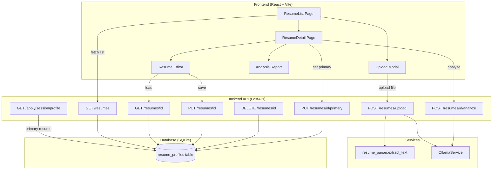
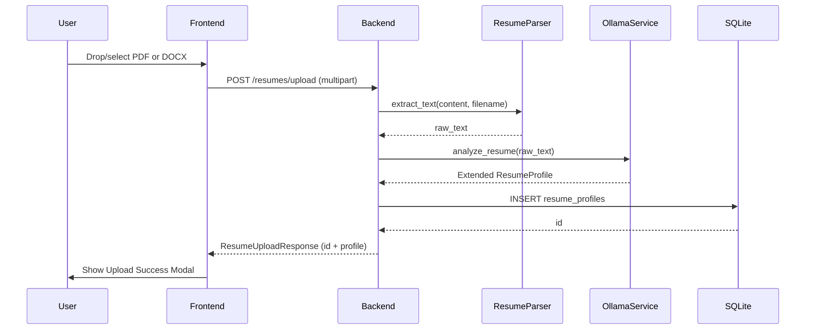
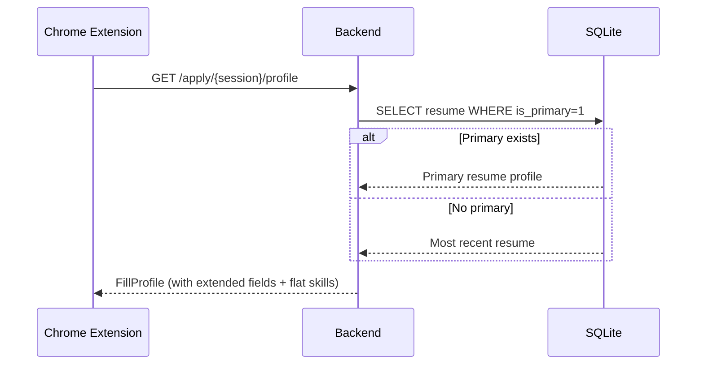

# Design Document: Resume Upload & Analysis

## Overview

The Resume Upload & Analysis feature transforms the stub `/app/resume` page into a full resume management system. It extends the existing `ResumeProfileDB` model and `POST /resumes/upload` endpoint into a complete CRUD API with multiple resume support, primary selection, AI quality analysis, and a rich structured editor frontend.

The system builds on three existing backend services:
- `resume_parser.extract_text()` — PDF/DOCX text extraction
- `OllamaService.analyze_resume()` — AI-powered resume parsing into structured data
- `GET /apply/{session}/profile` — Chrome extension autofill endpoint

Key additions:
1. Extended schema with projects, categorized technologies, and richer education/experience fields
2. Full CRUD API (`GET /resumes`, `GET/PUT/DELETE /resumes/{id}`, `PUT /resumes/{id}/primary`)
3. AI quality analysis endpoint (`POST /resumes/{id}/analyze`) with graded report
4. React frontend with list view, upload modal, structured editor, and analysis report
5. Primary resume selection that feeds into the Chrome extension autofill

## Architecture



### Data Flow: Upload



### Data Flow: Autofill Integration



## Components and Interfaces

### Backend File Structure

```
backend/
├── routers/resumes.py          — Extended with CRUD + analyze endpoints
├── schemas/resume.py           — Extended Pydantic models
├── db/models.py                — Extended ResumeProfileDB
├── services/ollama_service.py  — New analyze_resume_quality method
└── routers/apply.py            — Modified to use primary resume
prompts/
└── analyze_resume_quality.txt  — New prompt template for quality analysis
```

### Frontend File Structure

```
frontend/src/
├── pages/
│   ├── Resume.tsx              — ResumeList page (replaces stub)
│   └── ResumeDetail.tsx        — Editor + Analysis Report page
├── resume.css                  — Styles for resume pages
└── main.tsx                    — Add /app/resume/:id route
```

### Backend API Interfaces

```python
# GET /resumes → list[ResumeListItem]
class ResumeListItem(BaseModel):
    id: int
    name: str
    target_job_title: str | None
    is_primary: bool
    status: str  # "analyzed" | "pending"
    created_at: datetime
    updated_at: datetime

# GET /resumes/{id} → ResumeDetailResponse
class ResumeDetailResponse(BaseModel):
    id: int
    name: str
    target_job_title: str | None
    is_primary: bool
    profile: ResumeProfile  # extended schema
    analysis_report: AnalysisReport | None
    created_at: datetime
    updated_at: datetime

# PUT /resumes/{id} — body: ResumeUpdateRequest
class ResumeUpdateRequest(BaseModel):
    name: str | None = None
    target_job_title: str | None = None
    profile: ResumeProfile | None = None

# POST /resumes/{id}/analyze → AnalysisReport
class AnalysisReport(BaseModel):
    overall_grade: str  # "EXCELLENT" | "GOOD" | "FAIR"
    urgent_fix_count: int
    critical_fix_count: int
    optional_fix_count: int
    summary: str
    highlights: list[str]

# POST /resumes/upload → ResumeUploadResponse (extended)
class ResumeUploadResponse(BaseModel):
    id: int
    profile: ResumeProfile
```

### Extended ResumeProfile Schema

```python
class EducationItem(BaseModel):
    school: str = ""
    degree: str = ""
    start_date: str = ""
    end_date: str = ""
    gpa: str = ""
    achievements: list[str] = []
    coursework: list[str] = []

class ExperienceItem(BaseModel):
    company: str = ""
    title: str = ""
    location: str = ""
    start_date: str = ""
    end_date: str = ""
    bullets: list[str] = []

class ProjectItem(BaseModel):
    name: str = ""
    link: str = ""
    organization: str = ""
    location: str = ""
    start_date: str = ""
    end_date: str = ""
    bullets: list[str] = []

class ResumeProfile(BaseModel):
    name: str = ""
    email: str = ""
    phone: str = ""
    location: str = ""
    linkedin_url: str = ""
    github_url: str = ""
    other_link: str = ""
    skills: list[str] = []  # flat list for backward compat
    experience: list[ExperienceItem] = []
    education: list[EducationItem] = []
    projects: list[ProjectItem] = []
    technologies: dict[str, list[str]] = {}  # category → skills
```

### Frontend Component Hierarchy

```
Resume.tsx (List Page)
├── LoadingSpinner (conditional)
├── ErrorMessage (conditional)
├── EmptyState (conditional)
├── ResumeTable
│   └── ResumeRow[] (clickable → navigate to detail)
└── UploadModal
    ├── FileDropZone
    ├── AnalysisProgress (progress bar + tips)
    └── UploadSuccessModal (name + target job title inputs)

ResumeDetail.tsx (Detail Page)
├── ResumeHeader (name, primary badge, actions)
├── AnalysisReport (collapsible panel)
│   ├── GradeBadge
│   ├── FixCounts
│   ├── Summary
│   └── Highlights
├── SectionCard: Header Info
│   └── Editable fields (name, email, phone, location, URLs)
├── SectionCard: Education
│   └── EducationEntry[] (+ Add button)
├── SectionCard: Experience
│   └── ExperienceEntry[] (+ Add button, + Bullet button)
├── SectionCard: Projects
│   └── ProjectEntry[] (+ Add button, + Bullet button)
├── SectionCard: Technologies
│   └── CategoryGroup[] (category name + SkillTag[])
└── SaveButton (sticky footer)
```

### TypeScript Interfaces (Frontend)

```typescript
interface ResumeListItem {
  id: number;
  name: string;
  target_job_title: string | null;
  is_primary: boolean;
  status: string;
  created_at: string;
  updated_at: string;
}

interface ResumeProfile {
  name: string;
  email: string;
  phone: string;
  location: string;
  linkedin_url: string;
  github_url: string;
  other_link: string;
  skills: string[];
  experience: ExperienceItem[];
  education: EducationItem[];
  projects: ProjectItem[];
  technologies: Record<string, string[]>;
}

interface ExperienceItem {
  company: string;
  title: string;
  location: string;
  start_date: string;
  end_date: string;
  bullets: string[];
}

interface EducationItem {
  school: string;
  degree: string;
  start_date: string;
  end_date: string;
  gpa: string;
  achievements: string[];
  coursework: string[];
}

interface ProjectItem {
  name: string;
  link: string;
  organization: string;
  location: string;
  start_date: string;
  end_date: string;
  bullets: string[];
}

interface AnalysisReport {
  overall_grade: "EXCELLENT" | "GOOD" | "FAIR";
  urgent_fix_count: number;
  critical_fix_count: number;
  optional_fix_count: number;
  summary: string;
  highlights: string[];
}

interface ResumeDetail {
  id: number;
  name: string;
  target_job_title: string | null;
  is_primary: boolean;
  profile: ResumeProfile;
  analysis_report: AnalysisReport | null;
  created_at: string;
  updated_at: string;
}
```

## Data Models

### Extended ResumeProfileDB (SQLAlchemy)

```python
class ResumeProfileDB(Base):
    __tablename__ = "resume_profiles"

    id = Column(Integer, primary_key=True, index=True)
    name = Column(String, default="Untitled Resume")  # user-given name
    target_job_title = Column(String, nullable=True)
    is_primary = Column(Integer, default=0)  # 0 or 1
    status = Column(String, default="analyzed")  # "analyzed" | "pending"

    # Personal info
    profile_name = Column(String, nullable=True)  # person's name from resume
    email = Column(String, nullable=True)
    phone = Column(String, nullable=True)
    location = Column(String, nullable=True)
    linkedin_url = Column(String, nullable=True)
    github_url = Column(String, nullable=True)
    other_link = Column(String, nullable=True)

    # Structured sections (JSON)
    skills = Column(JSON, default=list)          # flat list for compat
    experience = Column(JSON, default=list)      # list of ExperienceItem dicts
    education = Column(JSON, default=list)       # list of EducationItem dicts
    projects = Column(JSON, default=list)        # list of ProjectItem dicts
    technologies = Column(JSON, default=dict)    # {category: [skills]}

    # Raw text and analysis
    raw_text = Column(Text, nullable=True)
    analysis_report = Column(JSON, nullable=True)  # AnalysisReport dict

    # Timestamps
    created_at = Column(DateTime, default=datetime.datetime.utcnow)
    updated_at = Column(DateTime, default=datetime.datetime.utcnow,
                        onupdate=datetime.datetime.utcnow)
```

### Migration Strategy

The existing `ResumeProfileDB` has columns: `id`, `name`, `email`, `phone`, `location`, `linkedin_url`, `skills`, `experience`, `education`, `raw_text`, `created_at`.

Changes needed:
- Rename `name` → `profile_name` (person's name from resume)
- Add `name` (user-given resume name, e.g., "Software Engineer Resume")
- Add `target_job_title`, `is_primary`, `status`
- Add `github_url`, `other_link`
- Add `projects`, `technologies` (JSON columns)
- Add `analysis_report` (JSON column)
- Add `updated_at`

Since this is SQLite with no production data yet, we can recreate the table. The existing upload endpoint will be updated to populate the new fields.

### Profile Serialization for Autofill

The `GET /apply/{session}/profile` endpoint will be updated to:
1. Query the primary resume (`is_primary=1`) instead of the most recent
2. Fall back to most recently created if no primary exists
3. Merge `technologies` dict values into the flat `skills` list for backward compatibility
4. Include `projects` in the response for richer form filling context

## Correctness Properties

*A property is a characteristic or behavior that should hold true across all valid executions of a system — essentially, a formal statement about what the system should do. Properties serve as the bridge between human-readable specifications and machine-verifiable correctness guarantees.*

### Property 1: Profile schema round-trip

*For any* valid ResumeProfile (with arbitrary name, email, phone, location, URLs, education entries, experience entries, project entries, and technologies dict), serializing it to JSON and deserializing it back SHALL produce an identical ResumeProfile object.

**Validates: Requirements 3.1, 3.2, 3.3, 3.4, 3.5**

### Property 2: Resume list rendering faithfulness

*For any* list of ResumeListItem objects returned by the API, the Resume_List_Page SHALL render exactly one table row per item, and each row SHALL display the correct name, target job title (or placeholder if null), a "PRIMARY" badge if and only if `is_primary` is true, and an "Analysis Complete" badge if and only if `status` is "analyzed".

**Validates: Requirements 1.1, 1.2, 1.3, 7.3, 7.4**

### Property 3: Editor rendering faithfulness

*For any* valid ResumeDetail response from the API, the Resume_Editor SHALL render the header fields matching the profile's personal info, one education entry per education item, one experience entry per experience item, one project entry per project item, and one technology category group per key in the technologies dict.

**Validates: Requirements 4.1, 4.2, 4.3, 4.4, 4.5, 4.6**

### Property 4: Add entry grows section

*For any* current section state (education, experience, or projects list of length N, or bullet list of length M), clicking the "+ Add" or "+ Bullet Points" button SHALL result in the list length increasing by exactly one, with the new entry having all fields empty.

**Validates: Requirements 4.7, 4.8**

### Property 5: Save payload matches editor state

*For any* editor state with modified profile data, clicking Save SHALL send a PUT request whose body contains the complete current profile state as displayed in the editor.

**Validates: Requirements 4.9**

### Property 6: Primary resume invariant

*For any* set of resumes in the database, after calling `PUT /resumes/{id}/primary` on any valid resume id, exactly one resume SHALL have `is_primary=1` (the targeted one), and all others SHALL have `is_primary=0`.

**Validates: Requirements 6.2, 8.5**

### Property 7: Autofill returns primary resume data

*For any* set of resumes where one is marked as primary, the `GET /apply/{session}/profile` endpoint SHALL return profile data (skills, experience, education) matching the primary resume's stored profile, and after updating that resume via PUT, subsequent autofill requests SHALL reflect the updated data.

**Validates: Requirements 6.5, 11.1, 11.3**

### Property 8: API CRUD round-trip

*For any* valid ResumeProfile and metadata (name, target_job_title), storing it via POST /resumes/upload (or updating via PUT /resumes/{id}), then retrieving it via GET /resumes/{id} SHALL return a profile with all fields matching the stored/updated values.

**Validates: Requirements 7.2, 8.2, 8.3**

### Property 9: Delete removes resume

*For any* existing resume id, calling DELETE /resumes/{id} then GET /resumes/{id} SHALL return a 404 status. Additionally, for any non-existent resume id, calling GET, PUT, DELETE, or POST analyze SHALL return a 404 status.

**Validates: Requirements 8.4, 8.7**

### Property 10: Analysis report rendering

*For any* valid AnalysisReport (with grade in {EXCELLENT, GOOD, FAIR}, non-negative fix counts, non-empty summary, and highlights list), the Analysis_Report component SHALL render the grade badge with the correct color (green for EXCELLENT, blue for GOOD, orange for FAIR), display all three fix counts, the summary text, and all highlight items.

**Validates: Requirements 5.3, 5.4, 5.5, 5.6, 10.5**

### Property 11: Analysis report persistence

*For any* resume with raw_text, after calling POST /resumes/{id}/analyze, the returned report SHALL contain all required fields (overall_grade, fix counts, summary, highlights), and subsequent GET /resumes/{id} calls SHALL return the same analysis_report without re-running analysis.

**Validates: Requirements 9.2, 9.5**

### Property 12: Skills list merges all technology categories

*For any* ResumeProfile with a technologies dict mapping N categories to lists of skills, the serialized flat `skills` list returned by the autofill endpoint SHALL contain every skill string from every category in the technologies dict.

**Validates: Requirements 11.4**

## Error Handling

| Scenario | HTTP Status | Behavior |
|---|---|---|
| Upload non-PDF/DOCX file | 400 | Return "Only PDF and DOCX files are accepted." |
| Text extraction fails | 422 | Return "Could not extract text: {detail}" |
| Extracted text is empty | 422 | Return "Extracted text is empty." |
| Ollama unreachable (upload) | 502 | Return "AI analysis failed: {detail}" |
| Ollama unreachable (analyze) | 502 | Return "AI quality analysis failed: {detail}" |
| Resume ID not found | 404 | Return "Resume not found." |
| Apply session not found | 404 | Return "Apply session not found." |
| No user settings configured | 400 | Return "User settings not configured." |
| Database write failure | 500 | Return "Internal server error." |

### Frontend Error Handling

| Scenario | UI Behavior |
|---|---|
| GET /resumes fails | Show error message in place of table |
| GET /resumes/{id} fails | Show error message in place of editor |
| PUT /resumes/{id} fails | Show error toast, keep editor state |
| DELETE /resumes/{id} fails | Show error toast |
| POST /resumes/upload fails | Show error in upload modal with API message |
| POST /resumes/{id}/analyze fails | Show error toast "Analysis could not be completed" |
| File type validation (client) | Show inline error in upload modal before sending |

## Testing Strategy

### Property-Based Tests (Hypothesis — Python backend)

The backend uses Python with FastAPI. We'll use **Hypothesis** for property-based testing of the backend logic.

**Configuration:**
- Library: `hypothesis` (Python PBT library)
- Runner: `pytest`
- Minimum iterations: 100 per property (`@settings(max_examples=100)`)
- Each test tagged with: `# Feature: resume-upload-analysis, Property {N}: {title}`

**Backend properties to implement:**
1. Profile schema round-trip (Property 1) — generate random ResumeProfile, serialize/deserialize
2. Primary resume invariant (Property 6) — generate random resume sets, set primary, verify invariant
3. Autofill returns primary (Property 7) — generate resumes, set primary, verify autofill response
4. CRUD round-trip (Property 8) — generate profiles, store/update/retrieve, verify equality
5. Delete removes (Property 9) — create then delete, verify 404
6. Analysis report persistence (Property 11) — mock Ollama, run analyze, verify persistence
7. Skills merge (Property 12) — generate technologies dicts, verify flat list contains all

### Property-Based Tests (fast-check — React frontend)

The frontend uses React + Vite with Vitest + fast-check (already set up from settings-profile-page spec).

**Configuration:**
- Library: `fast-check` (JavaScript PBT library)
- Runner: Vitest
- Minimum iterations: 100 per property
- Each test tagged with: `// Feature: resume-upload-analysis, Property {N}: {title}`

**Frontend properties to implement:**
2. List rendering faithfulness (Property 2) — generate random resume lists, verify table rendering
3. Editor rendering faithfulness (Property 3) — generate random profiles, verify section rendering
4. Add entry grows section (Property 4) — generate random section states, verify add behavior
5. Save payload correctness (Property 5) — generate random edits, verify PUT payload
10. Analysis report rendering (Property 10) — generate random reports, verify rendering

### Unit Tests (example-based)

**Backend:**
- Upload endpoint accepts PDF and DOCX, rejects other types
- Upload endpoint returns 422 for empty extracted text
- Analyze endpoint returns 502 when Ollama is unreachable
- GET /resumes returns empty list when no resumes exist
- PUT /resumes/{id}/primary with non-existent ID returns 404
- Autofill falls back to most recent when no primary exists

**Frontend:**
- Upload modal opens on "+ Add Resume" click
- File drop zone rejects non-PDF/DOCX files (client-side)
- Progress indicator shows during upload
- Success modal appears after upload completes
- Navigation to detail page on row click
- Loading state displays spinner
- Empty state displays prompt
- "Set as Primary" button shown for non-primary resumes
- "PRIMARY" badge shown for primary resume
- "Analyze" button triggers API call
- Toast notifications appear on success/error

### Integration Tests

- Full upload flow: upload file → parse → analyze → store → retrieve
- Primary selection: set primary → verify autofill returns correct data
- Edit flow: load → modify → save → reload → verify changes persisted
- Delete flow: create → delete → verify removed from list

### Manual/Visual Testing

- Responsive layout at 768px breakpoint
- Section card styling (white bg, border-radius, padding)
- Skill tag pill styling
- Grade badge color coding
- Table hover/alternating rows
- CSS variable usage throughout
- Upload drag-and-drop interaction
- Progress bar animation during analysis

