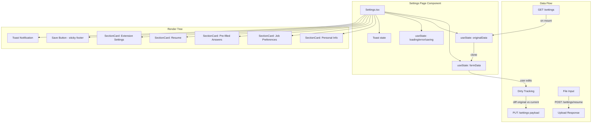
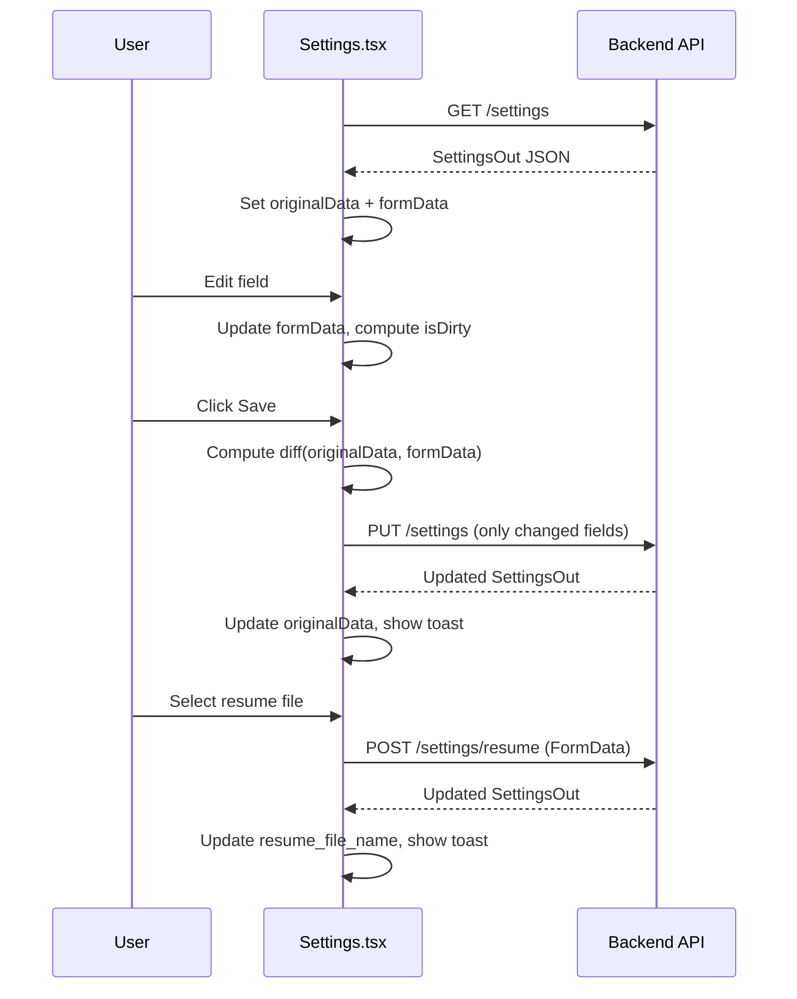

# Design Document: Settings Profile Page

## Overview

The Settings Profile Page is a React component rendered at `/settings` that provides a Jobright-inspired profile editor. It uses a card-based layout with five distinct sections (Personal Info, Job Preferences, Pre-filled Answers, Resume, Extension Settings) and communicates with the existing FastAPI backend via `GET /settings`, `PUT /settings`, and `POST /settings/resume`.

The component is designed as a self-contained module with no external state dependencies, making it extractable into a Chrome extension options page in the future. It follows the existing frontend patterns: `useState`/`useEffect` with `fetch`, plain CSS with CSS variables, and the Inter font family.

## Architecture



### Data Flow Sequence



## Components and Interfaces

### File Structure

All settings code lives in a single file for extraction simplicity:

```
frontend/src/pages/Settings.tsx    — Component + all logic
frontend/src/settings.css          — Dedicated CSS file
```

### Component Hierarchy

```
Settings (page component)
├── LoadingSpinner (conditional)
├── ErrorMessage (conditional)
├── SectionCard (wrapper, repeated 5x)
│   ├── SectionHeader (icon + title)
│   └── [section-specific content]
├── PersonalInfoSection
│   └── Input fields (2-column grid)
├── JobPreferencesSection
│   ├── Input fields
│   └── ToggleSwitch (remote_only)
├── PrefilledAnswersSection
│   └── KeyValueEditor
│       ├── KeyValueRow[] (question + answer + remove btn)
│       └── Add button
├── ResumeSection
│   ├── File name display
│   └── Upload button (hidden file input)
├── ExtensionSettingsSection
│   └── ToggleSwitch[] (3 toggles)
├── SaveButton (sticky footer)
└── Toast (portal or positioned)
```

### TypeScript Interfaces

```typescript
// Mirrors backend SettingsOut schema (relevant fields only)
interface SettingsData {
  first_name: string;
  last_name: string;
  email: string;
  phone: string;
  city: string;
  linkedin_url: string;
  website: string;
  job_title: string;
  location: string;
  remote_only: boolean;
  prefilled_answers: Record<string, string>;
  resume_uploaded: boolean;
  resume_file_name: string;
  pause_before_submit: boolean;
  smooth_scrolling: boolean;
  follow_companies: boolean;
}

// For the key-value editor, we use an array for ordering
interface PrefilledEntry {
  id: string;       // crypto.randomUUID() for React key stability
  question: string;
  answer: string;
}

// Toast notification
interface Toast {
  id: string;
  type: 'success' | 'error';
  message: string;
}
```

### Key Functions

```typescript
// Compute dirty diff for partial PUT
function computeDiff(
  original: SettingsData,
  current: SettingsData
): Partial<SettingsData> | null

// Convert prefilled entries array back to dict for API
function entriesToDict(entries: PrefilledEntry[]): Record<string, string>

// Convert dict from API to entries array for UI
function dictToEntries(dict: Record<string, string>): PrefilledEntry[]

// Data fetching (abstractable for future extension swap)
function fetchSettings(): Promise<SettingsData>
function saveSettings(diff: Partial<SettingsData>): Promise<SettingsData>
function uploadResume(file: File): Promise<SettingsData>
```

### ToggleSwitch Sub-Component

```typescript
interface ToggleSwitchProps {
  checked: boolean;
  onChange: (checked: boolean) => void;
  label: string;
  description?: string;
}
```

Renders a pill-shaped track (36px × 20px) with a sliding circle (16px). Active state uses `var(--accent)` background; inactive uses `#d1d5db`. Transition: `background-color 0.15s, transform 0.15s`.

### KeyValueEditor Sub-Component

```typescript
interface KeyValueEditorProps {
  entries: PrefilledEntry[];
  onChange: (entries: PrefilledEntry[]) => void;
}
```

Renders rows with two text inputs (question, answer) and a remove button (×). Add button at the bottom appends a new empty entry with a generated UUID.

### Toast Notification

Simple positioned element (fixed bottom-right or top-right). Auto-dismisses after 3 seconds. Uses CSS `@keyframes slideIn` for entrance animation.

```typescript
function showToast(type: 'success' | 'error', message: string): void
```

## Data Models

### State Shape

```typescript
// Component state
const [formData, setFormData] = useState<SettingsData | null>(null);
const [originalData, setOriginalData] = useState<SettingsData | null>(null);
const [prefilledEntries, setPrefilledEntries] = useState<PrefilledEntry[]>([]);
const [loading, setLoading] = useState(true);
const [error, setError] = useState<string | null>(null);
const [saving, setSaving] = useState(false);
const [toasts, setToasts] = useState<Toast[]>([]);
```

### Dirty Tracking Logic

```typescript
// isDirty is computed, not stored
const isDirty = useMemo(() => {
  if (!originalData || !formData) return false;
  return JSON.stringify(originalData) !== JSON.stringify({
    ...formData,
    prefilled_answers: entriesToDict(prefilledEntries)
  });
}, [originalData, formData, prefilledEntries]);
```

### API Payload (PUT /settings)

The `computeDiff` function compares `originalData` with the current form state field-by-field. Only fields where `current[key] !== original[key]` are included in the PUT payload. For `prefilled_answers`, the entire dictionary is sent if any entry changed (since the backend replaces the whole dict).

### Backend Schema Mapping

| Frontend Field | Backend SettingsOut | Backend SettingsUpdate |
|---|---|---|
| `first_name` | `first_name: str` | `first_name: Optional[str]` |
| `last_name` | `last_name: str` | `last_name: Optional[str]` |
| `email` | `email: str` | `email: Optional[str]` |
| `phone` | `phone: str` | `phone: Optional[str]` |
| `city` | `city: str` | `city: Optional[str]` |
| `linkedin_url` | `linkedin_url: str` | `linkedin_url: Optional[str]` |
| `website` | `website: str` | `website: Optional[str]` |
| `job_title` | `job_title: str` | `job_title: Optional[str]` |
| `location` | `location: str` | `location: Optional[str]` |
| `remote_only` | `remote_only: bool` | `remote_only: Optional[bool]` |
| `prefilled_answers` | `prefilled_answers: dict` | `prefilled_answers: Optional[dict]` |
| `resume_file_name` | `resume_file_name: str` | N/A (via POST /resume) |
| `pause_before_submit` | `pause_before_submit: bool` | `pause_before_submit: Optional[bool]` |
| `smooth_scrolling` | `smooth_scrolling: bool` | `smooth_scrolling: Optional[bool]` |
| `follow_companies` | `follow_companies: bool` | `follow_companies: Optional[bool]` |

## Correctness Properties

*A property is a characteristic or behavior that should hold true across all valid executions of a system — essentially, a formal statement about what the system should do. Properties serve as the bridge between human-readable specifications and machine-verifiable correctness guarantees.*

### Property 1: Data load round-trip

*For any* valid SettingsOut response from the API, after the Settings page loads and renders, every field in the rendered form SHALL contain the corresponding value from the API response.

**Validates: Requirements 1.1, 2.4, 3.3, 6.4**

### Property 2: Key-Value Editor faithfulness

*For any* `prefilled_answers` dictionary, the Key_Value_Editor SHALL render exactly one row per entry, and editing any row's question or answer field SHALL update the corresponding entry in the component state to match the new value.

**Validates: Requirements 4.2, 4.5**

### Property 3: Key-Value Editor add grows list

*For any* current list of prefilled answer entries (including empty), clicking the Add button SHALL result in the entry count increasing by exactly one, with the new entry having empty question and answer fields.

**Validates: Requirements 4.3**

### Property 4: Key-Value Editor remove shrinks list

*For any* non-empty list of prefilled answer entries and any valid row index, clicking the Remove button on that row SHALL decrease the entry count by exactly one and the removed entry SHALL no longer appear in the list.

**Validates: Requirements 4.4**

### Property 5: Resume file name display

*For any* non-empty `resume_file_name` string in the loaded settings, the Resume_Card SHALL display that exact file name in the UI.

**Validates: Requirements 5.3**

### Property 6: Dirty diff correctness

*For any* original settings state and any set of user modifications, the payload sent to `PUT /settings` SHALL contain exactly the fields that differ between the original and current state, and SHALL NOT contain any unchanged fields.

**Validates: Requirements 7.2**

### Property 7: Dirty indicator on modification

*For any* loaded settings state, modifying any single field from its original value SHALL cause the dirty indicator to become visible, and reverting that field back to its original value SHALL cause the dirty indicator to disappear.

**Validates: Requirements 7.6**

## Error Handling

| Scenario | Behavior |
|---|---|
| `GET /settings` network failure | Show error message in place of form: "Could not load settings. Please check your connection." |
| `GET /settings` returns non-200 | Show error message with status code |
| `PUT /settings` network failure | Show error toast: "Failed to save settings." Re-enable Save button. |
| `PUT /settings` returns 422 (validation) | Show error toast with detail from response body |
| `POST /settings/resume` failure | Show error toast: "Resume upload failed." |
| `POST /settings/resume` 400 (bad file type) | Show error toast: "Only PDF and DOCX files are accepted." |
| File too large (client-side check) | Prevent upload, show error toast: "File must be under 10MB." |
| Empty prefilled_answers key on save | Strip entries with empty question keys before sending to API |

### Toast Auto-Dismiss

Toasts auto-dismiss after 3000ms. Multiple toasts stack vertically. Each toast has a close button for manual dismissal.

## Testing Strategy

### Property-Based Tests (fast-check)

The project uses React + Vite with no existing test framework. We'll add Vitest + React Testing Library + fast-check for property-based testing.

**Configuration:**
- Library: `fast-check` (JavaScript PBT library)
- Runner: Vitest
- Minimum iterations: 100 per property
- Each test tagged with: `Feature: settings-profile-page, Property {N}: {title}`

**Properties to implement:**
1. Data load round-trip — generate random SettingsOut, mock fetch, verify rendered values
2. Key-Value Editor faithfulness — generate random dicts, verify row rendering and edit propagation
3. Key-Value Editor add — generate random entry lists, verify add behavior
4. Key-Value Editor remove — generate random non-empty lists, verify remove behavior
5. Resume file name display — generate random file names, verify display
6. Dirty diff correctness — generate random original + modified states, verify PUT payload
7. Dirty indicator — generate random states, modify field, verify indicator

### Unit Tests (example-based)

- Loading state displays spinner
- Error state displays message
- All five section cards render on success
- Section headers have correct icons and titles
- Toggle switches reflect boolean state
- Save button disabled during save
- Success/error toasts appear on save/upload outcomes
- File input accepts only PDF/DOCX
- Relative URLs used (no hardcoded domains)

### Integration Tests

- Resume upload calls POST with correct FormData
- Save calls PUT with correct payload structure
- Component works within React Router layout

### Manual/Visual Testing

- Responsive layout at 768px breakpoint
- CSS variable usage (accent colors, radius, fonts)
- Smooth transitions on hover/toggle (150ms)
- Sticky save button positioning
